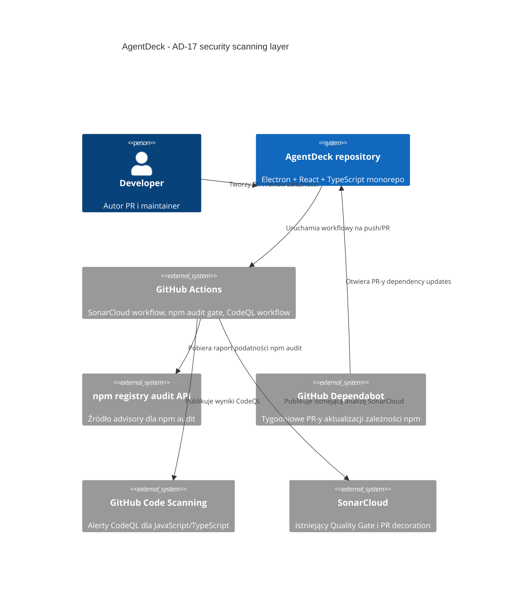

# AD-17 Add Dependabot, npm audit and CodeQL as a complement to SonarCloud - Plan Implementacji

## Szczegóły Zadania

| Pole | Wartość |
| --- | --- |
| Tytuł | AD-17 Add Dependabot, npm audit and CodeQL as a complement to SonarCloud |
| Opis | Dodać warstwę security scanning uzupełniającą SonarCloud: Dependabot dla zależności npm, bramkę `npm audit` w CI oraz CodeQL dla JavaScript/TypeScript. |
| Priorytet | Wysoki (`priority:high`) |
| Powiązany Research | `.github/Issue/ad-17-add-dependabot-npm-audit-and-codeql-as-a-complement-to-sonarcloud.research.md` |
| Numer Issue | 22 |
| Link do Issue | [https://github.com/Finfinder/AgentDeck/issues/22](https://github.com/Finfinder/AgentDeck/issues/22) |

## Proponowane Rozwiązanie

AgentDeck powinien zachować istniejący SonarCloud workflow jako główną bramkę jakości kodu, a AD-17 dodać jako warstwę obrony dla dependency security i GitHub code scanning. Rozwiązanie składa się z czterech elementów: lokalnie powtarzalnego skryptu `npm audit`, kroku audit w istniejącym `sonar.yml`, konfiguracji Dependabota dla npm oraz osobnego workflow CodeQL dla JavaScript/TypeScript.

`npm audit` powinien zostać wpięty po `npm ci --ignore-scripts`, ponieważ repozytorium już instaluje zależności w tym miejscu i ma deterministyczny `package-lock.json`. Audit ma działać konserwatywnie: `--audit-level=moderate --json`, exit code niezerowy od podatności `moderate` wzwyż, JSON zachowany jako wynik maszynowo czytelny.

Dependabot powinien monitorować npm w katalogu głównym `/`, działać tygodniowo i oznaczać PR-y etykietami `dependabot`, `security`, `priority:high`. Ponieważ Dependabot ignoruje custom labels, które nie istnieją w repozytorium, implementacja musi potwierdzić dostępność tych etykiet albo świadomie ograniczyć konfigurację do istniejących labeli i opisać brak w polityce triage. Nie należy konfigurować auto-merge; polityka review i remediacji ma zostać opisana w `SECURITY.md`.

CodeQL powinien zostać dodany jako osobny `.github/workflows/codeql.yml` z zakresem `javascript-typescript`, minimalnymi uprawnieniami joba i triggerami zgodnymi z istniejącym modelem branchy: `main` oraz `*.*.*` dla push i pull request. Workflow powinien używać pinned GitHub Actions przez pełny SHA, zgodnie z istniejącym wzorcem `sonar.yml`. Po pierwszym uruchomieniu trzeba potwierdzić, że GitHub Code Scanning jest dostępny dla repozytorium i że wyniki CodeQL pojawiają się w zakładce Security/Code scanning.

Rekomendowany routing wykonania: `/implement-pipeline` dla całości zmian, z pomocniczym zastosowaniem `writing-docs` dla `SECURITY.md`/README oraz `testing-ts-js` dla doboru walidacji npm/TS. To zadanie nie wymaga `/implement-ui`, `/implement-backend`, `/implement-e2e` ani zmian w runtime AgentDeck.

Decyzja modularyzacyjna: `modularization: use-existing-domain`. Uzasadnienie: `docs/domain.md` już definiuje granice AgentDeck, a AD-17 dotyczy workflowów, zależności i dokumentacji bezpieczeństwa. Zakres nie tworzy nowego bounded context, agregatu, własności danych ani zależności między pakietami aplikacji.

## Uzasadnienie Rozwiązania

### Wybrane podejście

Wybrane podejście to GitHub-native security hardening: Dependabot + `npm audit` + CodeQL jako uzupełnienie istniejącego SonarCloud. Pozwala to pokryć trzy różne klasy ryzyka bez wprowadzania zewnętrznego vendora: podatne zależności transitive/direct, regresje dependency updates oraz security queries w kodzie TypeScript/JavaScript.

Istniejący SonarCloud workflow ma już właściwy wzorzec bezpieczeństwa: `permissions: {}` na poziomie workflow, minimalne permissions joba, `npm ci --ignore-scripts`, pinned actions i gałęzie `main` oraz `*.*.*`. Plan wykorzystuje te konwencje zamiast tworzyć równoległy styl CI.

Bieżący baseline jakościowy jest korzystny: SonarCloud Quality Gate dla `Finfinder_AgentDeck` ma status `OK`, metryki projektu zgłaszają coverage `84.2`, `0` bugs, `0` vulnerabilities, `0` security hotspots, `0` code smells i duplicated lines density `0.0`. Lokalny `npm audit --audit-level=moderate --json` zwrócił exit code `0` i `0` podatności dla 399 zależności, więc konserwatywna bramka nie powinna blokować repo w momencie wdrożenia.

### Porównanie z alternatywami

| Kryterium | Wybrane rozwiązanie: Dependabot + npm audit + CodeQL | Tylko istniejący SonarCloud | Zewnętrzny vendor SCA/SAST |
| --- | --- | --- | --- |
| Pokrycie SCA | Wysokie: Dependabot PR-y i `npm audit` na lockfile | Niskie: SonarCloud nie zastępuje pełnego SCA dla npm | Wysokie, zależne od produktu |
| Pokrycie SAST | Wysokie: SonarCloud + CodeQL jako niezależne silniki | Średnie: jeden silnik i jeden model alertów | Wysokie, ale wymaga integracji |
| Integracja z GitHub | Wysoka: natywne PR-y, alerts i code scanning | Wysoka dla SonarCloud PR decoration | Zmienna, często wymaga sekretów i konta zewnętrznego |
| Koszt utrzymania | Niski: konfiguracja repo i GitHub Actions | Niski, ale nie spełnia DoD AD-17 | Średni/wysoki przez dodatkowy vendor i polityki dostępu |
| Zgodność z wymaganiami issue | Pełna | Niepełna | Częściowa, nadmiarowa względem wskazanych technologii |
| Ryzyko sekretów | Niskie: CodeQL i Dependabot bez nowych sekretów; Sonar już istnieje | Niskie | Wyższe, jeśli vendor wymaga tokenów API |

### Dlaczego odrzucono alternatywy

- Tylko istniejący SonarCloud: odrzucono, ponieważ nie spełnia wymagań AD-17 dotyczących Dependabota, `npm audit` i CodeQL oraz nie daje dedykowanego dependency update/remediation workflow.
- Zewnętrzny vendor SCA/SAST: odrzucono, ponieważ issue wskazuje konkretne natywne narzędzia GitHub/npm, a dodatkowy vendor zwiększa koszt utrzymania, liczbę sekretów i powierzchnię integracji bez potrzeby na tym etapie MVP.

## Rejestry Decyzji Architektonicznych (ADR)

### ADR-001: Warstwowe skanowanie bezpieczeństwa na GitHub Actions

| Pole | Wartość |
| --- | --- |
| Status | Proponowany |
| Data | 2026-05-31 |
| Kontekst | AgentDeck ma działający SonarCloud workflow, ale AD-17 wymaga osobnej warstwy SCA i CodeQL dla JavaScript/TypeScript. |

**Rozważane opcje**:

1. Rozszerzyć istniejący model GitHub Actions o Dependabot, `npm audit` i CodeQL.
2. Pozostać przy samym SonarCloud.
3. Dodać zewnętrzny vendor security scanning.

**Decyzja**: Rozszerzyć istniejący model GitHub Actions o natywne narzędzia GitHub/npm.

**Uzasadnienie**: To podejście spełnia DoD issue, reuse'uje istniejące konwencje CI i nie wymaga nowych sekretów poza już używanym `SONAR_TOKEN`.

**Konsekwencje**:

- ✅ Repo otrzyma niezależne warstwy SCA i SAST bez zmiany runtime aplikacji.
- ⚠️ Włączenie bramki `npm audit` od `moderate` może blokować PR-y po pojawieniu się nowych advisory w npm registry, nawet bez zmiany kodu.

### ADR-002: Konserwatywna polityka remediacji bez auto-merge

| Pole | Wartość |
| --- | --- |
| Status | Proponowany |
| Data | 2026-05-31 |
| Kontekst | Research doprecyzował, że `npm audit` ma failować od `moderate`, a Dependabot PR-y mają wymagać review człowieka. |

**Rozważane opcje**:

1. Fail od `moderate`, brak auto-merge, review maintainerów.
2. Audit tylko jako warning.
3. Auto-merge patch/minor po zielonym CI.

**Decyzja**: Fail od `moderate`, brak auto-merge, review maintainerów.

**Uzasadnienie**: MVP AgentDeck operuje w obszarze lokalnego IDE i przyszłych agentów, więc bezpieczniejszy jest jawny przegląd aktualizacji zależności niż automatyczne mergowanie zmian supply-chain.

**Konsekwencje**:

- ✅ Zmniejsza ryzyko nieprzejrzystych aktualizacji zależności i podatności transitive.
- ⚠️ Zwiększa liczbę PR-ów wymagających ręcznego triage i może wymagać szybkiej reakcji maintainerów przy advisory `moderate+`.

## Analiza Aktualnej Implementacji

### Już Zaimplementowane

- SonarCloud workflow - `.github/workflows/sonar.yml` - istnieje i działa jako główna bramka jakości z `npm ci --ignore-scripts`, typecheck, lint, coverage, architecture tests, build i SonarCloud scan.
- Konfiguracja SonarCloud - `sonar-project.properties` - istnieje dla project key `Finfinder_AgentDeck`, źródeł `apps,packages`, testów `tests` i coverage LCOV.
- Skrypty walidacyjne npm - `package.json` - istnieją `typecheck`, `lint`, `test`, `test:coverage`, `test:architecture` i `build`.
- Deterministyczny lockfile - `package-lock.json` - istnieje i umożliwia `npm ci` oraz stabilny `npm audit`.
- Dokumentacja SonarCloud - `README.md` - opisuje obecny model Code Quality, SonarCloud, SonarQube for IDE i SonarQube MCP Server.
- Kontrakt domenowy - `docs/domain.md` - istnieje i potwierdza, że AD-17 nie wymaga zmian w granicach domeny.
- Baseline jakości - SonarCloud MCP - Quality Gate `OK`, coverage `84.2`, `0` bugs, `0` vulnerabilities, `0` security hotspots, `0` code smells, duplicated lines density `0.0`.
- Baseline SCA - lokalny terminal - `npm audit --audit-level=moderate --json` zwraca exit code `0` i `0` podatności.

### Do Modyfikacji

- Skrypty npm - `package.json` - dodać jawny skrypt security audit, np. `audit:security`, aby lokalnie i w CI uruchamiać ten sam próg `moderate` i JSON output.
- Workflow SonarCloud - `.github/workflows/sonar.yml` - rozszerzyć po instalacji zależności o krok `npm audit` oraz opcjonalne zachowanie raportu JSON jako artefaktu workflow.
- Dokumentacja jakości - `README.md` - dodać krótkie odwołanie do polityki bezpieczeństwa i nowych warstw Dependabot/npm audit/CodeQL.

### Do Utworzenia

- Konfiguracja Dependabota - `.github/dependabot.yml` - tygodniowe aktualizacje npm dla katalogu `/`, etykiety triage i ograniczenie liczby otwartych PR-ów.
- Workflow CodeQL - `.github/workflows/codeql.yml` - advanced setup dla `javascript-typescript`, minimalne permissions, pinned actions i triggery zgodne z branchami repo.
- Polityka bezpieczeństwa - `SECURITY.md` - opis scope, zgłaszania podatności, progów severity, reguł review, braku auto-merge, triage Dependabot PR i obsługi alertów CodeQL.

## Otwarte Pytania

| # | Pytanie | Odpowiedź | Status |
| --- | --- | --- | --- |
| 1 | Czy `npm audit` ma blokować CI, czy tylko raportować wynik? | Ma blokować od `moderate`; lokalny baseline ma obecnie `0` podatności i exit code `0`. | ✅ Rozwiązane |
| 2 | Czy Dependabot PR-y mogą mieć auto-merge? | Nie; aktualizacje wymagają review człowieka i zielonych checks. | ✅ Rozwiązane |
| 3 | Kto ma być reviewerem Dependabot PR-ów? | Plan dokumentuje wymóg review przez maintainera repo i nie wpisuje konkretnego `reviewers` w `dependabot.yml`, dopóki nie ma potwierdzonego handle zespołu/użytkownika. | ✅ Rozwiązane |
| 4 | Czy etykieta `dependabot` istnieje w repozytorium? | Nie została potwierdzona w kodzie. Implementacja musi zweryfikować etykiety GitHub albo ograniczyć `labels` w `dependabot.yml` do istniejących labeli; samo repozytorium plikami nie tworzy labeli GitHub. | ❓ Otwarte do weryfikacji przy implementacji |
| 5 | Czy Dependabot ma obejmować GitHub Actions? | Nie w AD-17; zakres wymagany przez issue obejmuje npm. GitHub Actions Dependabot jest sensownym usprawnieniem poza zakresem. | ✅ Rozwiązane |
| 6 | Czy trzeba uruchamiać `/modularise` przed implementacją? | Nie; decyzja `modularization: use-existing-domain`, bo zmiana nie dotyczy bounded contexts ani kontraktu domenowego aplikacji. | ✅ Rozwiązane |

## Plan Implementacji

### Faza 1: Bramka npm audit w istniejącym CI

#### Zadanie 1.1 - [MODIFY] Dodanie lokalnego skryptu security audit

**Opis**: Rozszerzyć `package.json` o skrypt uruchamiający audyt zależności npm zgodnie z konserwatywną polityką AD-17.

**Definicja Ukończenia (Definition of Done)**:

- [x] `package.json` zawiera skrypt `audit:security` uruchamiający `npm audit --audit-level=moderate --json`.
- [x] Skrypt nie uruchamia `npm audit fix`, nie modyfikuje lockfile i nie instaluje zależności.
- [x] Lokalna walidacja `npm run audit:security` zwraca JSON i failuje zgodnie z exit code `npm audit` przy podatnościach `moderate+`.

#### Zadanie 1.2 - [MODIFY] Wpięcie npm audit do workflow SonarCloud

**Opis**: Rozszerzyć `.github/workflows/sonar.yml` o krok security audit po `npm ci --ignore-scripts`, reuse'ując już zainstalowane zależności i istniejące triggery workflow. W obecnym `sonar.yml` job jest pomijany dla PR-ów z forków, więc audit gate w AD-17 obejmuje push i PR-y z tego samego repozytorium; osobne wsparcie fork PR wymagałoby szerszej decyzji CI poza zakresem tego zadania.

**Definicja Ukończenia (Definition of Done)**:

- [x] Workflow uruchamia `npm run audit:security` po kroku `Install dependencies` i przed typecheck/lint/test/build.
- [x] Krok audytu zapisuje maszynowo czytelny raport do `npm-audit.json` także wtedy, gdy `npm audit` zwraca exit code niezerowy.
- [x] Implementacja zachowuje oryginalny exit code `npm audit`, publikuje `npm-audit.json` z `if: always()` i dopiero potem kończy krok/job tym samym statusem.
- [x] Jeśli użyty jest pipeline z `tee`, krok ustawia `shell: bash` oraz `set -o pipefail`, aby exit code `npm audit` nie został przykryty przez `tee`.
- [x] Nowe lub zmienione `uses:` w workflow są przypięte pełnym SHA commita z komentarzem wersji, spójnie z istniejącym `sonar.yml`.
- [x] Workflow nadal ma `permissions: {}` globalnie i minimalne permissions joba; krok audytu nie wymaga nowych sekretów.
- [x] Nazwa checka, który ma egzekwować audit gate, jest jednoznaczna w GitHub Actions i nie ukrywa porażki audytu pod nieczytelnym krokiem.

### Faza 2: Dependabot dla zależności npm

#### Zadanie 2.1 - [CREATE] Dodanie `.github/dependabot.yml`

**Opis**: Utworzyć konfigurację Dependabota dla rootowego npm workspace, z tygodniowym harmonogramem i etykietami triage.

**Definicja Ukończenia (Definition of Done)**:

- [x] `.github/dependabot.yml` używa `version: 2`.
- [x] Konfiguracja zawiera wpis `package-ecosystem: "npm"` oraz `directory: "/"`.
- [x] Harmonogram jest tygodniowy (`schedule.interval: "weekly"`) z jawnie dobranym dniem, czasem i timezone.
- [x] Konfiguracja ustawia etykiety `dependabot`, `security`, `priority:high` dla PR-ów dependency updates albo jawnie używa tylko labeli potwierdzonych w repozytorium.
- [x] Jeżeli label `dependabot` nie istnieje w GitHub, `SECURITY.md` albo komentarz w planie wdrożenia konfiguracji wskazuje, że label musi zostać utworzony w repo przed uznaniem triage rules za kompletne.
- [x] Konfiguracja ogranicza szum PR-ów przez rozsądny `open-pull-requests-limit`.
- [x] Konfiguracja nie zawiera auto-merge, sekretów, prywatnych registry credentials ani niepotwierdzonych reviewer handles.

#### Zadanie 2.2 - [REUSE] Zachowanie aktualnego modelu dependency ownership

**Opis**: Użyć istniejącego `package.json` i `package-lock.json` jako jedynego źródła prawdy dla zależności npm w AD-17; nie wprowadzać nowego package managera ani osobnych lockfile.

**Definicja Ukończenia (Definition of Done)**:

- [x] Dependabot aktualizuje istniejący `package.json` i `package-lock.json`, bez dodawania alternatywnego managera typu pnpm/yarn.
- [x] Planowana konfiguracja działa dla npm workspaces `apps/*` i `packages/*` z rootowym manifestem.
- [x] Nie powstają dodatkowe manifesty zależności poza zakresem AD-17.

### Faza 3: CodeQL jako osobny workflow code scanning

#### Zadanie 3.1 - [CREATE] Dodanie `.github/workflows/codeql.yml`

**Opis**: Utworzyć workflow CodeQL advanced setup dla JavaScript/TypeScript z minimalnymi uprawnieniami i triggerami zgodnymi z modelem branchy repo.

**Definicja Ukończenia (Definition of Done)**:

- [x] Workflow ma nazwę jasno wskazującą CodeQL/code scanning.
- [x] Workflow działa na `push` i `pull_request` dla `main` oraz `*.*.*`; opcjonalny `schedule` jest tygodniowy i nie koliduje z Dependabotem.
- [x] Workflow ma globalne `permissions: {}`.
- [x] Job CodeQL ma minimalne permissions: `contents: read` i `security-events: write`; dodatkowe scopes są dodane tylko z uzasadnieniem.
- [x] Job używa `github/codeql-action/init` i `github/codeql-action/analyze` dla `javascript-typescript` bez niestandardowych query packs.
- [x] Wszystkie third-party actions w workflow są przypięte pełnym SHA commita z komentarzem wersji.
- [x] Workflow nie wymaga nowych sekretów repozytorium i nie zapisuje danych wrażliwych do logów.
- [ ] Po pierwszym uruchomieniu workflow wyniki są widoczne w GitHub Code Scanning; jeśli repo/plan GitHub nie udostępnia Code Scanning, ograniczenie jest jawnie udokumentowane w `SECURITY.md` lub issue.
- [x] Nazwa checka CodeQL jest możliwa do wskazania jako wymagana bramka po pierwszym zielonym uruchomieniu.

#### Zadanie 3.2 - [REUSE] Dopasowanie CodeQL do istniejącego pipeline jakości

**Opis**: Zaprojektować CodeQL jako uzupełnienie SonarCloud, bez duplikowania kroków typecheck/lint/build tam, gdzie nie są wymagane do analizy JavaScript/TypeScript.

**Definicja Ukończenia (Definition of Done)**:

- [x] CodeQL workflow nie zastępuje `.github/workflows/sonar.yml` i nie usuwa SonarCloud Quality Gate.
- [x] CodeQL workflow nie dubluje pełnego `npm run build`, chyba że analiza CodeQL wymaga tego po pierwszym uruchomieniu.
- [x] Triggery CodeQL są spójne z branch strategy `main` + semver branches.
- [x] Plan obsługuje PR-y Dependabota przez `pull_request`, aby zmniejszyć ryzyko `403 Resource not accessible by integration` przy uploadzie code scanning results.

### Faza 4: Dokumentacja polityki bezpieczeństwa i triage

#### Zadanie 4.1 - [CREATE] Dodanie root `SECURITY.md`

**Opis**: Utworzyć centralną politykę bezpieczeństwa repozytorium opisującą disclosure, dependency remediation i review alertów CodeQL.

**Definicja Ukończenia (Definition of Done)**:

- [x] `SECURITY.md` opisuje zakres bezpieczeństwa dla AgentDeck, w tym kod aplikacji, workflowy CI i zależności npm.
- [x] Dokument wskazuje sposób zgłaszania podatności bez publikowania sekretów lub exploit details w publicznych issue.
- [x] Dokument opisuje próg `npm audit`: fail od `moderate`, priorytetowa obsługa `high` i `critical`.
- [x] Dokument opisuje politykę Dependabot PR: brak auto-merge, review maintainerów, wymagane zielone checks i triage etykietami.
- [x] Dokument opisuje obsługę alertów CodeQL: triage, false positive/accepted risk tylko z uzasadnieniem i powiązaniem z issue/PR.
- [x] Dokument nie zawiera sekretów, tokenów, prywatnych URL-i ani danych organizacyjnie wrażliwych.

#### Zadanie 4.2 - [MODIFY] Powiązanie README z nową polityką security

**Opis**: Zaktualizować `README.md`, aby sekcja Code Quality wskazywała nowe warstwy security scanning oraz odsyłała do `SECURITY.md` po szczegóły procesu remediacji.

**Definicja Ukończenia (Definition of Done)**:

- [x] `README.md` krótko wymienia Dependabot, `npm audit` i CodeQL jako uzupełnienie SonarCloud.
- [x] `README.md` linkuje do `SECURITY.md` jako źródła polityki remediacji i review.
- [x] Dokumentacja nie duplikuje pełnej polityki z `SECURITY.md`, tylko prowadzi do jednego źródła prawdy.
- [x] Istniejąca sekcja SonarCloud pozostaje aktualna i nie traci informacji o `SONAR_TOKEN` oraz Quality Gate.

### Faza 5: Walidacja implementacji

#### Zadanie 5.1 - [REUSE] Uruchomienie lokalnych quality gates repozytorium

**Opis**: Po zmianach uruchomić istniejące lokalne walidacje adekwatne dla konfiguracji CI, workflowów i dokumentacji.

**Definicja Ukończenia (Definition of Done)**:

- [x] `npm run audit:security` przechodzi lokalnie i raportuje `0` podatności przy aktualnym lockfile albo raportuje podatności `moderate+` jako blokujące.
- [x] `npm run typecheck` przechodzi bez błędów.
- [x] `npm run lint` przechodzi bez błędów, w tym dla plików konfiguracyjnych objętych ESLint.
- [x] `npm run test:coverage` przechodzi i nadal generuje `coverage/lcov.info` dla SonarCloud.
- [x] `npm run test:architecture` przechodzi i potwierdza brak naruszeń dependency-cruiser.
- [x] `npm run build` przechodzi po zmianach workflow/docs/scripts.

#### Zadanie 5.2 - [REUSE] Walidacja security scanning i workflow conventions

**Opis**: Zweryfikować, że nowe pliki spełniają wymagania security hardening i nie osłabiają istniejących konwencji GitHub Actions.

**Definicja Ukończenia (Definition of Done)**:

- [x] `.github/dependabot.yml` jest poprawnym YAML i zawiera tylko wymagane scope npm.
- [x] `.github/workflows/codeql.yml` jest poprawnym YAML, ma minimalne permissions i nie używa pływających action refs.
- [x] `.github/workflows/sonar.yml` po zmianie nadal zachowuje `permissions: {}` i pinned actions.
- [x] Żaden nowy plik nie zawiera sekretów, tokenów, prywatnych registry credentials ani instrukcji przekazywania sekretów agentowi.
- [ ] Po pierwszym uruchomieniu GitHub Actions CodeQL publikuje alerty do GitHub Code Scanning, a SonarCloud workflow nadal kończy się Quality Gate `OK`.

#### Zadanie 5.3 - [REUSE] Walidacja składni workflowów i konfiguracji YAML

**Opis**: Dodać do walidacji implementacji kontrolę syntaktyki GitHub Actions i plików YAML, ponieważ `npm run lint`, `typecheck` i testy TS nie wykrywają błędów w workflowach.

**Definicja Ukończenia (Definition of Done)**:

- [ ] `.github/workflows/sonar.yml` i `.github/workflows/codeql.yml` przechodzą walidację `actionlint` albo równoważnym narzędziem GitHub Actions workflow lint.
- [x] `.github/dependabot.yml` przechodzi walidację YAML i zawiera wymagane klucze `version`, `updates`, `package-ecosystem`, `directory` oraz `schedule.interval`.
- [x] Walidacja wykrywa brakujące `if: always()` dla uploadu artefaktu audytu, jeśli artefakt jest używany.
- [ ] Wynik walidacji workflowów jest dostępny dla reviewera jako output lokalny albo wynik CI, bez potrzeby zgadywania poprawności YAML.

## Aspekty Bezpieczeństwa

- `npm audit` staje się blokującą bramką SCA od poziomu `moderate`, więc nowe advisory npm mogą zatrzymać PR-y nawet bez zmian w kodzie; jest to zamierzony efekt konserwatywnej polityki.
- Dependabot PR-y nie mają auto-merge, aby aktualizacje supply-chain przechodziły przez review człowieka i zielone checks.
- CodeQL workflow wymaga `security-events: write`, ale tylko na poziomie joba; workflow globalnie pozostaje deny-all przez `permissions: {}`.
- Wszystkie nowe `uses:` w workflowach powinny być przypięte pełnym SHA, aby nie wprowadzać regresji supply-chain przez pływające tagi.
- Konfiguracja nie powinna dodawać nowych sekretów. Jeżeli w przyszłości pojawią się prywatne npm registry, wymagają osobnego projektu zarządzania sekretami.
- `SECURITY.md` powinien unikać publikowania szczegółów exploitów w publicznych issue i kierować zgłoszenia podatności do prywatnego kanału GitHub Security Advisories albo procesu maintainera.

## Strategia Testowania

### Piramida testów

| Typ testu | Zakres | Szacowana liczba | Pokrycie |
| --- | --- | --- | --- |
| Jednostkowe | Brak nowej logiki runtime; reuse istniejących testów TS dla regresji konfiguracji projektu | 0 nowych | Nie dotyczy dla nowych plików YAML/docs; istniejący `npm run test:coverage` musi pozostać zielony |
| Integracyjne | Lokalny audit, workflow/script smoke i istniejące walidacje monorepo | 5-6 komend | `npm run audit:security`, `typecheck`, `lint`, `test:coverage`, `test:architecture`, `build` |
| E2E | Brak zmian UI i przepływów użytkownika | 0 | Nie dotyczy |

### Podejście do testowania

- [ ] Test-first (TDD) dla złożonej logiki biznesowej - nie dotyczy, brak nowej logiki biznesowej.
- [ ] Testy regresji dla naprawianych defektów - nie dotyczy, zadanie dodaje konfigurację security scanning.
- [ ] Mocki/stuby dla zależności zewnętrznych w testach jednostkowych - nie dotyczy, brak nowych testów unit.

### Testy wydajnościowe

Nie dotyczy. Zadanie nie dodaje API, przetwarzania danych ani ścieżek runtime z wymaganiami SLA. Jedyny wpływ operacyjny to czas CI; reviewer powinien ocenić go na podstawie pierwszych uruchomień workflowów.

### Testy dostępności

Nie dotyczy. Zadanie nie zmienia UI ani interakcji użytkownika.

### Testy architektoniczne

- Narzędzie: dependency-cruiser przez `npm run test:architecture`.
- Reguły do egzekwowania:
- [x] Brak nowych zależności cyklicznych.
- [x] Renderer nadal nie importuje Node/Electron poza preload API.
- [x] Zmiany AD-17 nie modyfikują granic modułów opisanych w `docs/domain.md`.

### Testy mutacyjne

Nie dotyczy. Zadanie nie dodaje krytycznej logiki biznesowej ani algorytmów; dotyczy konfiguracji CI, SCA/SAST i dokumentacji.

## Zapewnienie Jakości

Lista kontrolna kryteriów akceptacji do weryfikacji, że implementacja spełnia zdefiniowane wymagania:

- [x] `.github/dependabot.yml` istnieje i monitoruje npm w katalogu `/` tygodniowo.
- [x] CI uruchamia `npm audit --audit-level=moderate --json` po deterministycznym `npm ci --ignore-scripts` i egzekwuje próg `moderate`.
- [x] `.github/workflows/codeql.yml` istnieje, jest skonfigurowany dla `javascript-typescript` i publikuje wyniki do GitHub Code Scanning.
- [x] `SECURITY.md` opisuje remediation policy, brak auto-merge, severity thresholds, triage Dependabot PR i proces CodeQL review.
- [x] Dependabot PR-y mają zdefiniowane etykiety/triage rules obejmujące `dependabot`, `security`, `priority:high`, a brakujące labelki GitHub są jawnie wskazane jako warunek kompletności triage.
- [x] Istniejący SonarCloud workflow i Quality Gate pozostają aktywne.
- [x] Workflowy GitHub Actions przechodzą lint/składnię i nie zawierają pływających `uses:` refs.

### Planowane quality gates z kontraktu `code-reviewing`

| Obszar | Planowana kontrola | Kryterium akceptacji |
| --- | --- | --- |
| OWASP Top 10 | Kontrola vulnerable components, security misconfiguration i exposure sekretów w workflow/docs | Brak sekretów w repo, `npm audit` blokuje od `moderate`, workflowy mają minimalne permissions |
| Secure by Design | Deny-all permissions, brak auto-merge, jawne progi severity i review alerts | `permissions: {}` globalnie, tylko potrzebne job permissions, `SECURITY.md` opisuje triage |
| Security scanning | SCA przez `npm audit`/Dependabot, SAST przez CodeQL/SonarCloud, secret scanning przez review plików | `npm run audit:security` zielony, CodeQL workflow obecny, SonarCloud Quality Gate pozostaje `OK` |
| Workflow syntax | GitHub Actions lint i YAML validation dla workflowów oraz Dependabota | `actionlint` albo równoważny lint nie zgłasza błędów; wymagane klucze Dependabota istnieją |
| Clean Architecture | Brak zmian w runtime boundaries i brak importów między pakietami | `npm run test:architecture` przechodzi; `docs/domain.md` nie wymaga aktualizacji |
| KISS i SOLID | Proste workflowy bez własnych skryptów parsujących advisory poza npm/GitHub | Brak custom parserów i brak nowego vendora security scanning |
| Reliability | Poprawne exit codes w audit step, szczególnie przy `tee`/artifact upload | `set -o pipefail` użyte, jeśli output jest tee'owany; failure `npm audit` blokuje job |
| Performance | Czas CI i liczba dodatkowych instalacji zależności | Audit reuse'uje istniejące `npm ci`; CodeQL nie dubluje pełnego builda bez potrzeby |
| Martwy i zbędny kod | Brak nieużywanych workflowów, martwych skryptów npm i duplikacji dokumentacji | `README.md` odsyła do `SECURITY.md`, zamiast powielać pełną politykę |
| Zero Trust dla danych zewnętrznych | Advisory z npm i alerty CodeQL traktowane jako niezaufane dane wejściowe do triage | Dokumentacja wymaga review człowieka i uzasadnienia false positive/accepted risk |
| Operacyjność | Widoczność wyników dla reviewerów | JSON audit jest dostępny w logu lub artefakcie; CodeQL alerts widoczne w GitHub Code Scanning |

## Usprawnienia (Poza Zakresem)

Potencjalne usprawnienia zidentyfikowane podczas planowania, które nie są częścią bieżącego zadania:

### Usprawnienie 1: Dependabot dla GitHub Actions

- **Opis**: W przyszłym zadaniu warto rozszerzyć `.github/dependabot.yml` o `package-ecosystem: "github-actions"`, aby automatycznie wykrywać aktualizacje akcji używanych w workflowach.
- **Uzasadnienie**: AD-17 wymaga tylko npm, a rozszerzenie na GitHub Actions może zwiększyć liczbę PR-ów i wymaga osobnej polityki pinowania SHA oraz testowania workflowów.
- **Korzyści**: Pozwoli skrócić czas reakcji na podatności lub deprecations w akcjach GitHub bez ręcznego monitorowania release notes.

### Usprawnienie 2: Automatyczny guard pinowania third-party actions

- **Opis**: W osobnym zadaniu można dodać workflow lub politykę typu zizmor, która automatycznie wykrywa `uses:` bez pełnego SHA w workflowach.
- **Uzasadnienie**: Plan AD-17 wymaga pinowania nowych akcji, ale nie wprowadza pełnego mechanizmu egzekucji tej reguły dla całego repozytorium.
- **Korzyści**: Zmniejszy ryzyko regresji supply-chain w kolejnych PR-ach i obniży koszt review workflowów przez automatyczne wykrywanie nieprzypiętych akcji.

## Code Review Findings

Przegląd wykonano 2026-05-31 na branchu `chore/0.1.0/Issue/22` (przed commitem). Kod nie trafił jeszcze do GitHub Actions — punkty wymagające CI oznaczono jako `Wymaga narzędzia/danych`.

### Wspólny kontrakt weryfikacyjny

| Obszar | Status | Uzasadnienie / ustalenia |
| --- | --- | --- |
| OWASP Top 10 | `Sprawdzone` | Brak wstrzyknięć, brak hardcoded secrets (V-02 czysty), brak nowych endpointów. `npm audit` jako blokująca bramka od `moderate`. Wszystkie nowe pliki przeskanowane — sekrety nieobecne. |
| Clean Architecture | `Sprawdzone` | Zmiany dotyczą wyłącznie `.github/`, `package.json` (skrypt), `SECURITY.md` i `README.md`. Brak modyfikacji granic pakietów ani importów. `npm run test:architecture` przechodzi. |
| Secure by Design | `Sprawdzone` | `permissions: {}` globalnie w obu workflowach. Minimalne job-level permissions. Brak auto-merge. Brak nowych sekretów. Dependency-level changes wymagają review człowieka. |
| Najlepsze praktyki CI/YAML | `Sprawdzone` | Wszystkie `uses:` przypięte pełnym SHA z komentarzem wersji. `shell: bash` + `set -o pipefail` + `PIPESTATUS[0]` poprawnie zachowuje exit code `npm audit`. `if: always()` na upload artefaktu. |
| KISS i SOLID | `Sprawdzone` | Brak custom parserów advisory. Brak nowego vendora. Workflow CodeQL jest 35-liniowy i nie duplikuje kroków sonar.yml. `SECURITY.md` jest zwięzły (36 linii). |
| Performance | `Sprawdzone` | Krok `npm audit` reuse'uje zainstalowane przez `npm ci` zależności — brak dodatkowej instalacji. CodeQL nie uruchamia pełnego builda. Czas CI zwiększa się o ≈ kilkadziesiąt sekund per run. |
| Reliability | `Sprawdzone` | `set +e` + `PIPESTATUS[0]` + `exit "$audit_exit"` poprawnie propaguje exit code nawet gdy `tee` jest w pipeline. `if-no-files-found: warn` zapobiega twardemu błędowi przy braku pliku audytu. |
| Martwy i zbędny kod | `Sprawdzone` | Brak nieużywanych workflowów ani zduplikowanej dokumentacji. README prowadzi do `SECURITY.md` zamiast powielać politykę. |
| Zero Trust dla danych zewnętrznych | `Sprawdzone` | Advisory npm i alerty CodeQL traktowane jako niezaufane dane do triage. `SECURITY.md` wymaga uzasadnienia dla false positive/accepted risk. Brak auto-merge. |
| Security scanning | `Sprawdzone` | SCA: `npm audit` (CI-gate) + Dependabot (weekly PRs). SAST: CodeQL + SonarCloud (Quality Gate `OK`, 0 issues, 0 hotspots — zweryfikowane przez SonarCloud MCP). Secret scanning: review plików — żaden nowy plik nie zawiera sekretów. |
| Sygnały ostrzegawcze bezpieczeństwa | `Sprawdzone` | V-02 (hardcoded secret): czysty. Brak CORS, SQL, `dangerouslySetInnerHTML`, `console.log` w nowym kodzie. Brak pływających action refs. |
| actionlint | `Wymaga narzędzia/danych` | `actionlint` nie jest zainstalowany lokalnie. Workflowy przeszły inspekcję manualną i mają poprawną składnię YAML. Weryfikację actionlint należy przeprowadzić jako krok CI po pierwszym pushu. |
| Wyniki CI (CodeQL + SonarCloud po pushu) | `Wymaga narzędzia/danych` | Branch nie został jeszcze wypchnięty. Weryfikacja po pierwszym uruchomieniu GitHub Actions. |

### Ustalenia (Findings)

#### F-01 — Informacyjne: Dwie stale devDependencies (dependency freshness)

**Typ**: Informacyjny | **Priorytet**: Niski  
**Źródło**: `dependency-freshness-report.md` (wygenerowany 2026-05-31)

| Pakiet | Zadeklarowana | Najnowsza stabilna | Nowsze wersje |
| --- | --- | --- | --- |
| `@vitejs/plugin-react` | `5.2.0` | `6.0.2` | 3 |
| `vite` | `7.3.3` | `8.0.14` | 15 |

Oba pakiety są devDependencies i nie mają podatności w `npm audit` (exit 0). Są to aktualizacje major — Dependabot otworzy PRy po pierwszym uruchomieniu. **Nie blokuje AD-17.**

#### F-02 — Informacyjne: Brak CHANGELOG.md w AgentDeck

**Typ**: Informacyjny | **Priorytet**: Niski  
AgentDeck nie ma pliku `CHANGELOG.md` (potwierdzono). Zmiana AD-17 nie wymaga jego tworzenia — poza zakresem zadania.

#### F-03 — Informacyjne: `--silent` w skrypcie npm run audit

**Typ**: Informacyjny  
`npm run --silent audit:security` w kroku CI — flag `--silent` suppresses npm's own messages, ale nie suppresses child process stdout. JSON output z `npm audit` przechodzi przez `tee` poprawnie. Bez ryzyka.

### Werdykt

**✅ APPROVED** — implementacja AD-17 spełnia wszystkie weryfikowalne kryteria akceptacji. Dwa punkty DoD pozostają otwarte do weryfikacji post-CI (CodeQL Code Scanning visibility, actionlint). Nie wykryto błędów blokujących.

---

## Changelog

| Data | Opis Zmiany |
| --- | --- |
| 2026-05-31 | Utworzono plan implementacji AD-17 na podstawie researchu, aktualnego stanu AgentDeck, baseline `npm audit` i metryk SonarCloud. |
| 2026-05-31 | Code review implementacji AD-17 — wszystkie weryfikowalne DoD spełnione; 2 punkty wymagają post-CI weryfikacji (CodeQL visibility, actionlint); werdykt APPROVED. |
