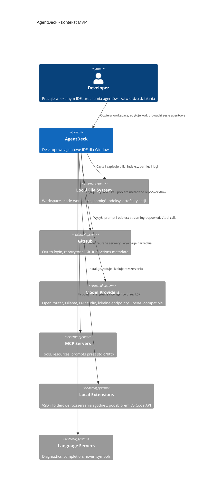

# AgentDeck - Plan Implementacji

## Szczegóły Zadania

| Pole | Wartość |
|---|---|
| Tytuł | AgentDeck - pełny MVP agentowego IDE na bazie Electron, React, Monaco i Node/TypeScript |
| Opis | Przygotować pełny plan utworzenia aplikacji AgentDeck zgodnie z aktualnym research: desktopowe IDE agentowe inspirowane VS Code i Claude Code, bez forka Code - OSS, z obsługą `.code-workspace`, Monaco, MCP, lokalnej pamięci i retrievalu, wielozakładkowego chatu agentowego, podzbioru kompatybilności rozszerzeń VS Code, GitHub login oraz domyślnego ciemnego motywu. |
| Priorytet | Wysoki |
| Powiązany Research | [agentowe-ide-na-bazie-vscode.research.md](agentowe-ide-na-bazie-vscode.research.md), [agentowe-ide-na-bazie-vscode.solution-research.md](agentowe-ide-na-bazie-vscode.solution-research.md) |
| Numer Issue | 1 |
| Link do Issue | https://github.com/Finfinder/AgentDeck/issues/1 |

## Proponowane Rozwiązanie

AgentDeck powinien powstać jako własna aplikacja desktopowa Windows Desktop zbudowana na stosie `Electron + React + Monaco + Node/TypeScript services + SQLite/sqlite-vec`. Produkt nie powinien startować od forka Code - OSS. MVP ma odtworzyć najważniejsze doświadczenie pracy z VS Code na poziomie workbencha i kontraktów rozszerzalności, ale implementować tylko świadomie wybrany podzbiór API i ekranów potrzebnych do agentowego workflow.

Decyzja modularyzacyjna: `modularization: include-in-plan`. Uzasadnienie: `AgentDeck` jest greenfieldem, a model domenowy sesji agentowej i granice modułów są częścią produktu MVP. Nie ma istniejącego `domain.md`, którego można użyć, a osobne uruchamianie `/modularise` przed implementacją opóźniłoby pierwszy pionowy slice bez zmniejszenia ryzyka. Wpływ na zakres: Faza 1 zawiera utworzenie kontraktu domenowego i testów architektonicznych zależności, a kolejne fazy implementują moduły zgodnie z tym kontraktem.

Główny pion MVP ma przejść ścieżkę: otwarcie `.code-workspace` -> Explorer -> Monaco editor -> chat tab -> wywołanie modelu -> kontrolowane narzędzie plikowe -> patch -> diff -> event log. Dopiero po tym slice kolejne fazy rozszerzają system o GitHub login, pamięć, retrieval, MCP, extension host, VSIX, terminal, debug, testing API i kompatybilność docelowych rozszerzeń.



```mermaid
C4Container
    title AgentDeck - kontenery MVP
    Person(dev, "Developer", "Użytkownik IDE")
    Container(shell, "Workbench Shell", "Electron main + React renderer", "Okno aplikacji, routing UI, activity bar, sidebar, editor area, panel, status bar")
    Container(workspace, "Workspace Service", "Node/TS", "Parser .code-workspace, file tree, watchers, recent workspaces")
    Container(editor, "Editor Service", "React + Monaco", "Modele dokumentów, tabs, dirty state, split editor")
    Container(runtime, "Agent Runtime", "Node/TS workers", "Sesje, chat tabs, workerzy, tool loop, subagenci, compaction")
    Container(modelGateway, "Model Gateway", "Node/TS", "Adaptery OpenRouter, Ollama, LM Studio i lokalne OpenAI-compatible")
    Container(auth, "Identity Service", "Node/TS", "GitHub OAuth, profil użytkownika, secure token storage")
    Container(permissions, "Permission Broker", "Node/TS", "Deny-first policy, approvals, sensitive paths, audit")
    Container(mcpManager, "MCP Manager", "Node/TS", "mcp.json, stdio/http lifecycle, tools/resources/prompts")
    Container(extensionHost, "Extension Host", "Node/TS isolated process", "package.json parser, activation events, vscode shim")
    Container(indexer, "Code Indexer", "Node/TS worker", "Tree-sitter chunks, embeddings, metadata")
    ContainerDb(store, "Local Store", "SQLite + sqlite-vec + Markdown files", "Event log, index, memory, settings metadata")
    Rel(dev, shell, "Używa")
    Rel(shell, workspace, "IPC")
    Rel(shell, editor, "Renderuje")
    Rel(shell, runtime, "Session commands i event stream")
    Rel(runtime, modelGateway, "LLM requests")
    Rel(runtime, permissions, "Tool approval")
    Rel(runtime, mcpManager, "MCP tool routing")
    Rel(runtime, indexer, "Retrieval queries")
    Rel(workspace, store, "Recent, file metadata")
    Rel(runtime, store, "Events, patches, memory")
    Rel(extensionHost, shell, "Views, commands, diagnostics")
    Rel(auth, github, "OAuth i API")
```

Docelowy model domenowy MVP:

| Obiekt domenowy | Odpowiedzialność | Właściciel modułu |
|---|---|---|
| `ChatTab` | Zakładka rozmowy z aktywnym agentem, modelem, historią i widokiem tool usage | Agent Runtime / Workbench UI |
| `AgentDefinition` | Kontrakt agenta: nazwa, instrukcje, dozwolone narzędzia, model domyślny, handoffs | Agent Runtime / Customizations Registry |
| `Worker` | Izolowane wykonanie zadania lub subagenta z własnym kontekstem i permission scope | Agent Runtime |
| `AgentTask` | Jednostka pracy widoczna w UI: status, wejście, wynik, narzędzia, powiązane patche | Agent Runtime |
| `PatchSet` | Zestaw operacji tekstowych z metadanymi, bazową wersją pliku i ryzykiem zmiany | Conflict Broker |
| `Conflict` | Kolizja patcha, zmiana wysokiego ryzyka albo naruszenie policy wymagające decyzji | Conflict Broker / Permission Broker |
| `MemoryEntry` | Audytowalny wpis pamięci z zakresem user/workspace/repo i źródłem prawdy w Markdown | Memory Service |
| `RetrievalQuery` | Zapytanie semantyczne do indeksu kodu/pamięci z filtrami scope, języka i świeżości | Code Indexer / Memory Service |
| `ExtensionManifest` | Znormalizowany manifest rozszerzenia i jego contribution points | Extension Host / VSIX Installer |
| `McpServerProfile` | Konfiguracja i stan zaufania serwera MCP dla user/workspace scope | MCP Manager |
| `IdentitySession` | Profil GitHub, tokeny w secure storage i status autoryzacji | Identity Service |

## Uzasadnienie Rozwiązania

### Wybrane podejście

Wybrane podejście to własna aplikacja Electron z rendererem React, edytorem Monaco oraz lokalnymi usługami Node/TypeScript. Research z 2026-05-30 wskazuje ten wariant jako najlepszy kompromis między tempem MVP, kontrolą nad agentowym UX i możliwością uruchamiania lokalnych narzędzi, MCP, LSP, modeli lokalnych oraz przyszłego podzbioru rozszerzeń.

To podejście zachowuje mentalny model VS Code: multi-root workspace, explorer, editor tabs, panel, problems, terminal i extension-like views. Jednocześnie nie obiecuje pełnej zgodności z VS Code ani Microsoft Marketplace. Zamiast tego MVP skupia się na kontrolowanym podzbiorze API, który wystarcza do uruchomienia priorytetowych integracji: SonarQube for IDE, GitHub Actions, Playwright Test, PowerShell, Context7 MCP i PDF Utilities MCP.

### Porównanie z alternatywami

| Kryterium | Electron + React + Monaco + Node/TS | Tauri + Monaco + Rust core | Web-first + remote backend |
|---|---|---|---|
| Dopasowanie do lokalnego IDE | Wysokie | Wysokie, ale droższe integracyjnie | Niskie dla lokalnych plików i narzędzi |
| Tempo MVP | Najwyższe | Średnie | Średnie dla UI, niskie dla local-first |
| Integracja MCP/LSP/terminal | Naturalna w Node/Electron | Wymaga sidecarów lub bridge | Trudna dla stdio i local tools |
| Kompatybilność z ekosystemem JS | Wysoka | Średnia | Wysoka po stronie web, słaba lokalnie |
| Bezpieczeństwo bazowe | Wymaga twardego IPC i permissions | Lepszy baseline capability model | Zależne od backendu i danych w chmurze |
| Koszt utrzymania | Kontrolowalny | Wyższy przez miks Rust/TS | Wyższy operacyjnie |
| Ocena ogólna | Wybrane | Kandydat MVP+ | Odrzucone dla MVP desktop |

### Dlaczego odrzucono alternatywy

- Tauri + Monaco + Rust core odrzucono dla MVP, ponieważ zwiększa koszt integracji z Node-first ekosystemem rozszerzeń, MCP stdio, LSP i lokalnymi narzędziami. Może wrócić jako kierunek optymalizacji w późniejszej wersji.
- Web-first + remote backend odrzucono, ponieważ słabo pasuje do Windows Desktop MVP, lokalnego filesystemu, modeli Ollama/LM Studio i narzędzi stdio. To może być osobny tryb cloud/headless po walidacji produktu lokalnego.
- Fork Code - OSS odrzucono dla aktualnego planu, ponieważ nowszy research rekomenduje zbudowanie kontrolowanego podzbioru doświadczenia VS Code bez kosztu utrzymywania pełnego upstream forka.

## Rejestry Decyzji Architektonicznych (ADR)

### ADR-001: Shell desktopowy

| Pole | Wartość |
|---|---|
| Status | Proponowany |
| Data | 2026-05-30 |
| Kontekst | MVP ma działać lokalnie na Windows Desktop, z UI podobnym do VS Code i dostępem do plików, terminala, procesów Node oraz lokalnych modeli. |

**Rozważane opcje**:
1. Electron + React + Monaco + Node/TS.
2. Tauri + Monaco + Rust core.
3. Web-first shell z remote backendem.

**Decyzja**: Electron + React + Monaco + Node/TS.

**Uzasadnienie**: Electron daje najkrótszą ścieżkę do desktopowego workbencha, IPC, lokalnych usług Node, MCP stdio, terminala i integracji LSP bez dodatkowego sidecara.

**Konsekwencje**:
- Szybszy start MVP i jeden dominujący język implementacji.
- Wymaga rygorystycznego IPC, sandboxingu renderera i kontroli użycia Node capabilities.

### ADR-002: IPC i granice procesów

| Pole | Wartość |
|---|---|
| Status | Proponowany |
| Data | 2026-05-30 |
| Kontekst | Renderer React nie może mieć bezpośredniego dostępu do filesystemu, tokenów, terminala ani procesów narzędziowych. |

**Rozważane opcje**:
1. Bezpośredni dostęp renderera do Node APIs.
2. Wersjonowane IPC przez preload z allowlistą komend.
3. HTTP localhost API między procesami.

**Decyzja**: Wersjonowane IPC przez preload z allowlistą komend i walidacją payloadów.

**Uzasadnienie**: Pozwala utrzymać małą powierzchnię ataku, jawne kontrakty typów i testowalną granicę między UI a usługami.

**Konsekwencje**:
- Renderer pozostaje prostszy i bezpieczniejszy.
- Każda nowa capability wymaga jawnego kontraktu IPC i testów walidacji.

### ADR-003: Runtime agentów

| Pole | Wartość |
|---|---|
| Status | Proponowany |
| Data | 2026-05-30 |
| Kontekst | Chat tabs, subagenci, tool calls i długie zadania nie mogą blokować UI ani współdzielić niekontrolowanego kontekstu. |

**Rozważane opcje**:
1. Jeden współdzielony agent loop w main process.
2. Izolowani workerzy zarządzani przez Session Broker.
3. Zdalna orkiestracja serwerowa.

**Decyzja**: Izolowani workerzy lokalni z Session Brokerem.

**Uzasadnienie**: Worker per sesja/subagent ogranicza kolizje kontekstu, ułatwia cancellation i pozwala przypisać permission scope do konkretnego zadania.

**Konsekwencje**:
- Lepsza odporność i czytelniejszy event log.
- Wymaga brokerowania patchy i konfliktów między sesjami.

### ADR-004: GitHub login

| Pole | Wartość |
|---|---|
| Status | Proponowany |
| Data | 2026-05-30 |
| Kontekst | Użytkownik wymaga możliwości logowania przez GitHub, a aplikacja desktopowa nie powinna przechowywać tokenów w rendererze ani w plikach workspace. |

**Rozważane opcje**:
1. OAuth Device Authorization Flow.
2. System browser + loopback callback.
3. Wklejanie tokena PAT w ustawieniach.

**Decyzja**: System browser + loopback callback jako domyślny flow, Device Authorization Flow jako fallback.

**Uzasadnienie**: Flow przez system browser jest ergonomiczny dla desktopu, a fallback device flow działa w środowiskach z ograniczonym callbackiem. Tokeny trafiają wyłącznie do secure storage na poziomie użytkownika.

**Konsekwencje**:
- Użytkownik dostaje bezpieczny i znajomy login.
- Trzeba obsłużyć callback port, CSRF `state`, minimalne scopes, revocation i odświeżanie statusu sesji.

### ADR-005: Pamięć i retrieval

| Pole | Wartość |
|---|---|
| Status | Proponowany |
| Data | 2026-05-30 |
| Kontekst | System ma mieć audytowalną pamięć podobną do Claude Code oraz semantyczny retrieval dla kodu i plików AI. |

**Rozważane opcje**:
1. Tylko pliki Markdown.
2. Pliki Markdown jako źródło prawdy + SQLite/sqlite-vec jako indeks.
3. Qdrant lub LanceDB jako główny store.

**Decyzja**: Pliki Markdown jako źródło prawdy + SQLite/sqlite-vec jako lokalny indeks MVP.

**Uzasadnienie**: Zapewnia transparentność i zero-config, a jednocześnie pozwala budować semantyczne wyszukiwanie bez osobnego serwera.

**Konsekwencje**:
- Łatwy backup i review pamięci.
- Trzeba wersjonować schemat indeksu i obsłużyć rebuild po zmianie modelu embeddings.

### ADR-006: Format event logu i patchy

| Pole | Wartość |
|---|---|
| Status | Proponowany |
| Data | 2026-05-30 |
| Kontekst | Sesje agentowe muszą być odtwarzalne, audytowalne i możliwe do odzyskania po awarii. |

**Rozważane opcje**:
1. Tylko historia chatu w JSON.
2. Append-only event log w SQLite + eksport JSONL.
3. Pliki diff bez pełnego event streamu.

**Decyzja**: Append-only event log w SQLite, z możliwością eksportu JSONL i patch setami jako osobnymi rekordami.

**Uzasadnienie**: Event log pozwala śledzić decyzje permission, tool calls, odpowiedzi modelu, patche i konflikty bez mieszania ich z samym tekstem rozmowy.

**Konsekwencje**:
- Lepsza diagnostyka i recovery.
- Trzeba dbać o retencję, redakcję sekretów i kompatybilność migracji schematu.

### ADR-007: Rozszerzenia i kompatybilność VS Code

| Pole | Wartość |
|---|---|
| Status | Proponowany |
| Data | 2026-05-30 |
| Kontekst | MVP ma obsługiwać praktyczny podzbiór rozszerzeń bez implementowania całego `vscode` module i Marketplace. |

**Rozważane opcje**:
1. Własny format pluginów.
2. Podzbiór zgodności z manifestem VS Code, lokalny folder i VSIX.
3. Pełna zgodność z VS Code API.

**Decyzja**: Podzbiór zgodności z manifestem VS Code, lokalnym folderem i VSIX.

**Uzasadnienie**: To minimalizuje lock-in i pozwala walidować priorytetowe rozszerzenia bez nierealnego zakresu pełnego VS Code.

**Konsekwencje**:
- Możliwe uruchomienie kontrolowanego zestawu rozszerzeń.
- Każde rozszerzenie wymaga compatibility matrix i jasnych ograniczeń.

### ADR-008: Domyślny motyw

| Pole | Wartość |
|---|---|
| Status | Proponowany |
| Data | 2026-05-30 |
| Kontekst | Użytkownik wymaga, aby aplikacja startowała od ciemnego motywu, nie jasnego. |

**Rozważane opcje**:
1. Dark theme jako domyślny i light theme jako opcja późniejsza.
2. Light theme jako domyślny z przełącznikiem.
3. Automatyczne dopasowanie do systemu od MVP.

**Decyzja**: Dark theme jako domyślny motyw MVP z tokenami przygotowanymi pod późniejsze motywy.

**Uzasadnienie**: Spełnia wymaganie użytkownika i pasuje do narzędzia developerskiego, ale nie blokuje późniejszego themingu.

**Konsekwencje**:
- Pierwszy ekran i cały workbench mają spójny dark baseline.
- Trzeba zaplanować kontrast WCAG 2.1 AA i nie hardcodować kolorów poza tokenami.

### ADR-009: Sandboxing i izolacja rozszerzeń

| Pole | Wartość |
|---|---|
| Status | Proponowany |
| Data | 2026-05-30 |
| Kontekst | Renderer, workerzy agentowi, MCP servers i rozszerzenia wykonują kod lub przetwarzają dane z workspace, więc MVP musi ograniczać capability i przepływ danych między procesami. |

**Rozważane opcje**:
1. Jeden proces z logicznym podziałem modułów.
2. Izolowane procesy dla renderera, Extension Host, Agent Runtime i workerów narzędziowych.
3. Pełny sandbox systemowy dla każdej operacji.

**Decyzja**: Izolowane procesy z minimalnymi capability, deny-first Permission Brokerem i kontrolowanym IPC; pełny sandbox systemowy pozostaje ograniczeniem MVP.

**Uzasadnienie**: Ten model daje realne ograniczenie ryzyka bez blokowania pierwszego pionowego slice'a lokalnego IDE na Windows. Pozwala osobno restartować Extension Host, workerów agentowych i MCP lifecycle oraz jasno powiązać capability z decyzją użytkownika.

**Konsekwencje**:
- Awaria rozszerzenia albo workera nie powinna zatrzymać całego workbencha.
- Każda capability rozszerzeń, MCP i narzędzi agentowych musi mieć jawny kontrakt, timeout, cancellation oraz wpis audytu.

### ADR-010: Schemat indeksu i danych lokalnych

| Pole | Wartość |
|---|---|
| Status | Proponowany |
| Data | 2026-05-30 |
| Kontekst | Event log, memory entries, code chunks, embeddings, retrieval queries i patche wymagają spójnego lokalnego modelu danych z migracjami. |

**Rozważane opcje**:
1. Niezależne pliki JSON/JSONL dla każdego modułu.
2. SQLite jako metadane i event store, `sqlite-vec` jako indeks wektorowy, Markdown jako źródło prawdy pamięci.
3. Zewnętrzna baza wektorowa jako obowiązkowa zależność MVP.

**Decyzja**: SQLite z wersjonowanymi migracjami dla sesji, eventów, patchy, zadań, indeksu i metadanych oraz `sqlite-vec` dla embeddings; Markdown pozostaje źródłem prawdy dla pamięci.

**Uzasadnienie**: Lokalny schemat zmniejsza liczbę zależności, upraszcza backup, pozwala testować migracje i daje wystarczającą wydajność dla Windows Desktop MVP.

**Konsekwencje**:
- Każda zmiana schematu wymaga migracji, testu na pustej i istniejącej bazie oraz strategii rebuild indeksu.
- Retrieval musi zapisywać wersję modelu embeddings, wymiar wektora, checksum źródła i timestamp indeksowania.

## Analiza Aktualnej Implementacji

### Już Zaimplementowane

Lista istniejących komponentów, funkcji i narzędzi, które zostaną ponownie użyte:

- Research zadania - `AI_Instruction/.github/Issue/agentowe-ide-na-bazie-vscode.research.md` - zawiera wymagania strategiczne, kontekst biznesowy, źródła i wcześniejsze decyzje produktu.
- Analiza rozwiązań - `AI_Instruction/.github/Issue/agentowe-ide-na-bazie-vscode.solution-research.md` - zawiera aktualną rekomendację `Electron + React + Monaco + Node/TS + SQLite/sqlite-vec`, kontrakt MVP, podzbiór VS Code API i ADR-y bazowe.
- Prompt planowania - `AI_Instruction/.github/prompts/plan.prompt.md` - definiuje format i wymagania dla niniejszego planu.
- Artefakty agentów - `AI_Instruction/.github/agents/` - dostarczają realne przykłady `.agent.md` do użycia jako fixtures Customizations Registry.
- Artefakty promptów - `AI_Instruction/.github/prompts/` - dostarczają przykłady `.prompt.md` do wykrywania, walidacji i uruchamiania workflow.
- Artefakty skilli - `AI_Instruction/.github/skills/**/SKILL.md` - dostarczają przykłady progressive disclosure dla Skill Registry.
- Instrukcje repozytoryjne - `AI_Instruction/.github/instructions/ai-instruction.instructions.md` - definiują konwencje artefaktów Copilota i bezpieczeństwa treści.
- Workspace multi-root - `AI_Instruction/AI_Instruction.code-workspace` - zawiera przykład lokalnego multi-root workspace i obecnie odwołuje się także do pustego folderu `AgentDeck`.

### Do Modyfikacji

Lista istniejącego kodu, który wymaga zmian lub rozszerzeń:

- Plan implementacji - `AI_Instruction/.github/Issue/agentowe-ide-na-bazie-vscode.plan.md` - wymaga zastąpienia starszej ścieżki opartej o fork Code - OSS planem zgodnym z aktualnym research.
- Analiza rozwiązań - `AI_Instruction/.github/Issue/agentowe-ide-na-bazie-vscode.solution-research.md` - jest wejściem do planu i nie wymaga zmian w tym zadaniu; należy ją traktować jako źródło prawdy dla decyzji architektonicznych.
- Workspace - `AI_Instruction/AI_Instruction.code-workspace` - zawiera folder `AgentDeck`; implementacja MVP powinna użyć tej lokalizacji, ale sama konfiguracja workspace nie wymaga dalszej zmiany w ramach planu.

### Do Utworzenia

Lista nowych komponentów, funkcji i narzędzi, które trzeba zbudować od podstaw:

- Projekt `AgentDeck` w pustym folderze workspace z aplikacją Electron, rendererem React, Monaco i usługami Node/TypeScript.
- `domain.md` lub równoważny kontrakt domenowy opisujący `ChatTab`, `AgentDefinition`, `Worker`, `AgentTask`, `PatchSet`, `Conflict`, `MemoryEntry`, `RetrievalQuery`, `McpServerProfile`, `ExtensionManifest` i `IdentitySession`.
- Workbench Shell z domyślnym ciemnym motywem, activity bar, sidebar, editor area, panel dolny i status bar.
- Workspace Service z parserem `.code-workspace`, file tree, watcherami i recent workspaces.
- Editor Service oparty o Monaco: tabs, dirty state, split editor i podstawowe syntax highlighting.
- Identity Service z GitHub OAuth, secure token storage i profilem użytkownika.
- Model Gateway z adapterami OpenRouter, Ollama, LM Studio i generic OpenAI-compatible local endpoint.
- Agent Runtime z chat tabs, workerami, subagentami, event logiem, tool loop i context compaction.
- Permission Broker i Conflict Broker z deny-first policy, approvals, patch model, conflict handling i audit log.
- Memory Service i Code Indexer z Markdown jako źródłem prawdy oraz SQLite/sqlite-vec jako indeksem.
- MCP Manager z obsługą `mcp.json`, stdio/http, trust, lifecycle, tools/resources/prompts i logów.
- Extension Host compatibility layer, VSIX Installer i minimalny `vscode` shim dla priorytetowych rozszerzeń.
- Terminal, Problems, Output, Test Explorer, Debug i LSP bridge w minimalnym zakresie MVP.
- Automatyczne testy jednostkowe, integracyjne, E2E, architektoniczne, a11y, security i performance smoke.

## Otwarte Pytania

| # | Pytanie | Odpowiedź | Status |
|---|----------|--------|--------|
| 1 | Czy start MVP obejmuje tylko Windows Desktop? | Tak, zgodnie z research MVP startuje od Windows Desktop. | Rozwiązane |
| 2 | Czy bazą implementacji jest fork Code - OSS? | Nie, aktualny research wskazuje własną aplikację Electron + React + Monaco bez forka Code - OSS. | Rozwiązane |
| 3 | Czy logowanie GitHub jest częścią MVP? | Tak, wymaganie zostało dodane przez użytkownika; plan zakłada GitHub OAuth przez system browser + loopback callback i fallback device flow. | Rozwiązane |
| 4 | Jaki motyw ma być domyślny? | Ciemny motyw jest domyślnym baseline UI MVP. | Rozwiązane |
| 5 | Czy pełna zgodność z VS Code API i Marketplace jest wymagana? | Nie, MVP wspiera tylko podzbiór API potrzebny priorytetowym rozszerzeniom oraz VSIX/load from folder. | Rozwiązane |
| 6 | Czy `bge-m3` ma być wymaganym lokalnym modelem embeddings w MVP? | Założenie planu: `bge-m3` jest domyślnym modelem docelowym, ale implementacja musi mieć adapter pozwalający zastąpić provider embeddings bez przebudowy indeksu aplikacji. | Rozwiązane |
| 7 | Czy auth GitHub ma od razu wykonywać operacje mutujące na repozytoriach? | Nie, MVP używa loginu do profilu i bezpiecznej podstawy integracji; mutujące operacje GitHub pozostają poza zakresem. | Rozwiązane |

## Plan Implementacji

Rekomendowany routing wykonania: fazy UI kierować do `/implement-ui`, usługi Node/TypeScript do `/implement-backend`, testy E2E do `/implement-e2e`, a przyszłe pipeline'y dystrybucji poza MVP do `/implement-pipeline`. Fazy opisują pełny MVP, ale pierwszy realny release powinien walidować pionowy slice z Faz 1-5 przed rozszerzaniem kompatybilności rozszerzeń.

### Faza 1: Fundament projektu i kontrakt domenowy

#### Zadanie 1.1 - [CREATE] Szkielet aplikacji Electron/React/TypeScript
**Opis**: Utworzyć bazową strukturę projektu `AgentDeck` jako aplikację desktopową z Electron main process, React renderer, TypeScript strict, test runnerem i wydzielonymi usługami Node.

**Definicja Ukończenia (Definition of Done)**:
- [x] Projekt zawiera jawne katalogi dla `apps/desktop`, `packages/workbench`, `packages/services`, `packages/agent-runtime`, `packages/shared` albo równoważny podział z opisanym public API.
- [x] TypeScript działa w trybie `strict`, a konfiguracja rozdziela runtime main, renderer, preload, tests i build.
- [x] Renderer nie ma bezpośredniego dostępu do Node APIs poza wersjonowanym preload IPC.
- [x] Aplikacja uruchamia puste okno z ciemnym tłem i kontrolowanym błędem startowym, jeśli wymagane usługi nie wstaną.
- [x] Skrypty lokalne obejmują co najmniej dev start, typecheck, lint i test unit bez uruchamiania zewnętrznych usług.

#### Zadanie 1.2 - [CREATE] Kontrakt domenowy i granice modułów
**Opis**: Udokumentować model domenowy i granice modułów MVP, aby kolejne fazy nie importowały implementacji przez przypadkowe ścieżki.

**Definicja Ukończenia (Definition of Done)**:
- [x] Powstaje `docs/domain.md` z odpowiedzialnościami modułów i obiektami: `ChatTab`, `AgentDefinition`, `Worker`, `AgentTask`, `PatchSet`, `Conflict`, `MemoryEntry`, `RetrievalQuery`, `McpServerProfile`, `ExtensionManifest`, `IdentitySession`.
- [x] Dokument definiuje właściciela danych, publiczne kontrakty i dozwolony kierunek zależności dla każdego modułu.
- [x] W projekcie istnieje test architektoniczny lub reguły dependency-cruiser blokujące cykle i importy z katalogów `internal`.
- [x] Decyzje z ADR-001..ADR-008 mają odpowiedniki w `docs/adr/` albo w jednym indeksie ADR.

### Faza 2: Workbench Shell i domyślny ciemny motyw

#### Zadanie 2.1 - [CREATE] Layout workbencha
**Opis**: Zbudować główny układ UI inspirowany VS Code: activity bar, side bar, editor area, panel dolny i status bar, bez landing page i bez marketingowego ekranu startowego.

**Definicja Ukończenia (Definition of Done)**:
- [x] Pierwszy ekran aplikacji jest funkcjonalnym workbenchem z opcją otwarcia folderu lub `.code-workspace`.
- [x] Layout ma stabilne regiony i nie zmienia wymiarów przy hover, loading, pustych stanach ani błędach.
- [x] Regiony UI mają semantyczne role i są osiągalne klawiaturą.
- [x] Workbench zachowuje czytelność na typowych viewportach desktop Windows bez nachodzenia tekstu i kontrolek.

#### Zadanie 2.2 - [CREATE] System tokenów i dark theme baseline
**Opis**: Wprowadzić ciemny motyw jako domyślny z tokenami kolorów, spacingu, focus ring, statusów i paneli.

**Definicja Ukończenia (Definition of Done)**:
- [x] Aplikacja startuje zawsze w ciemnym motywie, jeśli użytkownik nie ustawi inaczej.
- [x] Kolory są zdefiniowane przez tokeny/CSS variables, a nie rozproszone literały w komponentach.
- [x] Kontrast tekstu, ikon, statusów, focus ring i disabled state spełnia WCAG 2.1 AA dla krytycznych elementów.
- [x] Theme state jest przechowywany w Settings Service i nie powoduje flash jasnego motywu przy starcie.

### Faza 3: Workspace Service, Explorer i Search

#### Zadanie 3.1 - [CREATE] Parser `.code-workspace` i model workspace
**Opis**: Zaimplementować otwieranie folderów i plików `.code-workspace`, obsługę ścieżek względnych, multi-root folders, workspace settings i recent workspaces.

**Definicja Ukończenia (Definition of Done)**:
- [ ] Workspace Service parsuje `.code-workspace` z polami `folders`, `settings` i `extensions` oraz obsługuje komentarze JSONC.
- [ ] Ścieżki względne są rozwiązywane względem lokalizacji pliku workspace.
- [ ] Niepoprawny plik workspace daje kontrolowany błąd i nie zamyka aplikacji.
- [ ] Recent workspaces są zapisywane lokalnie bez ujawniania danych wrażliwych w logach.

#### Zadanie 3.2 - [CREATE] Explorer i podstawowy Search
**Opis**: Dodać drzewo plików, odświeżanie, reveal in explorer, basic context menu i wyszukiwanie tekstowe z glob include/exclude.

**Definicja Ukończenia (Definition of Done)**:
- [ ] Explorer pokazuje wszystkie foldery multi-root i reaguje na zmiany filesystem przez watcher.
- [ ] Klik w plik otwiera go w Editor Service.
- [ ] Search zwraca wyniki z nazwą pliku, linią, fragmentem tekstu i przejściem do wyniku.
- [ ] Sensitive paths są oznaczane dla Permission Broker i nie trafiają automatycznie do kontekstu modelu.

### Faza 4: Editor Service z Monaco

#### Zadanie 4.1 - [CREATE] Tabs, dirty state i zapis plików
**Opis**: Zintegrować Monaco jako edytor tekstowy z kartami, stanem dirty, zapisem, reload conflict i podstawowymi skrótami.

**Definicja Ukończenia (Definition of Done)**:
- [ ] Otwarcie pliku z Explorer lub Search tworzy kartę edytora z poprawną nazwą i ścieżką.
- [ ] Edycja pliku ustawia dirty state, a zapis przechodzi przez Workspace Service, nie przez renderer bezpośrednio.
- [ ] Konflikt zmiany pliku na dysku jest wykrywany i wymaga decyzji użytkownika.
- [ ] Editor Service obsługuje split view minimum w dwóch kolumnach.

#### Zadanie 4.2 - [CREATE] Podstawowe language features
**Opis**: Zapewnić syntax highlighting, podstawowe mapowanie języków i integrację z Problems/Diagnostics jako przygotowanie pod LSP i rozszerzenia.

**Definicja Ukończenia (Definition of Done)**:
- [ ] Najważniejsze typy plików projektu TS/JS/JSON/YAML/Markdown/PowerShell mają poprawne rozpoznanie języka.
- [ ] Problems panel potrafi nawigować do pliku i pozycji w Monaco.
- [ ] Editor API udostępnia minimalne operacje `open`, `reveal`, `applyWorkspaceEdit`, `showDiff` przez kontrolowany kontrakt.

### Faza 5: Identity Service i GitHub login

#### Zadanie 5.1 - [CREATE] GitHub OAuth dla desktopu
**Opis**: Dodać logowanie GitHub przez system browser + loopback callback oraz fallback Device Authorization Flow.

**Definicja Ukończenia (Definition of Done)**:
- [ ] Login uruchamia systemową przeglądarkę i waliduje `state` oraz callback.
- [ ] Fallback device flow działa bez lokalnego callback portu.
- [ ] Tokeny są przechowywane wyłącznie w OS secure storage albo równoważnej abstrakcji, nigdy w renderer localStorage ani plikach workspace.
- [ ] Scope GitHub jest minimalny dla profilu i odczytu metadanych MVP.
- [ ] Logout usuwa tokeny z secure storage i czyści stan sesji UI.

#### Zadanie 5.2 - [CREATE] Profil użytkownika i status integracji
**Opis**: Pokazać stan zalogowania, avatar/login, status tokena i kontrolowane błędy autoryzacji w status bar oraz Settings.

**Definicja Ukończenia (Definition of Done)**:
- [ ] Status bar pokazuje, czy użytkownik jest zalogowany do GitHub.
- [ ] Błędy auth nie ujawniają tokenów, kodów callback ani pełnych URL z parametrami wrażliwymi.
- [ ] Settings Service potrafi odczytać status auth bez dostępu renderera do tokena.
- [ ] Testy obejmują success, denied consent, invalid state, port busy i token revocation.

### Faza 6: Model Gateway i pierwszy pionowy slice chatu

#### Zadanie 6.1 - [CREATE] Kontrakt providerów modeli
**Opis**: Utworzyć wspólny kontrakt providerów dla OpenRouter, Ollama, LM Studio i generic OpenAI-compatible endpoint.

**Definicja Ukończenia (Definition of Done)**:
- [ ] Provider contract opisuje model list, health check, streaming, tool calling support, context window i embeddings support.
- [ ] Wszystkie dane zewnętrzne providerów są walidowane jako `unknown` na granicy adaptera.
- [ ] Każde wywołanie ma timeout, cancellation i znormalizowany błąd dla UI.
- [ ] API keys nie są logowane ani przekazywane do renderer process.

#### Zadanie 6.2 - [CREATE] Chat tab z wywołaniem modelu
**Opis**: Zbudować minimalny chat tab, który wysyła prompt do wybranego modelu, odbiera streaming i zapisuje eventy sesji.

**Definicja Ukończenia (Definition of Done)**:
- [ ] Użytkownik może utworzyć chat tab, wybrać model i wysłać wiadomość.
- [ ] Streaming odpowiedzi jest widoczny bez blokowania UI.
- [ ] Stop/cancel przerywa request modelu i zapisuje zdarzenie anulowania.
- [ ] Event log zapisuje user message, model request metadata, streaming chunks i final response bez sekretów.

### Faza 7: Tool Router, file tool, patch model i Permission Broker

#### Zadanie 7.1 - [CREATE] Narzędzia plikowe pierwszego slice'a
**Opis**: Dodać read file, search, propose patch i apply patch jako pierwsze narzędzia agenta, z deny-first approval dla operacji mutujących.

**Definicja Ukończenia (Definition of Done)**:
- [ ] Read-only narzędzia mają jawne limity rozmiaru i scope workspace.
- [ ] Mutujące narzędzie `applyPatch` wymaga approval, chyba że pasuje do jawnej allow rule.
- [ ] PatchSet zawiera bazowy hash/wersję pliku, listę operacji, autora sesji i klasyfikację ryzyka.
- [ ] Sensitive files nie mogą zostać zmienione bez osobnego high-risk approval.

#### Zadanie 7.2 - [CREATE] Conflict Broker i diff review
**Opis**: Wykrywać konflikty patchy, bezpiecznie scalać niekolidujące zmiany i kierować konflikt/delete/rename/binary/high-risk do review gate.

**Definicja Ukończenia (Definition of Done)**:
- [ ] Patch niezgodny z aktualną wersją pliku tworzy `Conflict`, a nie nadpisuje pliku.
- [ ] Niepodatne na konflikt patche tekstowe są stosowane atomowo.
- [ ] Diff jest widoczny w UI i powiązany z event logiem.
- [ ] Delete, rename, binary i zmiany wielu plików wysokiego ryzyka wymagają dodatkowej decyzji.

### Faza 8: Agent Runtime, workerzy i subagenci

#### Zadanie 8.1 - [CREATE] Session Broker i worker lifecycle
**Opis**: Rozszerzyć runtime o zarządzanie sesjami, workerami, retry, cancellation, statusami i izolowanym kontekstem.

**Definicja Ukończenia (Definition of Done)**:
- [ ] Każdy `ChatTab` ma własną `AgentSession`, model, agenta, event log i permission scope.
- [ ] Worker może zostać zatrzymany bez ubijania całego runtime.
- [ ] Crash workera jest raportowany w UI i pozwala wznowić sesję z event logu.
- [ ] Session Broker nie współdzieli mutowalnego kontekstu między sesjami bez jawnego kontraktu.

#### Zadanie 8.2 - [CREATE] Subagenci i task activity
**Opis**: Dodać możliwość uruchamiania subagentów jako osobnych zadań z ograniczonym kontekstem i podsumowaniem wracającym do sesji nadrzędnej.

**Definicja Ukończenia (Definition of Done)**:
- [ ] Parent session może uruchomić subagenta z nazwą, celem, modelem i ograniczeniem narzędzi.
- [ ] Subagent zwraca podsumowanie i referencje do wyników, nie pełną historię wewnętrzną.
- [ ] Task Activity pokazuje status subagentów, użyte narzędzia i wynik.
- [ ] Permission Broker rozróżnia scope parent session i subagenta.

### Faza 9: Memory Service i Code Indexer

#### Zadanie 9.1 - [CREATE] SQLite/sqlite-vec schema i event store
**Opis**: Zaprojektować lokalny schemat SQLite dla event logu, patchy, sesji, pamięci, embeddings, chunks i migracji.

**Definicja Ukończenia (Definition of Done)**:
- [ ] Schemat ma migracje wersjonowane i testowane na pustej oraz istniejącej bazie.
- [ ] Tabele mają klucze główne, relacje, `created_at`, jawne constraints i indeksy pod główne zapytania.
- [ ] Event log jest append-only z redakcją sekretów przed zapisem.
- [ ] `sqlite-vec` przechowuje embeddings z metadanymi modelu, wymiarem i wersją indeksu.

#### Zadanie 9.2 - [CREATE] File-based memory i retrieval
**Opis**: Utrzymywać pamięć jako pliki Markdown w scope user/workspace/repo oraz indeksować ją semantycznie razem z kodem.

**Definicja Ukończenia (Definition of Done)**:
- [ ] MemoryEntry wskazuje źródłowy plik Markdown, scope, checksum i źródło utworzenia.
- [ ] Agent może proponować zmianę pamięci jako patch wymagający review, nie jako cichy zapis.
- [ ] Tree-sitter chunking działa dla pierwszego zestawu języków: TS/JS/JSON/YAML/Markdown/PowerShell.
- [ ] RetrievalQuery obsługuje filtry scope, języka, folderu i świeżości.
- [ ] Indeks można przebudować deterministycznie po zmianie schematu lub modelu embeddings.

### Faza 10: MCP Manager

#### Zadanie 10.1 - [CREATE] Konfiguracja i lifecycle MCP
**Opis**: Obsłużyć `mcp.json` w user/workspace scope, serwery stdio/http, trust decision, start/stop i logi.

**Definicja Ukończenia (Definition of Done)**:
- [ ] MCP Manager wykrywa konfiguracje user i workspace oraz pokazuje konflikty scope.
- [ ] Serwer MCP ma status: disabled, needs trust, starting, running, failed, stopped.
- [ ] Start serwera workspace wymaga trust użytkownika.
- [ ] Logi MCP redagują sekrety i nie blokują startu aplikacji przy błędnej konfiguracji.

#### Zadanie 10.2 - [CREATE] Tools/resources/prompts w Tool Router
**Opis**: Zintegrować narzędzia MCP z Agent Runtime i Permission Broker.

**Definicja Ukończenia (Definition of Done)**:
- [ ] Tools/resources/prompts są widoczne dopiero dla uruchomionych i zaufanych serwerów.
- [ ] Każde wywołanie MCP tool przechodzi przez Permission Broker.
- [ ] Timeout, invalid response i protocol negotiation failure są kontrolowanymi błędami runtime.
- [ ] Testy integracyjne używają mock MCP server stdio i HTTP.

### Faza 11: Extension Host, VSIX Installer i kompatybilność rozszerzeń

#### Zadanie 11.1 - [CREATE] Parser manifestów i VSIX Installer
**Opis**: Dodać instalację z folderu i VSIX, walidację `package.json`, `engines.vscode`, contribution points i izolację plików rozszerzenia.

**Definicja Ukończenia (Definition of Done)**:
- [ ] Użytkownik może załadować rozszerzenie z folderu i z pliku `.vsix`.
- [ ] Installer waliduje manifest, rozmiar, strukturę archiwum i zgodność wersji API.
- [ ] Niepoprawny VSIX nie zostawia częściowej instalacji.
- [ ] Extension registry pokazuje enable/disable, wersję, activation log i znane ograniczenia.

#### Zadanie 11.2 - [CREATE] Minimalny `vscode` shim i contribution points MVP
**Opis**: Wspierać tylko ten podzbiór API i contribution points, który jest potrzebny priorytetowym rozszerzeniom MVP.

**Definicja Ukończenia (Definition of Done)**:
- [ ] Obsługiwane są `commands`, `configuration`, `views`, `menus`, `languages`, `grammars`, `snippets`, `themes`, `debuggers`, `problemMatchers` w zakresie MVP.
- [ ] Lifecycle extension obejmuje `activate`, `deactivate`, subscriptions, global/workspace state i secrets abstraction.
- [ ] Nieobsługiwane API zwraca kontrolowany błąd kompatybilności zamiast crash runtime.
- [ ] Compatibility matrix obejmuje SonarQube for IDE, GitHub Actions, Playwright Test, PowerShell, Context7 MCP i PDF Utilities MCP.

### Faza 12: Terminal, Problems, Output, Testing, Debug i LSP bridge

#### Zadanie 12.1 - [CREATE] Usługi IDE potrzebne rozszerzeniom
**Opis**: Zaimplementować minimalne usługi Problems, Output, Terminal, Test Explorer, Debug i LSP bridge.

**Definicja Ukończenia (Definition of Done)**:
- [ ] Problems panel pokazuje diagnostyki z LSP i rozszerzeń oraz nawiguje do Monaco.
- [ ] Output channels obsługują logi usług i rozszerzeń z filtrowaniem źródła.
- [ ] Terminal Service uruchamia podstawowe profile Windows i redaguje logi przekazywane do agentów.
- [ ] Testing API obsługuje drzewo testów, run profile, wynik i otwarcie miejsca testu.
- [ ] Debug Service obsługuje minimalny launch/stop i scenariusz PowerShell wymagany dla MVP.

#### Zadanie 12.2 - [CREATE] Walidacja priorytetowych rozszerzeń
**Opis**: Przygotować fixtures i testy smoke dla rozszerzeń wskazanych w research.

**Definicja Ukończenia (Definition of Done)**:
- [ ] SonarQube for IDE potrafi zarejestrować diagnostyki i co najmniej jeden code action/quick fix w środowisku testowym.
- [ ] GitHub Actions wykrywa workflow YAML i pokazuje widok workflow.
- [ ] Playwright Test wykrywa testy i uruchamia pojedynczy test z UI.
- [ ] PowerShell aktywuje język, snippets, terminal i podstawowy debug launch.
- [ ] Context7 MCP i PDF Utilities MCP działają jako natywne profile MCP Managera.

### Faza 13: Settings, secrets, docs i hardening MVP

#### Zadanie 13.1 - [CREATE] Settings Service i bezpieczne sekrety
**Opis**: Uporządkować konfigurację user/workspace, GitHub auth, provider credentials, MCP env i extension settings.

**Definicja Ukończenia (Definition of Done)**:
- [ ] Settings Service rozdziela user scope, workspace scope i wartości sekretne.
- [ ] Sekrety są przechowywane wyłącznie w secure storage albo wymagają jawnej referencji `${env:VAR_NAME}`.
- [ ] UI Settings ma JSON fallback i walidację schematu.
- [ ] Brak lub błąd konfiguracji providerów/MCP nie blokuje otwarcia workspace.

#### Zadanie 13.2 - [CREATE] Dokumentacja MVP i ograniczeń
**Opis**: Udokumentować architekturę, model bezpieczeństwa, uruchamianie, zakres kompatybilności rozszerzeń i ograniczenia MVP.

**Definicja Ukończenia (Definition of Done)**:
- [ ] README opisuje AgentDeck jako własne agentowe IDE inspirowane VS Code, bez sugerowania oficjalnej dystrybucji Microsoft.
- [ ] Dokumentacja opisuje GitHub login, konfigurację providerów, MCP, pamięć, retrieval, Permission Broker i extension compatibility matrix.
- [ ] Dokumentacja security opisuje IPC, deny-first permissions, sensitive paths, secure storage i ograniczenia sandboxingu Windows.
- [ ] Dokumentacja wskazuje, które funkcje są MVP, a które pozostają poza zakresem.

### Faza 14: Automatyczna walidacja i gotowość MVP

#### Zadanie 14.1 - [REUSE] Uruchomienie automatycznych quality gates
**Opis**: Zdefiniować i wykonać zestaw automatycznych walidacji adekwatnych do Electron/React/Node/TypeScript, SQLite i UI.

**Definicja Ukończenia (Definition of Done)**:
- [ ] Typecheck, lint i testy jednostkowe przechodzą dla renderer, main, preload, services i runtime.
- [ ] Testy integracyjne obejmują IPC, Workspace Service, Model Gateway, MCP mock servers, SQLite migrations i Extension Host fixtures.
- [ ] Testy E2E obejmują pion: open `.code-workspace` -> explorer -> Monaco -> chat tab -> call model mock -> file tool -> patch -> diff.
- [ ] Testy a11y obejmują workbench, chat, approvals, settings, MCP Manager i extension view.
- [ ] Testy architektoniczne blokują niedozwolone zależności i importy z `internal`.

#### Zadanie 14.2 - [REUSE] Przygotowanie materiału do review implementacji
**Opis**: Upewnić się, że implementacja ma komplet artefaktów weryfikowalnych przez code review bez ręcznych kroków QA.

**Definicja Ukończenia (Definition of Done)**:
- [ ] Każda faza ma powiązane testy albo jawnie opisane ograniczenie walidacji.
- [ ] ADR-y, `docs/domain.md`, compatibility matrix i security model są aktualne względem kodu.
- [ ] Raport testów wskazuje pokrycie krytycznych komponentów: Permission Broker, Tool Router, Model Gateway, MCP Manager, Memory Service, Extension Host.
- [ ] Ograniczenia nieweryfikowalne automatycznie, takie jak pełny sandbox Windows albo pełna zgodność VS Code API, są opisane jako ograniczenia MVP.

## Aspekty Bezpieczeństwa

- Renderer React nie może mieć bezpośredniego dostępu do filesystemu, terminala, tokenów, procesów ani secret storage; wszystkie capability przechodzą przez wersjonowane IPC i walidację payloadu.
- GitHub tokeny, OpenRouter API keys i inne credentials muszą być przechowywane w secure storage użytkownika albo odczytywane przez referencje env, nigdy w repozytorium ani renderer localStorage.
- Permission Broker działa w modelu deny-first: każde narzędzie mutujące pliki, terminal, Git, MCP albo sieć wymaga approval lub jawnej allow rule.
- Wszystkie dane zewnętrzne z modeli, MCP, URL, terminala, rozszerzeń i plików workspace są traktowane jako niezaufane i nie mogą nadpisywać system policies ani instrukcji bezpieczeństwa.
- Event log, output channels i crash logs muszą redagować sekrety, tokeny, cookies, pełne URL z parametrami auth, ścieżki wrażliwe i payloady credentials.
- MCP servers wymagają trust per workspace/user scope, limitów timeout, logów lifecycle i osobnych decyzji dla tool calls.
- Extension Host uruchamia rozszerzenia w izolowanym procesie z minimalnym `vscode` shim i kontrolowanymi błędami dla nieobsługiwanych API.
- File tools blokują sensitive paths domyślnie: `.env`, klucze prywatne, tokeny, credential stores, storage state, pliki z hasłami i konfiguracje chmurowe.
- GitHub OAuth musi używać `state` przeciw CSRF, minimalnych scopes i obsługi revocation/logout.
- Ciemny motyw nie może pogarszać dostępności: focus ring, kontrast i statusy muszą spełniać WCAG 2.1 AA.

## Strategia Testowania

### Piramida testów

| Typ testu | Zakres | Szacowana liczba | Pokrycie |
|---|---|---|---|
| Jednostkowe | Parser `.code-workspace`, IPC validators, provider adapters, GitHub auth state, Permission Broker, Tool Router, patch model, memory/index schemas | 120-180 | >=80% branch coverage dla logiki security, runtime i parsowania |
| Integracyjne | Electron main/preload IPC, Workspace Service z temp workspace, SQLite migrations, mock Model Gateway, mock MCP stdio/http, Extension Host fixtures | 50-80 | Krytyczne styki między usługami i recovery po błędach |
| E2E | Workbench, Explorer, Monaco, chat, file tool, approvals, diff, GitHub login mock, MCP Manager, VSIX install fixture | 25-45 | Główne ścieżki użytkownika MVP na Windows Desktop |
| Architektoniczne | Granice pakietów, brak cykli, brak importów `internal`, separacja renderer/services/runtime | 8-15 | Reguły zależności zgodne z `docs/domain.md` |
| Security/contract | Redakcja sekretów, sensitive paths, OAuth state, VSIX validation, MCP trust, extension unsupported API | 30-50 | Najważniejsze scenariusze Secure by Design i Zero Trust |

### Podejście do testowania
- [ ] Test-first (TDD) dla Permission Broker, patch/conflict model, GitHub OAuth state validation i parserów manifestów, bo błędy w tych miejscach mają wysoki koszt bezpieczeństwa.
- [ ] Testy regresji dla każdego wykrytego bypassu permission, wycieku sekretu, konfliktu patchy albo crash recovery.
- [ ] Mocki/stuby dla OpenRouter, Ollama, LM Studio, GitHub OAuth/API, MCP servers i rozszerzeń w testach jednostkowych oraz integracyjnych.
- [ ] Fixtures zawierają poprawne i błędne `.code-workspace`, `.prompt.md`, `.agent.md`, `SKILL.md`, `mcp.json`, VSIX, workflow YAML i pliki PowerShell.
- [ ] Testy E2E używają hermetycznego workspace fixture bez prawdziwych sekretów i bez zewnętrznej sieci.

### Testy wydajnościowe

- Budżety wydajności: cold start workbencha do interaktywnego pustego UI <= 3 sekundy na referencyjnej maszynie developerskiej, otwarcie średniego `.code-workspace` <= 2 sekundy po starcie, reakcja UI na streaming <= 100 ms opóźnienia renderowania chunków.
- Narzędzia: Playwright traces dla E2E UI, benchmarki Node dla parserów/indexera, pomiar IPC latency i testy obciążeniowe event logu na fixtures.
- Benchmarkowane ścieżki: start aplikacji, parsowanie `.code-workspace`, render drzewa 10k plików, wyszukiwanie tekstowe, streaming chatu, aplikowanie patcha, zapis event logu, retrieval query.

### Testy dostępności

- [ ] Automatyczne testy axe-core dla Workbench Shell, Settings, GitHub login state, Permission dialogs, MCP Manager, Extension view i Chat.
- [ ] Testy nawigacji klawiaturą obejmują activity bar, explorer tree, tabs, chat input, approval dialog, command palette i settings.
- [ ] Zgodność z WCAG 2.1 AA obejmuje kontrast ciemnego motywu, focus visible, statusy błędów i brak przekazywania informacji wyłącznie kolorem.

### Testy architektoniczne

- Narzędzie: dependency-cruiser albo równoważne reguły importów dla TS/JS.
- Reguły do egzekwowania:
  - [ ] Renderer importuje tylko publiczne API preload/shared, nie Node services bezpośrednio.
  - [ ] Agent Runtime nie importuje komponentów UI.
  - [ ] Provider adapters nie zależą od Workbench UI ani Extension Host.
  - [ ] Permission Broker jest jedyną ścieżką dla mutujących tool calls.
  - [ ] Implementacja jest zgodna z `docs/domain.md` i nie tworzy cykli modułów.

### Testy mutacyjne

- Narzędzie: Stryker dla TypeScript, jeśli integracja nie spowolni krytycznie feedback loop.
- Zakres: Permission Broker, sensitive path matcher, command classifier, patch conflict detector, OAuth state validator.
- Cel mutation score: >=70% dla komponentów security-critical po ustabilizowaniu testów jednostkowych.

## Zapewnienie Jakości

Lista kontrolna kryteriów akceptacji do weryfikacji, że implementacja spełnia zdefiniowane wymagania:

- [ ] Użytkownik otwiera `.code-workspace` i widzi Explorer, Monaco editor, chat, terminal, Problems i status bar w domyślnym ciemnym motywie.
- [ ] Użytkownik loguje się przez GitHub i może się wylogować bez pozostawiania tokenów w plikach workspace lub renderer storage.
- [ ] Chat obsługuje wiele zakładek, wybór modelu/agenta, streaming, stop/cancel i event log.
- [ ] Pierwszy pionowy slice działa: model mock lub realny provider proponuje zmianę pliku, Permission Broker prosi o approval, patch jest zastosowany, diff jest widoczny.
- [ ] Memory Service i Code Indexer działają lokalnie na SQLite/sqlite-vec i nie indeksują sensitive paths.
- [ ] MCP Manager obsługuje `mcp.json`, trust, lifecycle i wywołania tools/resources/prompts przez Permission Broker.
- [ ] Extension Host instaluje VSIX/load from folder i uruchamia priorytetowy podzbiór contribution points.
- [ ] Priorytetowe rozszerzenia mają smoke coverage albo jawnie opisane ograniczenia w compatibility matrix.
- [ ] Automatyczne testy unit, integration, E2E, a11y, security i architecture przechodzą dla zakresu MVP.

### Planowane quality gates z kontraktu `code-reviewing`

| Obszar | Planowana kontrola | Kryterium akceptacji |
| --- | --- | --- |
| Bezpieczeństwo | OWASP Top 10 dla desktop/web renderer, Zero Trust dla danych z modeli/MCP/terminala, secret scanning, SCA npm, walidacja OAuth state i secure storage | Brak twardo wpisanych sekretów, brak tokenów w renderer storage/logach, mutujące tool calls przechodzą przez Permission Broker |
| Architektura i jakość | Clean Architecture, `docs/domain.md`, dependency-cruiser, brak cykli, małe public API pakietów, brak martwego kodu/importów | Granice renderer/services/runtime/extension host/indexer są egzekwowane automatycznie |
| TypeScript/Node | `strict`, `unknown` na granicach zewnętrznych, timeouts, AbortController, brak sync I/O w hot paths, structured errors | Typecheck i lint przechodzą; adaptery zewnętrzne walidują payloady i obsługują cancellation |
| React/UI | A11y queries, stabilny state ownership, brak globalnego store dla lokalnego UI, tokeny CSS, brak raw HTML bez sanitizacji | Krytyczne komponenty UI mają testy interakcji i a11y; dark theme spełnia kontrast |
| Baza danych | Migracje SQLite, constraints, indeksy, wersjonowanie schematu, rebuild indeksu sqlite-vec | Migracje przechodzą na pustej i istniejącej bazie; zapytania krytyczne mają indeksy i testy |
| Reliability | Crash recovery workera, failed provider, failed MCP server, cancellation, invalid workspace, corrupt index | Aplikacja przechodzi do kontrolowanego stanu błędu bez utraty danych workspace |
| Performance | Budżety startu, indeksowania, renderu event logu, streaming UI i retrieval query | Smoke performance nie przekracza budżetów MVP albo odchylenie jest opisane jako ograniczenie |
| Supply chain | Audit zależności npm, walidacja VSIX, brak postinstall risk bez uzasadnienia, compatibility matrix rozszerzeń | Brak high/critical bez planu lub uzasadnienia; niepoprawny VSIX nie instaluje się częściowo |
| Ograniczenia walidacji | SonarQube, pełny sandbox Windows, pełna zgodność VS Code API i realne GitHub API mogą wymagać danych/narzędzi | Ograniczenia są jawnie opisane w dokumentacji MVP i nie są przedstawione jako zrealizowane funkcje |

## Usprawnienia (Poza Zakresem)

Potencjalne usprawnienia zidentyfikowane podczas planowania, które nie są częścią bieżącego zadania:

### Usprawnienie 1: Cross-platform macOS/Linux

- **Opis**: Po stabilizacji Windows Desktop warto rozszerzyć build, testy i secure storage na macOS oraz Linux.
- **Uzasadnienie**: MVP celowo ogranicza platformę do Windows, aby zmniejszyć koszt integracji terminala, filesystemu, OAuth callback i packagingu.
- **Korzyści**: Rozszerzenie platform zwiększy potencjalny zasięg użytkowników bez zmiany architektury domenowej, a automatyczna macierz testów ograniczy ryzyko regresji platformowych.

### Usprawnienie 2: Remote/headless agent workers

- **Opis**: Dodać możliwość uruchamiania workerów agentowych poza lokalnym procesem, na przykład na dedykowanej maszynie lub w środowisku chmurowym.
- **Uzasadnienie**: MVP lokalny lepiej chroni prywatność i szybciej waliduje UX, ale długie zadania mogą później wymagać pracy poza laptopem użytkownika.
- **Korzyści**: Remote workers mogą skrócić czas wykonywania długich zadań i zmniejszyć obciążenie lokalnej maszyny, szczególnie przy równoległych subagentach.

### Usprawnienie 3: Pełniejszy VS Code API compatibility layer

- **Opis**: Rozszerzyć `vscode` shim o kolejne namespace'y, web extensions, notebooks, SCM API, comments API i custom editors.
- **Uzasadnienie**: MVP wspiera tylko podzbiór API potrzebny priorytetowym rozszerzeniom, ponieważ pełna zgodność byłaby osobnym dużym produktem.
- **Korzyści**: Szerszy compatibility layer zwiększy liczbę działających rozszerzeń i obniży koszt migracji użytkowników z VS Code.

### Usprawnienie 4: Organizacyjne policy packs

- **Opis**: Dodać podpisywane zestawy polityk permissions, modeli, MCP i extension allowlist zarządzane centralnie dla zespołów.
- **Uzasadnienie**: MVP skupia się na pojedynczym użytkowniku i lokalnym workspace, a governance zespołowy wymaga dodatkowego modelu dystrybucji i zaufania.
- **Korzyści**: Policy packs zmniejszą czas konfiguracji nowych stanowisk i ograniczą ryzyko nieautoryzowanych narzędzi w zespołach.

### Usprawnienie 5: Cloud embedding uplift

- **Opis**: Dodać opcjonalne embeddings premium, na przykład `text-embedding-3-large`, obok lokalnego/domyslnego `bge-m3`.
- **Uzasadnienie**: MVP powinien działać lokalnie i przewidywalnie kosztowo, ale część zespołów może zaakceptować koszt chmury za lepszą jakość retrievalu.
- **Korzyści**: Opcjonalny uplift może poprawić trafność wyszukiwania semantycznego w dużych repozytoriach i zmniejszyć liczbę nietrafionych odczytów kontekstu.

### Usprawnienie 6: Pełny pipeline dystrybucji i auto-update

- **Opis**: Przygotować podpisywanie instalatorów, kanały update, release notes i automatyczną aktualizację aplikacji.
- **Uzasadnienie**: Plan MVP dotyczy budowy produktu i walidacji funkcjonalnej, a produkcyjna dystrybucja wymaga osobnego procesu release i zaufania binariów.
- **Korzyści**: Auto-update skróci czas dostarczania poprawek bezpieczeństwa i zmniejszy koszt utrzymania wielu wersji u użytkowników.

## Code Review Findings

### Review 2026-06-01 - Faza 2 / Issue 2 — pełna ponowna weryfikacja

| Severity | Ustalenie | Status |
| --- | --- | --- |
| MEDIUM | `tests/unit/settings-service.test.ts` był untracked (`??` w git). Bez `git add` trzy testy jednostkowe `SettingsService` nie weszłyby do commita i CI uruchamiałoby się bez pokrycia regresyjnego `packages/services/src/index.ts`. | Naprawione: plik dodany do staging (`git add tests/unit/settings-service.test.ts`); wszystkie 19 testów przechodzi lokalnie po zmianie. |
| INFO | `<section className="editor-area">` i `<section className="editor-surface">` wewnątrz niej odwołują się do tego samego `id="editor-title"`. Zagnieżdżone landmark regions z identyczną accessible name mogą generować nadmiarowe ogłoszenia screen readera. | Otwarte: akceptowalne dla statycznej powłoki Fazy 2 bez prawdziwej nawigacji tabami; do adresowania w Fazach 3-4 przy implementacji edytora Monaco. |
| INFO | Brak testu dla ścieżki `SyntaxError` (uszkodzony JSON) w `settings-service.test.ts`. Kod obsługuje ten przypadek, ale test pokrywa tylko nieprawidłową wartość `theme: "system"`. | Otwarte: minor gap, ryzyko niskie, akceptowalne dla MVP. |

### Kontrole Fazy 2 (ponowna weryfikacja pełna)

- `npm run lint` — OK.
- `npm run test:coverage` — OK, 3 pliki testowe, 19 testów, coverage 85.33%.
- `npm run test:architecture` — OK, 0 naruszeń dependency-cruiser (18 modułów, 22 zależności).
- `npm run build` — OK, main 5.64 kB, preload 2.76 kB, renderer 563 kB.
- `npm audit --audit-level=moderate` — OK, 0 vulnerabilities.
- SonarQube for IDE — 9 zmienionych plików przeanalizowanych lokalnie; 0 Problems, 0 potential security issues.
- SonarCloud MCP — Quality Gate: **OK** (poprzednio `NONE`), 0 bugs, 0 vulnerabilities, 0 security hotspots, 0 code smells, coverage 92.8%; code smell `typescript:S7764` zamknięty po ponownej analizie SonarCloud.
- Dependency freshness — nie dotyczy (AgentDeck nie jest w `AI_Instruction/.github/compliance/dependency-manifests.json`).

### Review 2026-05-31 - Faza 2 / Issue 2

| Severity | Ustalenie | Status |
| --- | --- | --- |
| MEDIUM | Light theme miał za niski kontrast tekstu na kolorze akcentu w `primary-action` i status barze. | Zamknięte: dodano token `--color-on-accent` dla dark/light theme i użyto go w akcjach oraz status barze; kontrast par tokenów wynosi `10.84`, `14.25`, `5.27`, `7.62`, czyli przechodzi WCAG AA. |
| INFO | Re-recenzja po poprawce kontrastu nie wykazała nowych blockerów dla bezpieczeństwa, granicy renderer/preload, a11y ani testów. | Zamknięte: lokalne quality gates i smoke UI przechodzą. |

### Uruchomione kontrole Fazy 2

- `npm run lint` - OK.
- `npm run test:coverage` - OK, 3 pliki testowe, 19 testów, coverage 85.33%.
- `npm run test:architecture` - OK, brak naruszeń dependency-cruiser.
- `npm run build` - OK, obejmuje per-target TypeScript typecheck.
- `npm audit --audit-level=moderate` - OK, 0 vulnerabilities.
- SonarQube for IDE - zmienione pliki TS/TSX/CSS i testy przeanalizowane lokalnie; po poprawkach 0 Problems w zmienionych plikach kodu i testów.
- Playwright harness smoke - OK, workbench renderuje regiony, przełącza motyw, obsługuje wybór workspace i nie emituje console errors/warnings.
- Electron dev smoke - OK po lokalnym pobraniu brakującego binary Electron przez `npm exec electron -- --version`; `npm run dev` buduje main/preload/renderer i startuje aplikację.

### Review 2026-05-31 - ponowna recenzja po poprawkach

| Severity | Ustalenie | Status |
| --- | --- | --- |
| LOW | `README.md` odsyła kontrybutorów do `monorepo.yaml`, ale repozytorium `AgentDeck` nie zawiera takiego pliku. To może wprowadzać w błąd przy samodzielnym uruchamianiu workflow kontrybucji. | Zamknięte: zaktualizowano `README.md`, aby odwoływać się do `AI_Instruction/monorepo.yaml`. |
| LOW | Panel diagnostyczny VS Code zgłasza istniejące problemy markdownlint w tym planie, głównie `MD060`, `MD034` i `MD032`. Nie wpływa to na działanie aplikacji, ale obniża jakość artefaktu review/planowania. | Otwarte: uporządkować format Markdown planu w osobnym kroku albo wyłączyć konkretne reguły dla generowanych planów, jeśli taki format jest akceptowany. |
| INFO | Ponowna kontrola kodowa po poprawkach nie wykazała regresji w granicy renderer/preload ani w testach regresyjnych sanitizacji błędu IPC. | Zamknięte: lokalne quality gates przechodzą; SonarCloud nadal wymaga kolejnej analizy, bo remote issue `typescript:S7764` jest stanem sprzed lokalnej poprawki. |

### Review 2026-05-31 - poprawki po review

| Severity | Ustalenie | Status |
| --- | --- | --- |
| MEDIUM | Pierwsza re-recenzja poprawki wykazała, że test regresyjny mógł przepuścić alert zawierający jednocześnie bezpieczny komunikat i surowe `IPC unavailable`, ponieważ `toHaveTextContent` dopasowywał fragment tekstu. | Naprawione: test wymaga dokładnego komunikatu `^Unable to read startup state\.$` i dodatkowo neguje obecność `IPC unavailable`. |
| INFO | Końcowe code review po poprawkach nie znalazło nowych findings. | Zamknięte: raw `error.message` nie trafia do UI, `globalThis.agentDeck` jest typowane bez `any`/castów, a granica preload/renderer pozostaje zachowana. |

### Review 2026-05-31 - Faza 1 po walidacji lokalnej i SonarCloud

| Severity | Ustalenie | Status |
| --- | --- | --- |
| MEDIUM | Renderer w fallbacku błędu preload/IPC pokazuje surowe `error.message` w `packages/workbench/src/App.tsx`. Aktualny handler startup state zwraca kontrolowany payload, ale ten wzorzec osłabia kontrakt bezpiecznych błędów na granicy main/preload/renderer i może ujawnić szczegóły wewnętrzne po rozbudowie usług startowych. | Naprawione: rejected preload promise pokazuje stabilny komunikat `Unable to read startup state.`, a test potwierdza, że surowe `error.message` nie trafia do UI. |
| LOW | SonarCloud zgłasza otwarty code smell `typescript:S7764` w `packages/workbench/src/App.tsx`: preferować `globalThis` zamiast `window`. | Naprawione lokalnie: renderer używa `globalThis.agentDeck`; potwierdzenie zamknięcia issue wymaga kolejnej analizy SonarCloud. |
| INFO | SonarCloud MCP znajduje projekt `Finfinder_AgentDeck` i metryki: coverage `92.9`, bugs `0`, vulnerabilities `0`, security hotspots `0`, code smells `1`, duplicated lines density `0.0`, ale Quality Gate zwraca status `NONE`. | Wymaga danych/konfiguracji SonarCloud: potwierdzić przypisanie Quality Gate po stronie projektu. |

### Status kontraktu weryfikacyjnego

| Obszar | Status | Uzasadnienie / ograniczenie |
| --- | --- | --- |
| OWASP Top 10 / Electron renderer boundary | Sprawdzone dla Fazy 1 | Sprawdzono `contextIsolation`, `sandbox`, brak Node/Electron importów w rendererze, CSP, preload type guard oraz sanitizowany fallback rejected preload promise. |
| Clean Architecture i granice modułów | Sprawdzone | `npm run test:architecture` przechodzi, dependency-cruiser blokuje cykle, importy z `internal`, Node built-ins i `electron` w rendererze. |
| Secure by Design / Zero Trust | Sprawdzone dla Fazy 1 | Startup IPC używa wersjonowanego kanału i type guardu; rejected preload promise pokazuje kontrolowany komunikat. Dane modeli/MCP/terminala/plików nie są jeszcze w zakresie Fazy 1. |
| TypeScript / Node / React | Sprawdzone | `strict` jest aktywny, per-target typecheck przechodzi, lint przechodzi, testy obejmują startup IPC i workbench startup surface. |
| KISS / SOLID / martwy kod | Sprawdzone | Szkielet jest mały, bez zbędnych abstrakcji; lokalna poprawka usuwa przyczynę SonarCloud `typescript:S7764`, a SonarCloud nadal wymaga kolejnej analizy do aktualizacji metryk. |
| Performance | Sprawdzone | Faza 1 nie dodaje ciężkich ścieżek runtime; build produkcyjny przechodzi, brak operacji synchronicznych w rendererze poza renderem UI. |
| Reliability | Sprawdzone | Kontrolowany startup state i fallback błędu usług są testowane; aplikacja buduje main, preload i renderer. |
| Security scanning / SCA | Sprawdzone | `npm audit --audit-level=moderate` zwraca 0 vulnerabilities. SonarCloud Quality Gate: OK (0 bugs/vulns/hotspots/smells, coverage 92.8%). Dependency freshness nie dotyczy, bo AgentDeck nie jest w `AI_Instruction/.github/compliance/dependency-manifests.json`. |
| Bazy danych / SQL | Nie dotyczy | Faza 1 nie zawiera schematu SQLite, migracji, ORM ani zapytań SQL. |

### Uruchomione kontrole

- `npm run typecheck` - OK.
- `npm run lint` - OK.
- `npm run test:coverage` - OK, 2 pliki testowe, 10 testów, coverage 93.1% lokalnie i LCOV wygenerowany.
- `npm run test:architecture` - OK, brak naruszeń dependency-cruiser.
- `npm run build` - OK.
- `npm audit --audit-level=moderate` - OK, 0 vulnerabilities.
- SonarQube for IDE - analiza `packages/workbench/src/App.tsx` uruchomiona lokalnie, 0 Problems, 0 potential security issues i 0 vulnerabilities.
- SonarCloud MCP - projekt znaleziony, 0 bugs/vulnerabilities/security hotspots, ostatnia analiza pokazywała 1 code smell, Quality Gate `NONE`; zamknięcie code smell wymaga kolejnego skanu SonarCloud.

### Poprzednie ustalenia z review Fazy 1

| Severity | Ustalenie | Status |
| --- | --- | --- |
| HIGH | Zbiorczy `tsconfig.typecheck.json` maskował brak samowystarczalności targetów TypeScript, szczególnie `tsconfig.test.json` i root `tsc -b`. | Naprawione: `npm run typecheck` uruchamia jawne per-target typechecki dla main, preload, shared, services, agent-runtime, workbench, tests i build; `npx tsc -b tsconfig.json --noEmit` przechodzi. |
| MEDIUM | Startup error przekazywał surowy `error.message` przez IPC do renderera. | Naprawione: renderer otrzymuje stabilny kod i bezpieczny komunikat `DESKTOP_SERVICES_UNAVAILABLE`; szczegóły błędu nie są częścią `StartupState`. |
| LOW | Renderer HTML nie miał bazowego Content Security Policy. | Naprawione: dodano CSP w `packages/workbench/index.html` z ograniczeniami dla skryptów, obrazów, fontów i dev `connect-src`. |

Review wykonano agentem `code-reviewer`; po poprawkach uruchomiono ponownie walidacje: `npm run typecheck`, `npm run lint`, `npm run test:unit`, `npm run test:architecture`, `npm run build`, `npx tsc -b tsconfig.json --noEmit`, `npm audit --audit-level=moderate` oraz smoke start `npm run dev`.

## Changelog

| Data | Opis Zmiany |
| --- | --- |
| 2026-05-31 | Wykonano code review Fazy 2, naprawiono kontrast light theme tokenem `--color-on-accent` i potwierdzono re-recenzją brak nowych blockerów. |
| 2026-05-31 | Zweryfikowano Fazę 2 lokalnie: lint, coverage, dependency-cruiser, build/typecheck, npm audit, SonarQube for IDE, Electron smoke i Playwright harness smoke. |
| 2026-05-31 | Zaimplementowano Fazę 2 / Issue 2: workbench shell, tokeny ciemnego motywu, Settings Service dla motywu, wybór folderu lub `.code-workspace` przez IPC oraz testy regresyjne. |
| 2026-05-31 | Wykonano końcowe code review po poprawkach; naprawiono test-gap z pierwszej re-recenzji i nie znaleziono nowych findings. |
| 2026-05-31 | Zaimplementowano poprawki po aktualnym code review: sanitizowany fallback błędu preload/IPC i `globalThis.agentDeck` w rendererze. |
| 2026-05-31 | Wykonano aktualny code review Fazy 1 z lokalnymi quality gates i SonarCloud MCP; odnotowano raw fallback error w rendererze, otwarty code smell SonarCloud oraz Quality Gate `NONE`. |
| 2026-05-31 | Wykonano code review Fazy 1 i poprawiono wskazane ustalenia: per-target typecheck, bezpieczny startup error oraz bazowy CSP renderera. |
| 2026-05-31 | Zaimplementowano Fazę 1: szkielet Electron/React/TypeScript, preload IPC, testy jednostkowe, dependency-cruiser, `docs/domain.md`, ADR-001..ADR-008 i skrypty walidacyjne. |
| 2026-06-01 | Ponowna pełna weryfikacja Fazy 2: znaleziono MEDIUM (untracked test file), naprawiono przez `git add`; SonarCloud Quality Gate zmienił się z NONE na OK; wszystkie quality gates przechodzą. |
| 2026-05-30 | Zaktualizowano plan do aktualnego research: Electron + React + Monaco + Node/TS services + SQLite/sqlite-vec, dodano GitHub login, domyślny ciemny motyw, decyzję modularyzacyjną i pełne fazy MVP. |