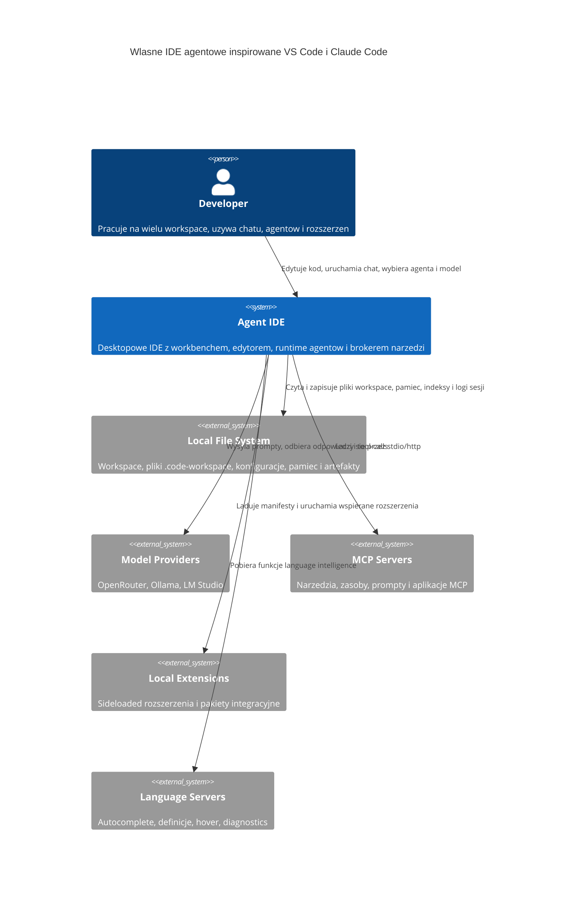

# Agentowe IDE na bazie VS Code - Analiza Rozwiazan

## Podsumowanie

| Pole | Wartosc |
|---|---|
| Zadanie | agentowe-ide-na-bazie-vscode |
| Oceniona zlozonosc | L |
| Liczba przeanalizowanych zrodel | 21 |
| Rekomendowane rozwiazanie | Electron + React + Monaco + Node/TS services + SQLite/sqlite-vec |
| Powiazany Research | `.github/Issue/agentowe-ide-na-bazie-vscode.research.md` |
| Data analizy | 2026-05-30 |

## Pytania Badawcze

Lista pytan, na ktore analiza odpowiada:

1. Jaki shell desktopowy i stos UI najszybciej dostarczy IDE podobne do VS Code bez forka?
2. Jak osiagnac praktyczna zgodnosc z `.code-workspace`, MCP i rozszerzeniami bez implementowania calego VS Code?
3. Jak zaprojektowac prosty, ale skalowalny runtime agentow z pamiecia, retrievalem i wieloagentowoscia?
4. Jakie technologie najlepiej pokryja routing modeli, lokalne modele i semantyczna baze wiedzy w MVP?

## Przeanalizowane Zrodla

### Repozytoria i Projekty Open-Source

| # | Nazwa | URL | Licencja | Gwiazdki / Aktywnosc | Kluczowe wnioski | Ocena |
|---|-------|-----|---------|----------------------|------------------|-------|
| 1 | VS Code | <https://github.com/microsoft/vscode> | MIT | ~185k stars, aktywne | Referencja dla workbencha, multi-root workspace, extension host i MCP UX. | 🟢 |
| 2 | Claude Code | <https://github.com/anthropics/claude-code> | NOASSERTION | ~12.7k stars, aktywne | Oficjalne repo pokazuje glownie shell/pluginy, nie pelny silnik. | 🟡 |
| 3 | Dive into Claude Code | <https://github.com/VILA-Lab/Dive-into-Claude-Code> | CC-BY-NC-SA-4.0 | aktywne | Najlepsze zrodlo architektoniczne o harnessie, pamieci, subagentach i safety. | 🟢 |
| 4 | Monaco Editor | <https://github.com/microsoft/monaco-editor> | MIT | dojrzaly projekt | Najkrotsza droga do edytora klasy VS Code bez forka calego workbencha. | 🟢 |

### Dokumentacje i API

| # | Nazwa | URL | Typ | Kluczowe wnioski | Ocena |
|---|-------|-----|-----|------------------|-------|
| 1 | VS Code multi-root workspaces | <https://code.visualstudio.com/docs/editing/workspaces/multi-root-workspaces> | docs | `.code-workspace` ma prosty schemat: `folders`, `settings`, `extensions`; wspiera sciezki wzgledne i komentarze. | 🟢 |
| 2 | VS Code Extension API | <https://code.visualstudio.com/api> | docs | Rozszerzenia to glowny mechanizm rozszerzalnosci, ale API jest bardzo szerokie. | 🟢 |
| 3 | VS Code Extension Host | <https://code.visualstudio.com/api/advanced-topics/extension-host> | docs | VS Code rozdziela host UI/web/workspace; to mocny wzorzec izolacji. | 🟢 |
| 4 | VS Code MCP Servers | <https://code.visualstudio.com/docs/copilot/chat/mcp-servers> | docs | `mcp.json`, profile user/workspace, stdio/http, discovery, trust i sandbox to dobry punkt odniesienia. | 🟢 |
| 5 | MCP Intro | <https://modelcontextprotocol.io/docs/getting-started/intro> | docs | MCP jest otwartym standardem dla tools/resources/prompts/apps. | 🟢 |
| 6 | OpenRouter Quickstart | <https://openrouter.ai/docs/quickstart> | docs | Jeden endpoint dla wielu modeli, SDK i agent SDK. | 🟢 |
| 7 | Ollama API | <https://docs.ollama.com/api> | docs | Stabilne lokalne API pod `localhost:11434/api`. | 🟢 |
| 8 | LM Studio OpenAI-compatible API | <https://lmstudio.ai/docs/app/api/endpoints/openai> | docs | Prosty adapter przez OpenAI-compatible base URL. | 🟢 |
| 9 | Electron docs | <https://www.electronjs.org/docs/latest/> | docs | Najprostszy desktop shell dla JS/HTML/CSS + Node.js. | 🟢 |
| 10 | Tauri docs | <https://tauri.app/start/> | docs | Mniejszy bundle i lepsza baza bezpieczenstwa, ale wieksza zlozonosc integracyjna. | 🟡 |
| 11 | Qdrant quickstart | <https://qdrant.tech/documentation/quickstart/> | docs | Mocny wektorowy store, ale wymaga osobnego serwisu. | 🟡 |
| 12 | LanceDB docs | <https://docs.lancedb.com/> | docs | Embedded/OSS, laczy vectors + FTS + SQL, dobry kandydat na etap 2. | 🟡 |
| 13 | sqlite-vec | <https://alexgarcia.xyz/sqlite-vec/> | docs | Zero-config, embedded, pure SQL, bardzo dobre pod lokalne MVP. | 🟢 |
| 14 | Tree-sitter | <https://tree-sitter.github.io/tree-sitter/> | docs | Incremental parsing "on every keystroke", dobre pod lokalny indeks kodu. | 🟢 |
| 15 | Language Server Protocol | <https://microsoft.github.io/language-server-protocol/> | docs | Najszybsza droga do smart features bez pisania wlasnych analizatorow. | 🟢 |

### Blogi, Artykuly i Case Studies

| # | Tytul | URL | Zrodlo | Kluczowe wnioski | Ocena |
|---|-------|-----|--------|------------------|-------|
| 1 | Claude Code Exposed | <https://bits-bytes-nn.github.io/insights/agentic-ai/2026/03/31/claude-code-architecture-analysis.html> | Bits & Bytes | Najcenniejsze lekcje to nie sam loop, tylko compaction, recovery, concurrency i permission harness. | 🟢 |
| 2 | Claude Code leak memory architecture | <https://www.mindstudio.ai/blog/claude-code-source-leak-memory-architecture> | MindStudio | File-based memory + index + self-healing jest dobre, ale bez vector retrieval i bez kontroli konfliktow multi-agent. | 🟢 |

### Rejestry Pakietow

| # | Pakiet | Rejestr | Wersja | Pobrania / Popularnosc | Kluczowe wnioski | Ocena |
|---|--------|---------|--------|------------------------|------------------|-------|
| 1 | `electron` | npm | 42.3.0 | bardzo popularny | Dojrzaly shell desktopowy dla JS stacku. | 🟢 |
| 2 | `monaco-editor` | npm | 0.55.1 | bardzo popularny | Stabilna baza edytora. | 🟢 |
| 3 | `@openrouter/sdk` | npm | 0.12.79 | niszowy, ale adekwatny | Wygodny adapter do modeli cloud. | 🟢 |
| 4 | `@openrouter/agent` | npm | 0.7.0 | niszowy | Przydatny jako inspiracja, ale wlasny broker nadal potrzebny. | 🟡 |
| 5 | `@qdrant/js-client-rest` | npm | 1.18.0 | umiarkowana popularnosc | Dobry klient, ale serwerowosc Qdrant pogarsza prostote MVP. | 🟡 |

## Matryca Porownawcza

| Kryterium | Electron + Monaco + Node/TS | Tauri + Monaco + Rust core | Web-first + remote backend |
|---|---|---|---|
| Dopasowanie do wymagan | 5/5 | 4/5 | 2/5 |
| Dojrzalosc i stabilnosc | 5/5 | 4/5 | 4/5 |
| Jakosc dokumentacji | 5/5 | 4/5 | 4/5 |
| Licencja i koszty | 4/5 | 5/5 | 4/5 |
| Zlozonosc integracji | 5/5 | 2/5 | 2/5 |
| Wydajnosc i skalowalnosc | 4/5 | 5/5 | 3/5 |
| Bezpieczenstwo | 4/5 | 5/5 | 3/5 |
| Krzywa uczenia sie | 5/5 | 2/5 | 4/5 |
| **Ocena ogolna** | **4.6/5** | **3.9/5** | **3.1/5** |

## Analiza Kandydatow

### Electron + Monaco + Node/TypeScript

**Opis**: desktopowe IDE z rendererem React/Monaco i osobnymi uslugami Node dla workspace, agentow, MCP, rozszerzen i indeksow.

**Korzysci**:
- Najblizej mentalnego modelu VS Code: Chromium + Node + IPC.
- Monaco daje edytor klasy VS Code bez forka calego workbencha.
- Najprosciej uruchomic lokalne tools, MCP, LSP, model adapters i extension host.
- Jeden glowny jezyk implementacji: TypeScript.

**Wady**:
- Wiekszy bundle i RAM niz Tauri.
- Trzeba samodzielnie doprojektowac bezpieczenstwo IPC, process isolation i permissions.
- Nie uzyskasz pelnej zgodnosci VS Code bez duzej pracy.

**Uzasadnienie**: najlepsza opcja na MVP. Najmniej ryzyk integracyjnych przy najwiekszym pokryciu wymagan.

### Tauri + Monaco + Rust core

**Opis**: lzejszy shell desktopowy z frontendem webowym i backendem Rust.

**Korzysci**:
- Mniejszy bundle i lepszy baseline bezpieczenstwa.
- Dobry kierunek na pozniejsza optymalizacje produktu.
- Silna kontrola nad systemowymi capabilities.

**Wady**:
- VS Code-like rozszerzalnosc i Node-ish narzedzia staja sie trudniejsze.
- Potrzebny miks Rust + TypeScript + prawdopodobnie sidecar Node dla czesci ekosystemu.
- Wiekszy koszt MVP i wiecej punktow awarii.

**Uzasadnienie**: dobra opcja dla wersji 2.x, nie dla szybkiego MVP.

### Web-first + remote backend

**Opis**: przegladarkowy shell z wiekszoscia logiki po stronie serwera.

**Korzysci**:
- Najlatwiejsze wdrozenie centralne.
- Naturalna skalowalnosc chmurowa.

**Wady**:
- Slabe dopasowanie do lokalnych plikow, narzedzi, MCP stdio i modeli Ollama/LM Studio.
- Gorsze UX dla lokalnego IDE.
- Trudniej uzyskac doswiadczenie podobne do VS Code desktop.

**Uzasadnienie**: nie spelnia dobrze kierunku produktowego na start.

## Rekomendacja

### Wybrane rozwiazanie

Electron + React + Monaco + Node/TS services + SQLite/sqlite-vec

### Uzasadnienie wyboru

Najlepsze cechy obu inspiracji da sie polaczyc tak:

- z VS Code przejac model multi-root workspace i obsluge `.code-workspace`,
- uzyc Monaco jako edytora,
- odtworzyc uklad workbencha: explorer, tabs, panel, chat sidebar,
- zbudowac extension host jako osobny runtime,
- wykorzystac LSP dla language intelligence,
- przejac `mcp.json` i wzorzec trust/sandbox/config scopes,
- z Claude Code przejac prosty agent loop, ale mocny harness wokol niego,
- uruchamiac izolowane subagenty i zwracac do parenta tylko podsumowania,
- prowadzic append-only session log,
- utrzymywac file-based memory jako warstwe prawdy,
- wprowadzic stopniowe context compaction,
- zbudowac deny-first permissions i broker narzedzi.

Kluczowa roznica wzgledem Claude Code: tu od razu trzeba dolozyc warstwe semantycznego retrievalu, bo wymagania obejmuja wektorowa pamiec i semantyczna baze kodu. Dlatego rekomendowana jest hybryda:

- warstwa prawdy: pliki Markdown / agent files / prompts / hooks / session artifacts,
- warstwa retrievalu: embeddings + indeks w `sqlite-vec`,
- warstwa audytu: append-only events w SQLite.

### Przewaga nad alternatywami

- Wzgledem Tauri + Monaco + Rust core: szybsza realizacja MVP, mniejszy koszt zgodnosci z ekosystemem JS, latwiejsze uruchamianie MCP/LSP/extensions.
- Wzgledem Web-first + remote backend: znacznie lepsza obsluga lokalnego filesystemu, tools, modeli lokalnych i przeplywow IDE.

## Podzbior VS Code Extension API dla MVP

MVP nie powinno probowac implementowac calego API VS Code. Powinno wspierac tylko ten podzbior, ktory realnie uruchomi wskazane rozszerzenia docelowe: SonarQube for IDE, Context7 MCP Server, GitHub Actions, PDF Utilities MCP, Playwright Test i PowerShell.

### Namespace'y i capability wymagane w MVP

| Obszar | Minimalny podzbior API / hosta | Po co | Rozszerzenia |
|---|---|---|---|
| Lifecycle | `activate()`, `deactivate()`, `ExtensionContext`, `subscriptions`, `workspaceState`, `globalState`, `extensionUri`, `storageUri`, `secrets` | podstawowy runtime rozszerzen i persystencja | wszystkie, szczegolnie SonarQube |
| Commands | `commands.registerCommand`, `commands.executeCommand` | command palette, akcje z widokow i quick fixes | wszystkie |
| Configuration | `workspace.getConfiguration`, `onDidChangeConfiguration`, `contributes.configuration` | ustawienia rozszerzen i profile workspace | wszystkie |
| Window basics | `showInformationMessage`, `showWarningMessage`, `showErrorMessage`, `withProgress`, `createStatusBarItem`, `createOutputChannel`, `showTextDocument` | UI operacyjne i status | SonarQube, PowerShell, GitHub Actions |
| Explorer / Views | `TreeDataProvider`, `registerTreeDataProvider`, `createTreeView`, `contributes.views`, `viewsContainers`, `viewsWelcome`, `menus`, `submenus` | panele i zakladki boczne | SonarQube, GitHub Actions, Playwright Test, PowerShell |
| Webview | `window.createWebviewPanel`, `WebviewViewProvider` | ekrany szczegolowe, onboarding, ustawienia i rich UI | SonarQube, potencjalnie GitHub Actions |
| Workspace + FS | `workspaceFolders`, `findFiles`, `fs`, `FileSystemWatcher`, `onDidOpenTextDocument`, `onDidSaveTextDocument`, `onDidChangeWorkspaceFolders` | reakcja na zmiany plikow i indeksacja workspace | SonarQube, GitHub Actions, Playwright Test |
| Text editor | `TextDocument`, `TextEditor`, `Selection`, `Range`, `WorkspaceEdit`, `Uri`, `languages.match` | nawigacja, quick fixy, edycje | SonarQube, PowerShell |
| Diagnostics / Code Actions | `languages.createDiagnosticCollection`, `CodeActionProvider`, `CodeActionKind.QuickFix`, `Diagnostic`, `DiagnosticSeverity` | bledy, ostrzezenia, quick fixes | SonarQube, GitHub Actions |
| Languages contributions | `contributes.languages`, `grammars`, `snippets`, `configurationDefaults`, `themes` | skladnia i podstawowe language UX | GitHub Actions, PowerShell |
| Testing API | `tests.createTestController`, `TestItem`, `TestRunProfile`, `TestMessage`, `TestRunRequest` | panel testow i uruchamianie testow | Playwright Test |
| Terminal / Shell | `window.createTerminal`, `Terminal`, `Pseudoterminal`, `ShellExecution` | uruchamianie testow, narzedzi i sesji powloki | Playwright Test, PowerShell |
| Tasks | `tasks.registerTaskProvider`, `Task`, `TaskExecution`, `TaskDefinition`, `problemMatchers` | uruchamianie workflow i testow z integracja wynikow | PowerShell, czesc scenariuszy Playwright |
| Debug | `debug.registerDebugConfigurationProvider`, `DebugAdapterDescriptorFactory`, `startDebugging`, `contributes.debuggers`, `breakpoints` | konieczne do PowerShell debug | PowerShell |
| Language status | `languages.createLanguageStatusItem` | status sesji jezykowej i polaczenia | PowerShell |
| LSP bridge | host dla `vscode-languageclient`, custom requests/notifications, process spawn, stdio transport | uruchamianie serwerow jezykowych i analizatorow | SonarQube, PowerShell |
| Extension packaging | parser `package.json`, activation events, `contributes.*`, ladowanie z lokalnego folderu i VSIX | instalacja i aktywacja rozszerzen | wszystkie |
| MCP manager | wbudowana obsluga `mcp.json`, serwerow `stdio/http`, resources/tools/prompts | natywne wsparcie MCP, nie jako pelne API VS Code | Context7 MCP, PDF Utilities MCP |

### Activation events, ktore musza wejsc do MVP

- `onCommand:*`
- `onLanguage:*`
- `workspaceContains:*`
- `onView:*`
- `onDebugResolve:*`
- opcjonalnie `onStartupFinished`, ale tylko jako fallback dla rozszerzen typu SonarQube

### Contribution points, ktore musza wejsc do MVP

- `commands`
- `configuration`
- `views`
- `viewsContainers`
- `viewsWelcome`
- `menus`
- `submenus`
- `languages`
- `grammars`
- `snippets`
- `themes`
- `configurationDefaults`
- `debuggers`
- `breakpoints`
- `problemMatchers`
- `walkthroughs`

### Co obslugiwac natywnie zamiast pelnej kompatybilnosci VS Code

| Funkcja | Decyzja MVP | Powod |
|---|---|---|
| MCP servers | natywny MCP manager | Context7 MCP Server i PDF Utilities MCP bardziej zalezne sa od MCP niz od API rozszerzen |
| Marketplace | brak | wystarczy sideload z folderu i VSIX |
| Notebooks | brak | niepotrzebne dla wskazanych rozszerzen |
| Remote / Codespaces / Containers | brak | poza zakresem Windows Desktop MVP |
| SCM API | minimalne lub brak | nie jest krytyczne dla listy rozszerzen MVP |

### Ocena zgodnosci docelowych rozszerzen

| Rozszerzenie | Status dla MVP | Krytyczne wymagania |
|---|---|---|
| SonarQube for IDE | Tak, przy wsparciu LSP + webview + diagnostics + configuration + secrets | language client host, webview, tree views, diagnostics, quick fixes |
| GitHub Actions | Tak | languages, grammars, diagnostics, tree views, commands, configuration |
| Playwright Test | Tak | Testing API, terminal, commands, tree views |
| PowerShell | Tak, ale to najtrudniejsze rozszerzenie MVP | LSP host, debug API, terminal, language status, views, snippets, themes |
| Context7 MCP Server | Tak, jako natywny MCP server z opcjonalnym wrapperem rozszerzenia | MCP manager, config UI, tools/resources/prompts |
| PDF Utilities MCP | Tak, jako natywny MCP server z opcjonalnym wrapperem rozszerzenia | MCP manager, config UI, tools/resources/prompts |

### Odrzucony zakres na MVP

- pelna zgodnosc z calym `vscode` module,
- pelna zgodnosc z web extensions,
- notebooks, custom editors, comments API, timeline API,
- marketplace sync i telemetria zgodna 1:1 z VS Code,
- rozszerzenia wymagajace bardzo szerokiego SCM/remote/debug ecosystem poza wskazana lista.

## Model C4 Context

Diagram kontekstowy systemu w skladni Mermaid:

### Opis elementow diagramu

| Element | Typ | Opis |
|---------|-----|------|
| dev | Person | Glowny uzytkownik IDE. |
| ide | System | Wlasne IDE z UI, agent runtime i memory/retrieval. |
| fs | System_Ext | Workspace i lokalne pliki konfiguracyjne. |
| models | System_Ext | Chmurowe i lokalne silniki modeli. |
| mcp | System_Ext | Zewnetrzne capabilities przez MCP. |
| ext | System_Ext | Lokalne rozszerzenia, skille, hooki. |
| lsp | System_Ext | Smart editor features. |

## Rejestry Decyzji Architektonicznych (ADR)

### ADR-001: Shell desktopowy

| Pole | Wartosc |
|---|---|
| Status | Proponowany |
| Data | 2026-05-30 |
| Kontekst | Potrzebne jest szybkie MVP z UI i zachowaniem zblizonym do VS Code. |

**Rozwazane opcje**:
1. Electron - desktop JS/HTML/CSS + Node.
2. Tauri - web frontend + Rust core.
3. Web-only - browser shell + backend.

**Decyzja**: Electron

**Uzasadnienie**: najszybciej dostarcza workbench, IPC, local tooling, extension host i zgodnosc z ekosystemem JS.

**Konsekwencje**:
- ✅ Szybszy start i prostsza architektura zespolowa.
- ⚠️ Wieksze zuzycie pamieci niz Tauri.

### ADR-002: Runtime agentow

| Pole | Wartosc |
|---|---|
| Status | Proponowany |
| Data | 2026-05-30 |
| Kontekst | Wymagane sa wieloagentowosc, rownolegle subagenty i broker konfliktow. |

**Rozwazane opcje**:
1. Jeden wspoldzielony agent loop.
2. Izolowani workerzy z brokerem sesji.
3. Zdalna orkiestracja serwerowa.

**Decyzja**: izolowani workerzy z brokerem sesji

**Uzasadnienie**: to najblizszy praktyczny odpowiednik zalet Claude Code bez eksplozji kontekstu i bez niekontrolowanych kolizji.

**Konsekwencje**:
- ✅ Kazda zakladka i subagent maja wlasny kontekst, log i permission scope.
- ⚠️ Potrzebny dodatkowy broker scalajacy patche i decyzje o konfliktach.

### ADR-003: Pamiec i retrieval

| Pole | Wartosc |
|---|---|
| Status | Proponowany |
| Data | 2026-05-30 |
| Kontekst | System ma miec pamiec podobna do Claude Code, ale dodatkowo semantyczny retrieval. |

**Rozwazane opcje**:
1. Tylko pliki Markdown.
2. Pliki + `sqlite-vec`.
3. Qdrant jako glowny store.
4. LanceDB jako glowny store.

**Decyzja**: pliki jako zrodlo prawdy + `sqlite-vec` jako indeks MVP, z domyslnym embeddingiem `bge-m3`

**Uzasadnienie**: zachowujesz transparentnosc i audytowalnosc pamieci, a jednoczesnie dostajesz semantyczne wyszukiwanie bez stawiania osobnego serwera. `bge-m3` jest dobrym domyslnym kompromisem dla polskich opisow, promptow i zapytan mieszanych kod + tekst.

**Konsekwencje**:
- ✅ Jeden lokalny store, latwy backup i zero-config.
- ✅ Jeden domyslny model embeddingow dla pamieci i indeksu kodu upraszcza MVP.
- ⚠️ Przy wiekszej skali trzeba zostawic droge migracji do Qdrant/LanceDB.
- ⚠️ Dla cloud premium warto pozniej dodac opcjonalny uplift na `text-embedding-3-large`.

### ADR-004: Rozszerzenia i kompatybilnosc

| Pole | Wartosc |
|---|---|
| Status | Proponowany |
| Data | 2026-05-30 |
| Kontekst | Potrzebna jest obsluga rozszerzen podobnie jak w VS Code, ale bez kopiowania calego Marketplace i calego API. |

**Rozwazane opcje**:
1. Wlasny format pluginow.
2. Podzbior zgodnosci z manifestem VS Code.
3. Pelna kompatybilnosc z VS Code API.

**Decyzja**: podzbior zgodnosci z manifestem VS Code, z ladowaniem rozszerzen z lokalnego folderu i z VSIX

**Uzasadnienie**: to minimalizuje lock-in i skraca droge uzytkownika, ale nie pcha MVP w nierealny zakres. VSIX jest wazne, bo pozwoli uruchamiac kontrolowany zestaw rozszerzen bez budowy marketplace.

**Konsekwencje**:
- ✅ Mozna wspierac lokalne/sideloaded rozszerzenia i instalacje z VSIX.
- ✅ Da sie uruchomic priorytetowy zestaw rozszerzen bez kopiowania calego ekosystemu VS Code.
- ⚠️ Czesc istniejacych rozszerzen nie zadziala bez warstwy kompatybilnosci.

### ADR-005: Semantyczna baza kodu

| Pole | Wartosc |
|---|---|
| Status | Proponowany |
| Data | 2026-05-30 |
| Kontekst | Agenci maja potrzebowac lepszego zrozumienia workspace niz zwykle grep/read. |

**Rozwazane opcje**:
1. Tylko embeddings plikow.
2. Tree-sitter + embeddings + metadata.
3. Wylacznie LSP.

**Decyzja**: Tree-sitter + embeddings + metadata, z opcjonalnym LSP enrichment

**Uzasadnienie**: Tree-sitter daje szybki incremental parsing, embeddings daja semantyke, a LSP moze wzbogacic definicje/refs dla obslugiwanych jezykow.

**Konsekwencje**:
- ✅ Lepszy retrieval dla agentow i lepsze chunkowanie niz po liniach.
- ⚠️ Trzeba utrzymywac pipeline indeksacji i wersjonowanie indeksu.

## Rozstrzygniete Pytania

| # | Pytanie | Status |
|---|---------|--------|
| 1 | Jaki dokladnie podzbior VS Code extension API ma wejsc do MVP? | ✅ Podzbior opisany w sekcji "Podzbior VS Code Extension API dla MVP". |
| 2 | Czy rozszerzenia maja byc ladowane tylko z lokalnego folderu, czy tez z VSIX? | ✅ Oba mechanizmy: lokalny folder i VSIX. |
| 3 | Czy broker konfliktow ma automatycznie scalac niekolidujace patche, czy zawsze wymagac review? | ✅ Auto-merge dla patchy niekolidujacych; review tylko dla konfliktow, delete, binary i zmian wysokiego ryzyka. |
| 4 | Jakie modele embeddingow beda domyslne dla indeksu pamieci i kodu? | ✅ `bge-m3` jako domyslny model dla obu indeksow; opcjonalny cloud uplift na `text-embedding-3-large`. |
| 5 | Czy start ma obejmowac tylko Windows desktop, czy od razu cross-platform? | ✅ Tylko Windows Desktop. |

## Kontrakt MVP

Kontrakt MVP opisuje minimalny zestaw ekranow, uslug backendowych i contribution points, ktore musza istniec, aby system byl uznany za gotowy do pierwszego uzycia na Windows Desktop oraz zeby dalo sie uruchomic priorytetowy zestaw rozszerzen.

### 1. Ekrany i obszary UI

| Ekran / obszar | Zakres MVP | Obowiazkowe elementy |
|---|---|---|
| Start / Home | otwarcie folderu lub `.code-workspace`, lista ostatnich workspace | przycisk Open Workspace, lista Recent, ostatnio uzywany model i agent |
| Workbench glowne | layout podobny do VS Code | activity bar, side bar, editor area, panel dolny, status bar |
| Explorer | przegladanie plikow i folderow | tree view, odswiezanie, reveal in explorer, basic context menu |
| Editor | podglad i edycja plikow | tabs, dirty state, syntax highlighting, split view minimum 2 kolumny |
| Search | podstawowe wyszukiwanie po plikach | tekst, glob include/exclude, lista wynikow |
| Chat | wielozakladkowy chat agentowy | osobne taby sesji, wybor agenta, wybor modelu, historia rozmowy, tool usage summary |
| Agent Tasks / Activity | podglad zadan agentow i subagentow | status, uruchomione narzedzia, wynik, link do zmian |
| Problems | lista diagnostyk | severity, plik, linia, przejscie do miejsca bledu |
| Output / Logs | logi uslug i rozszerzen | kanały output, filtrowanie po zrodle |
| Terminal | zintegrowany terminal | wiele terminali, podstawowe profile, output stream |
| Extensions | instalacja i zarzadzanie rozszerzeniami | install from VSIX, load from folder, enable/disable, wersja, log aktywacji |
| MCP Servers | konfiguracja MCP | lista serwerow, scope user/workspace, stdio/http, enable/disable, test connection |
| Settings | ustawienia aplikacji i rozszerzen | UI + JSON fallback, workspace/user scope |
| Test Explorer | widok testow | drzewo testow, run/debug, wynik i czas |
| Debug | podstawowy debug view | launch selection, start/stop, variables/call stack tylko dla minimalnego scenariusza |
| Memory / Retrieval Inspector | debugowy wglad dla MVP | ostatnie wpisy pamieci, source chunks, retrieval hits |

### 2. Uslugi i procesy aplikacyjne

| Usluga | Odpowiedzialnosc | Tryb uruchomienia |
|---|---|---|
| Workbench Shell | okno Electron, routing UI, IPC boundary | glowny proces + renderer |
| Workspace Service | parsowanie `.code-workspace`, file tree, watchers, recent workspaces | proces Node |
| Editor Service | otwieranie dokumentow, dirty buffers, save, reveal, editor state | renderer + IPC |
| Extension Host | ladowanie rozszerzen, activation events, `vscode` shim | osobny proces Node |
| VSIX Installer | import VSIX, rozpakowanie, walidacja manifestu, instalacja lokalna | proces Node |
| MCP Manager | ladowanie `mcp.json`, start/stop serwerow stdio/http, routing tools/resources/prompts | proces Node |
| Agent Runtime | sesje chat, modele, tool loop, subagenci | osobny proces Node |
| Conflict Broker | merge patchy, wykrywanie kolizji, review gating | komponent runtime |
| Model Gateway | adaptery OpenRouter, Ollama, LM Studio | proces Node |
| Memory Service | zapis pamieci plikowej, embeddings, retrieval | proces Node |
| Code Indexer | chunking kodu, tree-sitter, embeddings, incremental reindex | proces Node / worker |
| Diagnostics Service | kolekcje diagnostyk, code actions, problems list | extension host + shared service |
| Test Service | mapowanie Testing API na UI, run/debug lifecycle | extension host + renderer |
| Terminal Service | zarzadzanie terminalami i pseudo-terminalami | glowny proces / Node |
| Debug Service | minimalna obsluga debug adapterow | proces Node |
| Settings Service | user/workspace settings, secrets, config sync lokalny | proces Node |
| Output Service | output channels, extension logs, service logs | renderer + Node |

### 3. Wspierane contribution points w kontrakcie MVP

| Contribution point | Status MVP | Uwagi |
|---|---|---|
| `commands` | wymagane | command palette i akcje z widokow |
| `configuration` | wymagane | user + workspace scope |
| `views` | wymagane | tree views dla SonarQube, GitHub Actions, Playwright, PowerShell |
| `viewsContainers` | wymagane | side bar containers |
| `viewsWelcome` | wymagane | onboarding pustych widokow |
| `menus` | wymagane | view/item/title/context menus |
| `submenus` | wymagane | grupowanie akcji |
| `languages` | wymagane | GitHub Actions, PowerShell |
| `grammars` | wymagane | syntax highlighting |
| `snippets` | wymagane | minimum import i aktywacja |
| `themes` | wspierane ograniczenie | tylko kolorystyczne theme registration |
| `configurationDefaults` | wspierane | potrzebne dla jezykow i rozszerzen |
| `debuggers` | wymagane minimum | tylko scenariusze potrzebne PowerShell |
| `breakpoints` | wymagane minimum | linie + start/stop debug |
| `problemMatchers` | wspierane | integracja task/terminal -> Problems |
| `walkthroughs` | opcjonalne MVP+ | mozna renderowac jako prosta strone onboardingowa |
| `keybindings` | opcjonalne MVP+ | minimalny parser, bez pelnej zgodnosci |
| `taskDefinitions` | opcjonalne MVP+ | wystarczy API task provider bez pelnego UI authoring |

### 4. Kontrakt funkcjonalny per rozszerzenie

#### 4.1 SonarQube for IDE

**Zakres MVP**:
- aktywacja rozszerzenia,
- polaczenie z backendem analitycznym przez LSP lub dedykowany process bridge,
- wyswietlanie diagnostyk w editorze i Problems,
- quick fix / code action dla wspieranych przypadkow,
- widok boczny SonarQube,
- konfiguracja tokena/adresu przez settings + secrets,
- output channel i status bar item.

**Niezbedne API**:
- `languages.createDiagnosticCollection`
- `CodeActionProvider`
- `window.createTreeView`
- `window.createWebviewPanel` lub `WebviewViewProvider`
- `workspace.getConfiguration`
- `secrets`
- host `vscode-languageclient`

**Definition of Done**:
- otwarcie projektu pokazuje diagnostyki SonarQube,
- klik na problem otwiera plik i linie,
- przynajmniej jeden quick fix jest wywolywalny,
- konfiguracja polaczenia jest zapisywana lokalnie.

#### 4.2 GitHub Actions

**Zakres MVP**:
- rozpoznawanie workflow YAML w `.github/workflows`,
- widok boczny workflow/list runs w zakresie lokalnym lub metadata-based,
- diagnostyki skladni i podstawowych bledow workflow,
- komendy typu open workflow / refresh / validate,
- skladnia i ikonografia dla YAML workflow.

**Niezbedne API**:
- `contributes.languages`
- `contributes.grammars`
- `TreeDataProvider`
- `commands`
- `configuration`
- diagnostics

**Definition of Done**:
- workspace z `.github/workflows` aktywuje rozszerzenie,
- plik workflow ma poprawne kolorowanie i podstawowe diagnostyki,
- widok GitHub Actions pokazuje wykryte workflow,
- komenda refresh przeladowuje widok.

#### 4.3 Playwright Test

**Zakres MVP**:
- wykrywanie konfiguracji Playwright,
- renderowanie drzewa testow,
- uruchamianie testu, pliku i calej grupy,
- pokazanie wyniku i outputu,
- otwarcie miejsca testu z widoku testow,
- opcjonalnie debug jednego testu jako MVP stretch.

**Niezbedne API**:
- `tests.createTestController`
- `TestRunProfile`
- `window.createTerminal`
- `TreeView`
- `commands`
- `workspace.findFiles`

**Definition of Done**:
- rozszerzenie wykrywa testy po otwarciu projektu Playwright,
- pojedynczy test daje sie uruchomic z UI,
- wynik przechodzi do Test Explorer i Output,
- klik w test otwiera odpowiedni plik.

#### 4.4 PowerShell

**Zakres MVP**:
- syntax highlighting i snippets dla PowerShell,
- uruchomienie language service,
- diagnostyki i podstawowe IntelliSense,
- zintegrowany terminal PowerShell,
- podstawowy debug skryptu `.ps1`,
- widok boczny rozszerzenia,
- output channel, status bar, konfiguracja hosta.

**Niezbedne API**:
- `onLanguage:powershell`
- `contributes.languages`, `grammars`, `snippets`, `themes`
- LSP bridge
- `window.createTerminal`
- `debug.registerDebugConfigurationProvider`
- `DebugAdapterDescriptorFactory`
- `languages.createLanguageStatusItem`
- `views`, `commands`, `configuration`

**Definition of Done**:
- otwarcie `.ps1` aktywuje rozszerzenie i daje kolorowanie,
- diagnostyki pojawiaja sie w Problems,
- terminal PowerShell startuje z UI,
- debug prostego skryptu dziala w scenariuszu launch.

### 5. Kontrakt dla MCP i rozszerzen narzedziowych

| Obszar | Zakres MVP |
|---|---|
| Context7 MCP Server | konfiguracja przez MCP Manager, start/stop, test polaczenia, ekspozycja tools/resources/prompts do chatu |
| PDF Utilities MCP | to samo co wyzej, plus widocznosc wynikow narzedzi w czacie i logach |
| Integracja z chatem | agent moze wykryc narzedzia MCP, wywolac je i pokazac wynik w sesji |
| Bezpieczenstwo | trust per workspace, allow/deny list dla serwerow i narzedzi, log wykonania |

### 6. Kontrakt techniczny dla brokera i agentow

| Obszar | Minimalna zasada MVP |
|---|---|
| Chat tabs | kazda zakladka ma osobna sesje, model, agenta i event log |
| Subagenci | uruchamiani jako osobne zadania z ograniczonym kontekstem |
| Patch model | zmiany plikowe jako zestaw operacji tekstowych z metadanymi |
| Auto-merge | patch bez konfliktu jest scalany automatycznie |
| Review gate | wymagane dla konfliktu, delete, rename, binary, zmian wielu plikow wysokiego ryzyka |
| Audit | kazda decyzja brokera i agenta trafia do event logu |

### 7. Kryteria akceptacyjne calego MVP

1. Uzytkownik otwiera `.code-workspace` i widzi explorer, editor, chat, terminal i problems.
2. Uzytkownik instaluje rozszerzenie z VSIX albo laduje je z folderu.
3. SonarQube, GitHub Actions, Playwright Test i PowerShell aktywuja sie w odpowiednich workspace.
4. Context7 MCP i PDF Utilities MCP sa konfigurowalne i wywolywalne z chatu.
5. Chat obsluguje wiele zakladek i rozne modele/agenty rownolegle.
6. Pamiec i retrieval dzialaja lokalnie na Windows Desktop.
7. Broker automatycznie scala bezpieczne patche i zatrzymuje konflikty do review.

## Nastepne Kroki

- Zaprojektowac model domenowy sesji agentowej: chat tab, agent, worker, task, patch, conflict, memory entry, retrieval query.
- Rozpisac moduly systemu: Workbench UI, Workspace Service, Agent Runtime, MCP Manager, Extension Host, VSIX Installer, Indexer, Memory Store.
- Przygotowac pierwsze ADR-y wykonawcze: IPC, sandboxing, format event logu, patch format, index schema, extension isolation.
- Zbudowac pierwszy pionowy slice: open `.code-workspace` -> explorer -> Monaco -> chat tab -> call model -> file tool.
