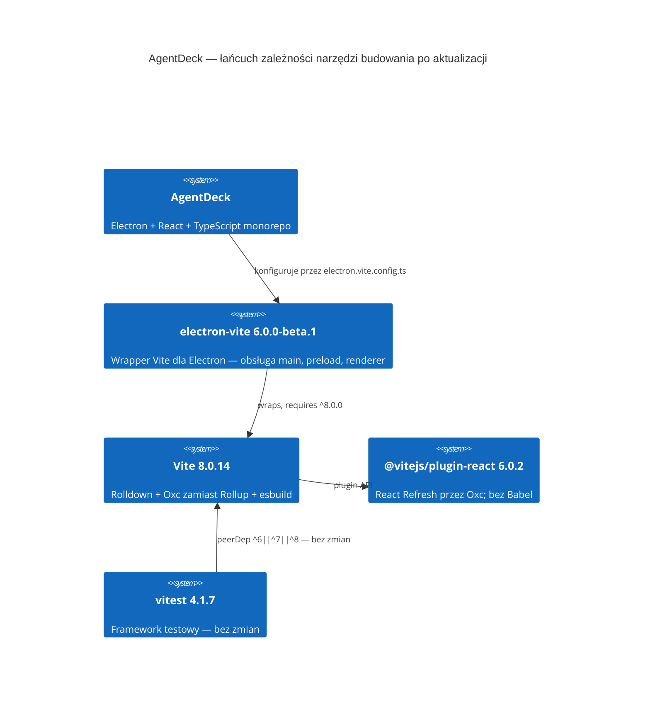

# Aktualizacja Vite 8 i @vitejs/plugin-react 6 — Plan Implementacji

## Szczegóły Zadania

| Pole | Wartość |
| --- | --- |
| Tytuł | Aktualizacja Vite 7→8 oraz @vitejs/plugin-react 5→6 |
| Opis | Dwie powiązane aktualizacje major bibliotek zgłoszone przez Dependabota: `vite` 7.3.3→8.0.14 (PR #27) i `@vitejs/plugin-react` 5.2.0→6.0.2 (PR #28). Aktualizacje są ze sobą ściśle powiązane — plugin-react 6.x wymaga Vite 8+. Wdrożenie wymaga równoczesnej aktualizacji `electron-vite` z v5 do v6, ponieważ electron-vite v5 obsługuje wyłącznie Vite ^5 \|\| ^6 \|\| ^7. |
| Priorytet | Wysoki (`priority:high`, `security`) |
| Powiązany Research | — |
| Numer Issue | PR #27, PR #28 |
| Link do Issue | [PR #27 — Bump vite 7→8](https://github.com/Finfinder/AgentDeck/pull/27), [PR #28 — Bump @vitejs/plugin-react 5→6](https://github.com/Finfinder/AgentDeck/pull/28) |

## Proponowane Rozwiązanie

Skoordynowana aktualizacja trzech powiązanych pakietów narzędziowych w jednej gałęzi zadaniowej:

| Pakiet | Wersja obecna | Wersja docelowa | Źródło |
| --- | --- | --- | --- |
| `vite` | 7.3.3 | 8.0.14 | PR #27 (Dependabot) |
| `@vitejs/plugin-react` | 5.2.0 | 6.0.2 | PR #28 (Dependabot) |
| `electron-vite` | 5.0.0 | 6.0.0-beta.1 | Wymagane — brak wsparcia dla Vite 8 w v5 |

Poza aktualizacją wersji w `package.json` wymagana jest migracja `rollupOptions` → `rolldownOptions` w `electron.vite.config.ts` (3 wystąpienia) oraz instalacja zaktualizowanego `package-lock.json`.

**Pakiet `vitest` 4.1.7 nie wymaga aktualizacji** — peerDependency vitest 4.x już obsługuje `vite ^6.0.0 || ^7.0.0 || ^8.0.0`.



## Uzasadnienie Rozwiązania

### Wybrane podejście

Skoordynowana jednoczesna aktualizacja wszystkich trzech pakietów w jednym PR. Podejście to jest wymuszone przez ciasny łańcuch zależności: `@vitejs/plugin-react` 6.x wymaga Vite 8, a Vite 8 wymaga `electron-vite` v6 w kontekście Electron. Scalanie PR-ów Dependabota oddzielnie lub bez aktualizacji `electron-vite` skutkowałoby błędem naruszenia peerDependency.

### Porównanie z alternatywami

| Kryterium | Skoordynowana aktualizacja (wybrane) | Tylko PR #27 bez electron-vite v6 | Oczekiwanie na electron-vite stable |
| --- | --- | --- | --- |
| Poprawność peerDep | ✅ Spełniona | ❌ Naruszenie peerDep electron-vite v5 | ✅ Spełniona po wydaniu stable |
| Zakres zmian | Średni — 3 pakiety + migracja config | Mały — lecz łamie CI | Zerowy — bez działania |
| Ryzyko | Średnie — electron-vite v6 beta | Wysokie — build nie kompiluje | Niskie, lecz zależności stale nieaktualne |
| Czas wdrożenia | Teraz | Nie dotyczy | Nieznany termin stable |

### Dlaczego odrzucono alternatywy

- **Tylko PR #27 bez electron-vite v6**: Narusza peerDependency `electron-vite@5.0.0` (`"vite": "^5.0.0 || ^6.0.0 || ^7.0.0"`). Build Electron przestałby kompilować.
- **Oczekiwanie na electron-vite stable**: Zależności pozostałyby stale nieaktualne, a stan security z raportów Dependabota nie byłby adresowany. electron-vite v6.0.0-beta.1 jest oznaczony tagiem `beta` na npm i wersją `Latest` na GitHub — wskazuje to na dojrzałość do użytku.

## Rejestry Decyzji Architektonicznych (ADR)

### ADR-001: Aktualizacja electron-vite do wersji beta

| Pole | Wartość |
| --- | --- |
| Status | Proponowany |
| Data | 2026-06-01 |
| Kontekst | electron-vite v6.0.0-beta.1 jest jedyną dostępną wersją obsługującą Vite 8. Na npm jest opublikowana pod tagiem `beta`; `latest` nadal wskazuje na v5.0.0. |

**Rozważane opcje**:
1. `electron-vite@beta` (6.0.0-beta.1) — aktualna najnowsza wersja wspierająca Vite 8
2. Utrzymanie `electron-vite@5.0.0` — wyklucza Vite 8

**Decyzja**: Użyć `electron-vite@6.0.0-beta.1`.

**Uzasadnienie**: electron-vite v6.0.0-beta.1 jest oznaczony jako `Latest` na GitHub Releases, a changelog (`fix(deps)!: update vite to v8`) wskazuje na gotowość techniczną. Projekt posiada kompletne pokrycie testami jednostkowymi (CI: typecheck + vitest) i smoke test builda, co pozwala szybko wykryć regresję.

**Konsekwencje**:
- ✅ Odblokowanie PR #27 i PR #28 z pełną kompatybilnością zależności
- ✅ Compat layer `rollupOptions`/`rolldownOptions` w electron-vite v6 chroni przed nagłą regresją config
- ⚠️ electron-vite v6 to wciąż beta — ryzyko kolejnych breaking changes do momentu stable release
- ⚠️ Wymaga monitorowania wydania stable i szybkiej aktualizacji po jego ukazaniu się

## Analiza Aktualnej Implementacji

### Już Zaimplementowane

- `package.json` — deklaracja wszystkich zależności narzędziowych z pinowanymi wersjami — plik główny do modyfikacji
- `electron.vite.config.ts` — główna konfiguracja builda (main, preload, renderer); używa `rollupOptions.input` w 3 miejscach — do migracji
- `vitest.config.ts` — konfiguracja testów jednostkowych; używa `react()` bez opcji Babel — bez zmian po aktualizacji
- `package-lock.json` — lock file do regeneracji po aktualizacji

### Do Modyfikacji

- `package.json` — `e:\AI_WORKSPACE\Moje projekty\AgentDeck\package.json` — aktualizacja wersji: `electron-vite` 5→6.0.0-beta.1, `vite` 7.3.3→8.0.14, `@vitejs/plugin-react` 5.2.0→6.0.2
- `electron.vite.config.ts` — `e:\AI_WORKSPACE\Moje projekty\AgentDeck\electron.vite.config.ts` — migracja `rollupOptions` (3 wystąpienia w sekcjach `main.build`, `preload.build`, `renderer.build`) na `rolldownOptions` zgodnie z API Vite 8

### Do Utworzenia

Brak — wyłącznie modyfikacje istniejących plików.

## Otwarte Pytania

| # | Pytanie | Odpowiedź | Status |
| --- | --- | --- | --- |
| 1 | Czy `vitest` 4.x wymaga aktualizacji przy Vite 8? | Nie — peerDep vitest 4.1.7 to `vite ^6.0.0 \|\| ^7.0.0 \|\| ^8.0.0` (potwierdzone w npm registry) | ✅ Rozwiązane |
| 2 | Czy `@vitejs/plugin-react` 6.x usuwa API używane w projekcie? | Nie — projekt wywołuje `react()` bez opcji Babel; usunięte API (`babel` option) nie jest używane | ✅ Rozwiązane |
| 3 | Czy `electron-vite` v6 zachowuje compat dla `rollupOptions`? | Tak — changelog v6 wskazuje `fix!: compatible with rollupOptions and rolldownOptions`; zalecana jest jednak migracja | ✅ Rozwiązane |
| 4 | Czy zmiana browser target (Chrome 107→111) wpływa na Electron 42? | Electron 42 używa Chromium 128+, więc podniesienie minimalnego celu budowania do Chrome 111 jest w pełni kompatybilne | ✅ Rozwiązane |

## Plan Implementacji

**Decyzja modularyzacyjna**: `modularization: not-needed` — zakres zadania to wyłącznie aktualizacje toolchain devDependencies. Nie są wymagane bounded contexts, migracje domenowe ani nowe agregaty.

**Routing wykonania**: Całość → `/implement-backend` (TypeScript/Node toolchain changes) lub bezpośrednio przez `software-engineer`.

---

### Faza 1: Aktualizacja zależności w package.json

#### Zadanie 1.1 — [MODIFY] Aktualizacja wersji pakietów w package.json

**Opis**: Zmień wersje trzech devDependencies w `package.json`: `electron-vite` z `5.0.0` na `6.0.0-beta.1`, `vite` z `7.3.3` na `8.0.14`, `@vitejs/plugin-react` z `5.2.0` na `6.0.2`. Usuń, jeśli istnieje, lokalne nadpisanie peerDep dla `electron-vite`.

**Definicja Ukończenia (Definition of Done)**:
- [x] `package.json` zawiera `"electron-vite": "6.0.0-beta.1"` w `devDependencies`
- [x] `package.json` zawiera `"vite": "8.0.14"` w `devDependencies`
- [x] `package.json` zawiera `"@vitejs/plugin-react": "6.0.2"` w `devDependencies`
- [x] `npm install` kończy się bez błędów naruszenia peerDependency
- [ ] `package-lock.json` jest zaktualizowany i zacommitowany razem z `package.json`
- [x] `npm run audit:security` zwraca exit code 0 (brak nowych podatności moderate+)

---

### Faza 2: Migracja konfiguracji electron-vite

#### Zadanie 2.1 — [MODIFY] Migracja rollupOptions → rolldownOptions w electron.vite.config.ts

**Opis**: W pliku `electron.vite.config.ts` zamień wszystkie trzy wystąpienia `rollupOptions` na `rolldownOptions` zgodnie z API Vite 8 / electron-vite v6. Wszystkie trzy bloki konfigurują wyłącznie pole `input` — semantyka jest identyczna w obu nazwach.

Plik przed zmianą (fragment):
```ts
// main (linia ~20)
rollupOptions: {
  input: resolve(rootDir, 'apps/desktop/src/main/index.ts')
}
// preload (linia ~29)
rollupOptions: {
  input: resolve(rootDir, 'apps/desktop/src/preload/index.ts')
}
// renderer (linia ~41)
rollupOptions: {
  input: resolve(rootDir, 'packages/workbench/index.html')
}
```

Po zmianie: każde `rollupOptions` zastąpione `rolldownOptions`.

**Definicja Ukończenia (Definition of Done)**:
- [x] `electron.vite.config.ts` nie zawiera żadnego wystąpienia słowa `rollupOptions`
- [x] Wszystkie trzy sekcje (`main.build`, `preload.build`, `renderer.build`) używają `rolldownOptions`
 - [x] TypeScript compiler nie zgłasza błędów dla `electron.vite.config.ts` (`npm run typecheck`)

---

### Faza 3: Weryfikacja poprawności i bramki jakości

#### Zadanie 3.1 — [REUSE] Typecheck i testy jednostkowe

**Opis**: Uruchom pełny stos weryfikacyjny: typecheck wszystkich pakietów oraz zestaw testów jednostkowych Vitest, aby potwierdzić brak regresji po aktualizacji zależności.

**Definicja Ukończenia (Definition of Done)**:
 [x] `npm run typecheck` (wszystkie 8 wariantów) kończy się bez błędów TypeScript
 [x] `npm run test:unit` — wszystkie testy przechodzą
 [x] `npm run test:architecture` (dependency-cruiser) — reguły architektoniczne nie są naruszone
 [x] Brak nowych ostrzeżeń lint: `npm run lint` kończy się bez błędów
 [x] `npm run build` kończy się bez błędów (bez komunikatu `rollupOptions deprecation` jako błędu, jedynie ewentualne ostrzeżenie)
 [x] Katalog `out/` zawiera artefakty: `out/main/index.js`, `out/preload/index.js`, `out/renderer/index.html`
 [x] Żaden plik wyjściowy w `out/` nie jest pusty (> 0 bajtów)
**Opis**: Uruchom kompletny build produkcyjny Electron, aby potwierdzić, że konfiguracja `electron-vite` v6 + Vite 8 poprawnie generuje artefakty main, preload i renderer.

**Definicja Ukończenia (Definition of Done)**:
- [ ] `npm run build` kończy się bez błędów (bez komunikatu `rollupOptions deprecation` jako błędu, jedynie ewentualne ostrzeżenie)
- [ ] Katalog `out/` zawiera artefakty: `out/main/index.js`, `out/preload/index.js`, `out/renderer/index.html`
- [ ] Żaden plik wyjściowy w `out/` nie jest pusty (> 0 bajtów)

#### Zadanie 3.3 — [CLOSE] Zamknięcie PR-ów Dependabota

**Opis**: Po scaleniu gałęzi zadaniowej z docelowym branchem wersyjnym zamknij oba PR-y Dependabota jako rozwiązane ręcznie, z komentarzem informującym o sposobie rozwiązania. Dependabot automatycznie zamknie swoje PR-y jeśli wykryje, że zależności zostały zaktualizowane do docelowej lub wyższej wersji — w razie braku auto-zamknięcia zamknij PR-y ręcznie.

**Definicja Ukończenia (Definition of Done)**:
- [ ] [PR #27 — Bump vite 7→8](https://github.com/Finfinder/AgentDeck/pull/27) ma status `Closed` na GitHub (ręcznie lub przez auto-close Dependabota)
- [ ] [PR #28 — Bump @vitejs/plugin-react 5→6](https://github.com/Finfinder/AgentDeck/pull/28) ma status `Closed` na GitHub (ręcznie lub przez auto-close Dependabota)
- [ ] Każdy zamknięty PR posiada komentarz: `Rozwiązano ręcznie w ramach skoordynowanej aktualizacji z electron-vite v6 — zob. #<numer PR zadaniowego>.`

## Aspekty Bezpieczeństwa

- **Cel aktualizacji**: Dependabot oznaczył obie aktualizacje etykietą `security` — aktualizacja eliminuje potencjalne podatności w starszych wersjach Vite i plugin-react
- **esbuild usunięty jako zależność bezpośrednia Vite**: W Vite 8 esbuild nie jest już zależnością bezpośrednią (Rolldown/Oxc go zastępuje). Zmniejsza to surface attack dla narzędzi budowania
- **npm audit gate w CI**: Istniejący krok `npm run audit:security` w `sonar.yml` jest pierwszą linią obrony — aktualizacja zależności musi zachować exit code 0 po `npm install`
- **Źródło electron-vite beta**: Pakiet `6.0.0-beta.1` jest pobierany z npm registry (ten sam trusted source co stable) pod tagiem `beta` — brak ryzyka supply chain innego niż przy zwykłej aktualizacji

## Strategia Testowania

### Piramida testów

| Typ testu | Zakres | Szacowana liczba | Pokrycie |
| --- | --- | --- | --- |
| Jednostkowe (Vitest) | Logika biznesowa, hooki, serwisy | Istniejące (~184 testy wg. pokrycia 84.2%) | Regresja — wszystkie muszą przechodzić |
| Architektoniczne (dep-cruiser) | Reguły zależności między pakietami | Istniejące reguły | Reguły architektoniczne nie mogą być naruszone |
| Build smoke | Kompilacja Electron (main + preload + renderer) | 1 | Artefakty wygenerowane bez błędów |

### Podejście do testowania
- [ ] Testy regresji: uruchomienie istniejącego zestawu bez modyfikacji testów
- [ ] Weryfikacja builda jako smoke test poprawności konfiguracji narzędziowej

### Testy wydajnościowe

Nie dotyczy — zmiana dotyczy wyłącznie toolchainu devDependencies. Nie zmienia runtime ani ścieżek krytycznych SLA.

### Testy dostępności

Nie dotyczy — brak zmian w warstwie UI.

### Testy architektoniczne

- Narzędzie: `dependency-cruiser` (istniejący `npm run test:architecture`)
- Reguły do egzekwowania:
  - [ ] Kierunek zależności między pakietami monorepo — bez regresji po aktualizacji toolchain

### Testy mutacyjne

Nie dotyczy — brak zmian w logice biznesowej.

## Zapewnienie Jakości

Lista kontrolna kryteriów akceptacji:

- [x] `npm install` — zero błędów peerDependency
- [x] `npm run audit:security` — exit code 0 (brak podatności moderate+)
- [x] `npm run typecheck` — zero błędów TypeScript (wszystkie 8 wariantów)
- [x] `npm run test:unit` — wszystkie testy przechodzą
- [x] `npm run test:architecture` — reguły dep-cruiser spełnione
- [x] `npm run lint` — zero błędów ESLint
- [x] `npm run build` — artefakty Electron wygenerowane w `out/`
- [x] `electron.vite.config.ts` nie zawiera `rollupOptions` (migracja ukończona)
- [x] PR zawiera zaktualizowany `package-lock.json`

### Planowane quality gates z kontraktu `code-reviewing`

| Obszar | Planowana kontrola | Kryterium akceptacji |
| --- | --- | --- |
| Bezpieczeństwo | `npm audit --audit-level=moderate` w CI (istniejący krok `sonar.yml`) | Exit code 0; brak nowych podatności moderate+ |
| Zależności | Weryfikacja peerDep po `npm install` | Zero błędów/ostrzeżeń peerDependency conflict |
| Architektura i jakość | TypeScript strict + dep-cruiser rules | Zero błędów TS; reguły architektoniczne bez regresji |
| Build | Smoke test `npm run build` | Artefakty `out/main`, `out/preload`, `out/renderer` obecne i niepuste |
| Operacyjność | CI: `sonar.yml` full run (typecheck + audit + testy + SonarCloud) | SonarCloud Quality Gate: `OK` |

## Usprawnienia (Poza Zakresem)

### Usprawnienie 1: Aktualizacja electron-vite do stable v6 po wydaniu

- **Opis**: Po ukazaniu się stabilnej wersji `electron-vite@6.0.0` (bez sufiksu `-beta`) zaktualizować pin w `package.json` z `6.0.0-beta.1` na stabilną.
- **Uzasadnienie**: Niniejszy plan celowo używa wersji beta, ponieważ jest to jedyne dostępne wydanie obsługujące Vite 8. Stabilna wersja eliminuje ryzyko kolejnych breaking changes przed oficjalnym GA.
- **Korzyści**: Redukcja ryzyka nieoczekiwanych breaking changes przy kolejnych instalacjach; `npm install` bez potrzeby użycia tagu `@beta`; większa pewność co do stabilności API publicznego electron-vite.

### Usprawnienie 2: Aktualizacja skryptu dependency-freshness-report po wdrożeniu

- **Opis**: Raport `dependency-freshness-report.md` (wygenerowany 2026-05-31) wskazuje `vite` i `@vitejs/plugin-react` jako stale. Po zaakceptowaniu PR i wdrożeniu planu uruchomić regenerację raportu świeżości.
- **Uzasadnienie**: Aktualny raport odzwierciedla stan sprzed wdrożenia, co może mylić przy kolejnych przeglądach świeżości zależności.
- **Korzyści**: Utrzymanie aktualności raportu eliminuje false-positive findings i redukuje czas triage kolejnych przeglądów zależności o szacowane 5–10 minut per cykl.

### Usprawnienie 3: Zbadanie migracji do Vite 8 oxc config zamiast esbuild compat

- **Opis**: Vite 8 wprowadza natywną konfigurację `oxc` zamiast pola `esbuild` (deprecated). Jeśli projekt w przyszłości będzie potrzebował dostrajania transformacji JS (np. define, jsxInject), migracja do `oxc.*` zamiast `esbuild.*` jest rekomendowaną ścieżką.
- **Uzasadnienie**: Projekt aktualnie nie używa opcji `esbuild` w konfiguracji — brak pilnej potrzeby. Warto zaadresować przy pierwszej okazji rozbudowy konfiguracji.
- **Korzyści**: Przygotowanie konfiguracji na usunięcie `esbuild` compat layer w przyszłych wersjach Vite, redukcja ryzyka breaking change przy kolejnym major update.

## Changelog

| Data | Opis Zmiany |
| --- | --- |
| 2026-06-01 | Utworzono wstępny plan na podstawie PR #27 i PR #28 Dependabota |
| 2026-06-01 | Wdrożono aktualizację: `vite@8.0.14`, `@vitejs/plugin-react@6.0.2`, `electron-vite@6.0.0-beta.1`; zmigrowano `rollupOptions`→`rolldownOptions`; utworzono branch `chore/0.1.0/PR/dependabot/27-28`; lokalne typecheck, testy i build przeszły. |
