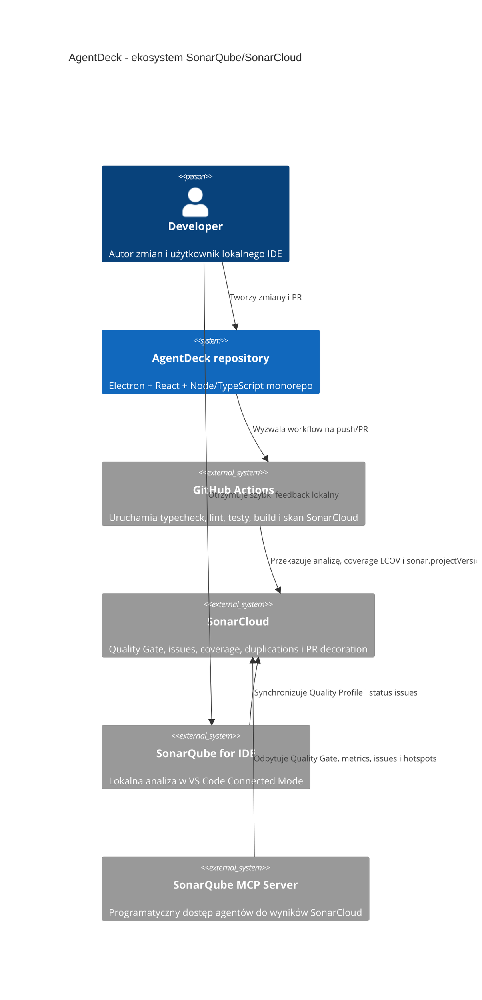

# Wdrozenie SonarQube do AgentDeck - Plan Implementacji

## Szczegóły Zadania

| Pole | Wartość |
| --- | --- |
| Tytuł | Wdrożenie SonarQube/SonarCloud do projektu AgentDeck |
| Opis | Przygotować wdrożenie ekosystemu Sonar dla AgentDeck na wzór istniejących konfiguracji `SeqMcpServer` i `DQN_Framework`: analiza CI w SonarCloud, lokalny Connected Mode dla SonarQube for IDE, opcjonalny SonarQube MCP Server dla agentów oraz jasny podział pracy między agenta i konfigurację manualną właściciela repozytorium. |
| Priorytet | Wysoki |
| Powiązany Research | Brak dedykowanego pliku research; podstawą jest bieżące zadanie, analiza AgentDeck oraz porównanie lokalnych wdrożeń `SeqMcpServer` i `DQN_Framework`. |
| Numer Issue | 16 |
| Link do Issue | [https://github.com/Finfinder/AgentDeck/issues/16](https://github.com/Finfinder/AgentDeck/issues/16) |

## Proponowane Rozwiązanie

AgentDeck powinien użyć SonarCloud jako centralnej usługi jakości kodu oraz SonarQube for IDE jako lokalnej warstwy feedbacku. Ponieważ AgentDeck jest monorepo TypeScript/Electron/React bez dedykowanego skanera build-systemowego, konfiguracja powinna iść modelem zbliżonym do `DQN_Framework`: `sonar-project.properties` w katalogu głównym, osobny workflow `.github/workflows/sonar.yml`, raport pokrycia w formacie LCOV z Vitest oraz przekazanie wersji projektu z pliku `VERSION` przez `sonar.projectVersion`.

Wzorzec `SeqMcpServer` należy wykorzystać dla elementów wspólnych: workflow `SonarCloud Analysis`, pełny checkout (`fetch-depth: 0`), `permissions: {}` na poziomie workflow, minimalne uprawnienia joba, tokeny przekazywane przez `env:`, README z sekcjami SonarCloud, SonarQube for IDE i SonarQube MCP Server oraz `.sonarlint/connectedMode.json` jako shared binding.

Decyzja modularyzacyjna: `modularization: use-existing-domain`. Uzasadnienie: wdrożenie SonarQube nie zmienia bounded contexts ani kontraktu domenowego AgentDeck, a repozytorium ma już `docs/domain.md` oraz `.dependency-cruiser.cjs` egzekwujące granice pakietów. Wpływ na zakres: plan ponownie używa istniejących granic, skryptów i testów architektonicznych; nie wymaga uruchamiania `/modularise` ani modyfikacji modelu domenowego.

Rekomendowany routing wykonania: całość wdrożenia repozytoryjnego kierować do `/implement-pipeline`, ponieważ główną zmianą jest CI/CD i bramka jakości. Zmiany w `vitest.config.ts`, `package.json` i dokumentacji mogą korzystać pomocniczo ze skilli `testing-ts-js`, `typescript-best-practices` i `ensuring-code-quality`.

Podział odpowiedzialności:

| Obszar | Może wykonać agent | Musi wykonać człowiek / właściciel |
| --- | --- | --- |
| Konfiguracja repozytorium | Utworzyć `sonar-project.properties`, `.github/workflows/sonar.yml`, `.sonarlint/connectedMode.json`, zaktualizować `package.json`, `package-lock.json`, `vitest.config.ts` i `README.md`. | Zatwierdzić docelowy project key, jeżeli organizacja SonarCloud wymaga innej konwencji niż `Finfinder_AgentDeck`. |
| SonarCloud | Po utworzeniu projektu agent może odpytać SonarQube MCP o Quality Gate, metryki i issues. | W SonarCloud utworzyć/importować projekt `Finfinder_AgentDeck` w organizacji `finfinder`, podłączyć repo `Finfinder/AgentDeck`, wybrać metodę analizy GitHub Actions, ustawić Quality Gate `Sonar way` i New Code Definition `Previous version`. |
| GitHub secrets | Agent może przygotować workflow oczekujący sekretu `SONAR_TOKEN` i opisać wymagania. | W GitHub: `Settings -> Secrets and variables -> Actions -> New repository secret`, dodać `SONAR_TOKEN` wygenerowany w SonarCloud. Sekretu nie wolno przekazywać agentowi ani zapisywać w repo. |
| Branch protection | Agent może wskazać nazwę wymaganego checka po pierwszym uruchomieniu workflow. | W GitHub: `Settings -> Branches -> Branch protection rules`, dodać wymagany status check dla `SonarCloud Analysis / sonar` po jego pojawieniu się w Actions. |
| SonarQube for IDE | Agent może dodać shared binding i dokumentację konfiguracji. | Każdy deweloper instaluje rozszerzenie `SonarSource.sonarlint-vscode`, ma Java 17+ i podaje własny User Token w Connected Mode. |
| SonarQube MCP Server | Agent może dodać przykładową konfigurację `.vscode/mcp.json` do README i później używać narzędzi MCP, jeżeli serwer jest aktywny. | Deweloper konfiguruje lokalnie Docker oraz token w VS Code input/env; token nie jest commitowany. |

## Uzasadnienie Rozwiązania

### Wybrane podejście

Wybrane podejście to SonarCloud CI + SonarQube for IDE Connected Mode + opcjonalny SonarQube MCP Server. Jest to najbliższy model do istniejących projektów w workspace: `DQN_Framework` już używa `sonar-project.properties`, pinned `SonarSource/sonarqube-scan-action` i przekazywania `sonar.projectVersion`, a `SeqMcpServer` dokumentuje pełny ekosystem Sonar w README oraz shared binding `.sonarlint/connectedMode.json`.

Dla AgentDeck nie ma sensu model .NET z `dotnet sonarscanner begin/end`, bo projekt nie ma `.sln` ani `.csproj`. Najbardziej naturalny jest SonarScanner CLI uruchamiany przez GitHub Action, z konfiguracją TypeScript/JavaScript i coverage LCOV generowanym przez Vitest.

### Porównanie z alternatywami

| Kryterium | SonarScanner CLI + `sonar-project.properties` | SonarCloud automatic analysis | Dedykowany skaner build-systemowy |
| --- | --- | --- | --- |
| Dopasowanie do TypeScript/Electron monorepo | Wysokie, kontroluje `apps`, `packages`, `tests` i coverage | Średnie, mniej kontroli nad testami i coverage | Niskie, brak Maven/Gradle/.NET jako głównego build systemu |
| Zgodność z DQN_Framework | Wysoka | Niska | Niska |
| Zgodność z SeqMcpServer | Średnia dla CI i dokumentacji, inny skaner | Niska | Wysoka tylko dla .NET, nie dla AgentDeck |
| Obsługa coverage | Wysoka przez LCOV | Ograniczona bez pełnego workflow testów | Zależna od skanera, nieadekwatna dla TS |
| Kontrola Quality Gate w CI | Wysoka przez `sonar.qualitygate.wait=true` | Ograniczona | Wysoka, ale niepasująca technologicznie |
| Koszt utrzymania | Niski i jawny | Niski, ale mniej deterministyczny | Wyższy przez niedopasowanie |

### Dlaczego odrzucono alternatywy

- SonarCloud automatic analysis odrzucono, ponieważ AgentDeck potrzebuje deterministycznego workflow z `npm ci`, typecheck, lint, testami, buildem, coverage LCOV oraz `sonar.projectVersion` zgodnym z plikiem `VERSION`.
- Dedykowany skaner build-systemowy odrzucono, ponieważ AgentDeck nie jest projektem .NET, Maven ani Gradle. Model z `SeqMcpServer` jest przydatny jako wzorzec bezpieczeństwa workflow i dokumentacji, ale nie jako techniczny skaner.
- Konfigurację wyłącznie lokalną przez SonarQube for IDE odrzucono jako niewystarczającą, ponieważ nie daje PR decoration, Quality Gate na pull requestach ani wspólnego źródła metryk jakości dla zespołu i agentów.

## Rejestry Decyzji Architektonicznych (ADR)

### ADR-001: Skanowanie AgentDeck przez SonarScanner CLI

| Pole | Wartość |
| --- | --- |
| Status | Proponowany |
| Data | 2026-05-31 |
| Kontekst | AgentDeck jest monorepo TypeScript/Electron/React z `npm` workspaces, Vitest, ESLint, dependency-cruiser i plikiem `VERSION`. Repozytorium nie ma obecnie workflow GitHub Actions ani projektu SonarCloud. |

**Rozważane opcje**:

1. SonarScanner CLI przez `SonarSource/sonarqube-scan-action` z `sonar-project.properties`.
2. SonarCloud automatic analysis bez własnego workflow.
3. Dedykowany skaner build-systemowy, np. model `.NET` z `SeqMcpServer`.

**Decyzja**: SonarScanner CLI przez `SonarSource/sonarqube-scan-action` z konfiguracją w `sonar-project.properties`.

**Uzasadnienie**: To podejście jest zgodne ze stosem TypeScript/JavaScript, pozwala włączyć pełny zestaw lokalnych walidacji `npm`, importuje coverage LCOV i zachowuje lokalny model z `DQN_Framework`, gdzie projekt bez dedykowanego skanera build-systemowego jest analizowany przez SonarScanner CLI.

**Konsekwencje**:

- Workflow pozostaje czytelny i przenośny dla monorepo TS.
- Wymaga utrzymywania zakresów `sonar.sources`, `sonar.tests`, exclusions i coverage path przy rozwoju struktury repo.

### ADR-002: Manualna konfiguracja SonarCloud i sekretów poza repozytorium

| Pole | Wartość |
| --- | --- |
| Status | Proponowany |
| Data | 2026-05-31 |
| Kontekst | Agent nie powinien otrzymywać ani zapisywać tokenów SonarCloud. MCP potwierdził istnienie projektów `Finfinder_DQN_Framework` i `Finfinder_SeqMcpServer`, ale nie znalazł projektu `AgentDeck`. |

**Rozważane opcje**:

1. Agent przygotowuje repo, a właściciel ręcznie tworzy projekt SonarCloud i sekret `SONAR_TOKEN`.
2. Agent próbuje automatycznie tworzyć projekt i sekret przez API z tokenem użytkownika.

**Decyzja**: Agent przygotowuje repo i dokumentację, a właściciel wykonuje konfigurację SonarCloud/GitHub secrets ręcznie.

**Uzasadnienie**: Tokeny, uprawnienia organizacyjne i branch protection są operacjami wysokiego zaufania. Ręczny krok właściciela zmniejsza ryzyko wycieku sekretów oraz pozwala potwierdzić billing/plan, instalację GitHub App i polityki organizacji `finfinder`.

**Konsekwencje**:

- Agent może doprowadzić repozytorium do stanu gotowego do pierwszej analizy bez poznawania sekretów.
- Pierwsze zielone uruchomienie workflow jest zablokowane do czasu wykonania manualnych kroków w SonarCloud i GitHub.

## Analiza Aktualnej Implementacji

### Już Zaimplementowane

Lista istniejących komponentów, funkcji i narzędzi, które zostaną ponownie użyte (wraz ze ścieżkami do plików):

- Skrypty walidacyjne npm - `package.json` - istnieją `typecheck`, `lint`, `test`, `test:unit`, `test:architecture` i `build`, które powinny stać się wejściem dla workflow SonarCloud.
- Lockfile zależności - `package-lock.json` - repo używa deterministycznej instalacji przez `npm ci`.
- Konfiguracja TypeScript strict - `tsconfig.base.json`, `tsconfig.typecheck.json`, `tsconfig.test.json`, `tsconfig.build.json` - zawiera `strict`, `noImplicitOverride`, `exactOptionalPropertyTypes`, `noUncheckedIndexedAccess` i `useUnknownInCatchVariables`.
- Konfiguracja ESLint - `eslint.config.js` - egzekwuje `consistent-type-imports`, zakaz `any` i reguły React Hooks.
- Konfiguracja Vitest - `vitest.config.ts` - uruchamia testy w `jsdom` i ma aliasy pakietów monorepo.
- Testy jednostkowe - `tests/unit/startup-state.test.ts`, `tests/unit/workbench.test.tsx` - zapewniają minimalny baseline coverage po włączeniu raportu LCOV.
- Test architektoniczny - `.dependency-cruiser.cjs` - blokuje cykle, importy z `internal`, Node built-ins w rendererze i import `electron` w workbenchu.
- Kontrakt domenowy - `docs/domain.md` - definiuje moduły, dependency direction i public API policy, więc nie trzeba planować nowej modularyzacji.
- Kanoniczna wersja projektu - `VERSION` - zawiera `0.1.0` i powinna być źródłem `sonar.projectVersion`.
- `.gitignore` - wyklucza `coverage/`, `dist/`, `out/`, `.vite/`, `node_modules/`, logi i env files, więc raporty coverage nie będą przypadkowo commitowane.

### Do Modyfikacji

Lista istniejącego kodu, który wymaga zmian lub rozszerzeń (wraz ze ścieżkami do plików i opisem zmian):

- Skrypty i devDependencies - `package.json`, `package-lock.json` - dodać `test:coverage` oraz provider coverage dla Vitest, np. `@vitest/coverage-v8` w wersji zgodnej z `vitest`.
- Konfiguracja testów - `vitest.config.ts` - dodać sekcję `coverage` generującą `text`, `json-summary` i `lcov` dla `apps/**/*.{ts,tsx}` oraz `packages/**/*.{ts,tsx}`, z wykluczeniem testów, build output i plików konfiguracyjnych.
- Dokumentacja - `README.md` - dodać badge Quality Gate, sekcję Code Quality oraz instrukcje SonarCloud, SonarQube for IDE i SonarQube MCP Server analogiczne do `SeqMcpServer`, ale dostosowane do AgentDeck.

### Do Utworzenia

Lista nowych komponentów, funkcji i narzędzi, które trzeba zbudować od podstaw:

- Konfiguracja skanera - `sonar-project.properties` - wskazuje `Finfinder_AgentDeck`, organizację `finfinder`, źródła `apps,packages`, testy `tests`, TypeScript/JavaScript inclusions, exclusions i `sonar.javascript.lcov.reportPaths=coverage/lcov.info`.
- Workflow SonarCloud - `.github/workflows/sonar.yml` - uruchamia `npm ci`, typecheck, lint, coverage, build oraz `SonarSource/sonarqube-scan-action` z `sonar.projectVersion` i `sonar.qualitygate.wait=true`.
- Shared binding IDE - `.sonarlint/connectedMode.json` - wiąże repo z `sonarCloudOrganization=finfinder` i `projectKey=Finfinder_AgentDeck`.

## Otwarte Pytania

| # | Pytanie | Odpowiedź | Status |
| --- | --- | --- | --- |
| 1 | Czy w SonarCloud istnieje już projekt AgentDeck? | MCP SonarQube nie znalazł projektu dla `AgentDeck`; trzeba go utworzyć/importować manualnie. | ✅ Rozwiązane |
| 2 | Jaki project key przyjąć dla AgentDeck? | Rekomendowany project key to `Finfinder_AgentDeck`, spójny z `Finfinder_DQN_Framework` i `Finfinder_SeqMcpServer`. | ✅ Rozwiązane |
| 3 | Jaką definicję new code ustawić? | Rekomendowane `Previous version` z `sonar.projectVersion` czytanym z `VERSION`, zgodnie z aktualną dokumentacją SonarCloud i modelem DQN. | ✅ Rozwiązane |
| 4 | Którą wersję `SonarSource/sonarqube-scan-action` przypiąć? | Przed implementacją sprawdzić aktualny release i przypiąć pełny commit SHA z komentarzem wersji; 2026-05-31 publiczne releases pokazują `v8.1.0` jako najnowsze. | ✅ Rozwiązane |
| 5 | Czy workflow ma skanować PR z forków? | Nie w pierwszym wdrożeniu; wzorem `SeqMcpServer` i `DQN_Framework` skan z sekretem ma działać dla push oraz PR z tego samego repozytorium. | ✅ Rozwiązane |

## Plan Implementacji

### Faza 1: Manualny onboarding SonarCloud i sekretów

#### Zadanie 1.1 - [CREATE] Utworzenie projektu SonarCloud

**Opis**: Wykonawca: człowiek. W SonarCloud należy utworzyć lub zaimportować projekt dla repozytorium `Finfinder/AgentDeck` w organizacji `finfinder`, aby workflow mógł wysyłać analizę pod project key `Finfinder_AgentDeck`.

**Definicja Ukończenia (Definition of Done)**:

- [x] W SonarCloud organizacja `finfinder` zawiera projekt `AgentDeck` z project key `Finfinder_AgentDeck`.
- [x] Projekt jest powiązany z repozytorium GitHub `Finfinder/AgentDeck` i ma wybraną metodę analizy `GitHub Actions`.
- [x] Quality Gate projektu używa `Sonar way` albo organizacyjnego odpowiednika zgodnego z polityką `finfinder`.
- [x] New Code Definition jest ustawione na `Previous version`, aby działało z `sonar.projectVersion` przekazywanym przez workflow.

#### Zadanie 1.2 - [CREATE] Dodanie sekretu GitHub Actions

**Opis**: Wykonawca: człowiek. W SonarCloud należy wygenerować token analizy, a następnie dodać go jako sekret repozytorium GitHub bez ujawniania wartości agentowi.

**Definicja Ukończenia (Definition of Done)**:

- [x] Token SonarCloud ma minimalny wymagany zakres do wykonania analizy projektu `Finfinder_AgentDeck`.
- [x] W GitHub repo `Finfinder/AgentDeck`, ścieżka `Settings -> Secrets and variables -> Actions -> Repository secrets`, istnieje sekret `SONAR_TOKEN`.
- [x] Wartość tokena nie występuje w plikach repozytorium, historii terminala, README, workflow ani logach.

### Faza 2: Konfiguracja skanera i coverage w repozytorium

#### Zadanie 2.1 - [CREATE] Dodanie `sonar-project.properties`

**Opis**: Wykonawca: agent. Utworzyć konfigurację SonarScanner CLI dla AgentDeck, spójną z modelem `DQN_Framework`, ale dostosowaną do TypeScript/JavaScript monorepo.

**Definicja Ukończenia (Definition of Done)**:

- [x] Plik `sonar-project.properties` zawiera `sonar.projectKey=Finfinder_AgentDeck` i `sonar.organization=finfinder`.
- [x] `sonar.sources` obejmuje `apps,packages`, a `sonar.tests` obejmuje `tests`.
- [x] Inclusions obejmują pliki `*.ts` i `*.tsx`, a exclusions pomijają `node_modules`, `coverage`, `dist`, `out`, `.vite`, pliki konfiguracyjne, build output i artefakty wygenerowane.
- [x] `sonar.javascript.lcov.reportPaths` wskazuje `coverage/lcov.info`.
- [x] `sonar.sourceEncoding=UTF-8` jest ustawione jawnie.

#### Zadanie 2.2 - [MODIFY] Dodanie coverage LCOV do Vitest

**Opis**: Wykonawca: agent. Rozszerzyć konfigurację testów i zależności tak, aby `npm run test:coverage` generował raport LCOV importowany przez SonarCloud.

**Definicja Ukończenia (Definition of Done)**:

- [x] `package.json` zawiera skrypt `test:coverage` uruchamiający Vitest z coverage.
- [x] `package.json` i `package-lock.json` zawierają provider coverage zgodny z wersją `vitest`, np. `@vitest/coverage-v8`.
- [x] `vitest.config.ts` generuje raporty `text`, `json-summary` i `lcov` do katalogu `coverage`.
- [x] Coverage obejmuje kod w `apps` i `packages`, a nie obejmuje `tests`, `node_modules`, `coverage`, `dist`, `out` ani plików konfiguracyjnych.

### Faza 3: Workflow SonarCloud w GitHub Actions

#### Zadanie 3.1 - [CREATE] Dodanie `.github/workflows/sonar.yml`

**Opis**: Wykonawca: agent. Utworzyć workflow `SonarCloud Analysis` wzorowany na `DQN_Framework` i `SeqMcpServer`, z bezpiecznymi uprawnieniami, pełnym checkoutem i analizą TypeScript.

**Definicja Ukończenia (Definition of Done)**:

- [x] Workflow uruchamia się na `push` do `main` i branchy semver `X.Y.Z` oraz na `pull_request` do tych branchy.
- [x] Workflow ma `permissions: {}` na poziomie workflow oraz minimalne `contents: read` i `pull-requests: read` na poziomie joba.
- [x] Job ma warunek ograniczający użycie sekretu do `push` oraz PR z tego samego repozytorium.
- [x] `actions/checkout`, `actions/setup-node` i `SonarSource/sonarqube-scan-action` są przypięte do pełnych commit SHA z komentarzem wersji.
- [x] Workflow używa `fetch-depth: 0`, `npm ci`, `npm run typecheck`, `npm run lint`, `npm run test:coverage`, `npm run test:architecture` i `npm run build`.
- [x] Workflow czyta wersję z `VERSION`, waliduje format `X.Y.Z` i przekazuje ją jako `-Dsonar.projectVersion=...`.
- [x] Workflow przekazuje `SONAR_TOKEN` i `GITHUB_TOKEN` przez `env:` oraz nie interpoluje sekretów bezpośrednio w treści komendy.
- [x] Analiza ustawia `sonar.qualitygate.wait=true`, aby Quality Gate mógł blokować merge przez status check.

#### Zadanie 3.2 - [REUSE] Zachowanie istniejących lokalnych quality gates

**Opis**: Wykonawca: agent. Workflow SonarCloud ma ponownie używać istniejących skryptów zamiast tworzyć równoległe komendy walidacji.

**Definicja Ukończenia (Definition of Done)**:

- [x] Typecheck w workflow używa `npm run typecheck` z obecnego `package.json`.
- [x] Lint w workflow używa `npm run lint` z obecnego `package.json`.
- [x] Testy architektoniczne pozostają częścią `npm run test` albo osobnego kroku, ale nie dublują reguł `.dependency-cruiser.cjs` ręcznie w YAML.
- [x] Workflow nie wprowadza nowych reguł architektonicznych sprzecznych z `docs/domain.md`.

### Faza 4: Connected Mode, README i lokalny workflow jakości

#### Zadanie 4.1 - [CREATE] Dodanie `.sonarlint/connectedMode.json`

**Opis**: Wykonawca: agent. Dodać shared binding dla SonarQube for IDE, analogiczny do `SeqMcpServer` i `DQN_Framework`.

**Definicja Ukończenia (Definition of Done)**:

- [x] Plik `.sonarlint/connectedMode.json` zawiera `sonarCloudOrganization=finfinder`.
- [x] Plik `.sonarlint/connectedMode.json` zawiera `projectKey=Finfinder_AgentDeck`.
- [x] Plik nie zawiera tokenów, adresów prywatnych ani danych użytkownika.

#### Zadanie 4.2 - [MODIFY] Uzupełnienie README o Code Quality

**Opis**: Wykonawca: agent. Dodać dokumentację użytkową dla SonarCloud, SonarQube for IDE i SonarQube MCP Server z jasnym opisem kroków manualnych.

**Definicja Ukończenia (Definition of Done)**:

- [x] README zawiera Quality Gate badge dla `Finfinder_AgentDeck`.
- [x] README opisuje workflow `.github/workflows/sonar.yml`, coverage LCOV, PR decoration i Quality Gate.
- [x] README opisuje instalację SonarQube for IDE, wymaganie Java 17+, Connected Mode i User Token generowany przez każdego dewelopera osobno.
- [x] README opisuje opcjonalny SonarQube MCP Server z konfiguracją Docker, `SONAR_HOST_URL=https://sonarcloud.io`, `SONAR_ORGANIZATION=finfinder` i tokenem podawanym przez VS Code input/env.
- [x] README jasno stwierdza, że tokenów Sonar nie wolno commitować ani przekazywać agentom w czacie.

### Faza 5: Manualne zabezpieczenia po pierwszym uruchomieniu CI

#### Zadanie 5.1 - [MODIFY] Ustawienie branch protection pod Quality Gate

**Opis**: Wykonawca: człowiek. Po pierwszym uruchomieniu workflow GitHub Actions należy włączyć wymagany status check, bo GitHub pokazuje check dopiero po jego pojawieniu się w historii repozytorium.

**Definicja Ukończenia (Definition of Done)**:

- [ ] W GitHub `Settings -> Branches -> Branch protection rules` dla `main` oraz branchy wersyjnych skonfigurowano wymagany check `SonarCloud Analysis / sonar`.
- [ ] Reguła branch protection wymaga aktualnego statusu przed merge.
- [ ] Jeżeli organizacja wymaga dodatkowych checków, są one spójne z istniejącymi skryptami `typecheck`, `lint`, `test` i `build`.

#### Zadanie 5.2 - [REUSE] Weryfikacja wyników przez SonarQube MCP

**Opis**: Wykonawca: agent, po manualnym utworzeniu projektu i pierwszej analizie. Użyć narzędzi SonarQube MCP do potwierdzenia Quality Gate i metryk projektu.

**Status bieżący**: MCP znajduje projekt `Finfinder_AgentDeck` i metryki projektu, ale Quality Gate nadal ma status `NONE`. Ostatnia analiza SonarCloud zgłasza `0` bugs, `0` vulnerabilities, `0` security hotspots, coverage `92.9`, duplicated lines density `0.0` oraz `1` otwarty code smell `typescript:S7764` w `packages/workbench/src/App.tsx`; lokalna poprawka usuwa przyczynę tego code smell i wymaga potwierdzenia w kolejnej analizie SonarCloud.

**Definicja Ukończenia (Definition of Done)**:

- [x] MCP `search_my_sonarqube_projects` znajduje `Finfinder_AgentDeck`.
- [ ] MCP `get_project_quality_gate_status` zwraca status Quality Gate dla `Finfinder_AgentDeck`.
- [x] MCP `get_component_measures` zwraca co najmniej coverage, duplicated lines density, bugs, vulnerabilities i code smells.
- [x] Jeżeli MCP lub projekt nie są dostępne, ograniczenie jest odnotowane jako `Wymaga narzędzia/danych`, a workflow CI pozostaje źródłem prawdy.

## Aspekty Bezpieczeństwa

- Token `SONAR_TOKEN` jest sekretem GitHub Actions i nigdy nie trafia do repozytorium, README, przykładowych plików, historii komend ani treści issue.
- Workflow przekazuje sekrety przez `env:` i ogranicza analizę PR z forków, aby nie udostępniać sekretów niezaufanemu kodowi.
- Workflow stosuje `permissions: {}` na poziomie globalnym oraz minimalne uprawnienia joba, wzorem `SeqMcpServer` i `DQN_Framework`.
- Akcje GitHub powinny być przypięte do pełnych SHA z komentarzem wersji, ponieważ repozytoria lokalne traktują pinning jako element hardeningu workflow.
- SonarQube MCP Server jest opcjonalny i konfigurowany lokalnie; token do MCP ma być podawany przez input/env użytkownika, a nie commitowany w `.vscode/mcp.json`.
- SonarQube for IDE wymaga osobistego User Token per deweloper; decyzje Accepted/False Positive powinny być wykonywane w SonarCloud z uzasadnieniem, a nie przez lokalne wyciszanie reguł bez śladu.
- Raport coverage i logi CI nie mogą zawierać sekretów ani pełnych payloadów z przyszłych integracji agentowych.

## Strategia Testowania

### Piramida testów

| Typ testu | Zakres | Szacowana liczba | Pokrycie |
| --- | --- | --- | --- |
| Jednostkowe | Istniejące testy Vitest dla startup IPC i workbench surface, uruchamiane z coverage LCOV. | 2 istniejące pliki testowe, bez nowych testów produktowych wymaganych przez samo wdrożenie Sonar. | Coverage raportowane do SonarCloud; próg quality gate na new code zgodny z `Sonar way`. |
| Integracyjne | Integracja workflow z GitHub Actions i SonarCloud przez `sonar-project.properties`, `coverage/lcov.info` oraz `sonar.projectVersion`. | 1 workflow CI. | Pierwsze uruchomienie workflow ma potwierdzić import analizy, coverage i Quality Gate. |
| E2E | Nie dotyczy zmian w aplikacji użytkownika; wdrożenie dotyczy pipeline i narzędzi jakości kodu. | 0 | Nie dotyczy. |

### Podejście do testowania

- [ ] Test-first (TDD) dla złożonej logiki biznesowej nie dotyczy, ponieważ wdrożenie nie dodaje logiki biznesowej.
- [ ] Testy regresji dla naprawianych defektów nie dotyczy, ponieważ zadanie nie naprawia konkretnego defektu runtime.
- [ ] Mocki/stuby dla zależności zewnętrznych w testach jednostkowych nie są wymagane, ponieważ integracja SonarCloud jest weryfikowana przez CI i MCP po pierwszej analizie.
- [x] Weryfikacją lokalną implementacji repozytoryjnej są `npm run typecheck`, `npm run lint`, `npm run test:coverage`, `npm run test:architecture` i `npm run build`.

### Testy wydajnościowe

Nie dotyczy. Zmiana nie dodaje API, przetwarzania danych ani ścieżek runtime o budżetach SLA. Koszt workflow należy kontrolować przez timeout joba, cache npm i unikanie nadmiarowych macierzy runnerów.

### Testy dostępności

Nie dotyczy. Zmiana nie dodaje UI ani interakcji użytkownika w aplikacji AgentDeck. Lokalne SonarQube for IDE działa jako rozszerzenie VS Code, a nie jako część UI AgentDeck.

### Testy architektoniczne

- Narzędzie: `dependency-cruiser` przez istniejący skrypt `npm run test:architecture`.
- Reguły do egzekwowania:
  - [x] Brak zależności cyklicznych między modułami.
  - [x] Brak importów z `packages/*/src/internal` spoza właściciela pakietu.
  - [x] Renderer w `packages/workbench/src` nie importuje Node built-ins ani `electron`.
  - [x] Izolacja modułów pozostaje zgodna z `docs/domain.md`.

### Testy mutacyjne

Nie dotyczy. Zadanie dotyczy konfiguracji jakości i CI, a nie krytycznej logiki biznesowej lub algorytmów wymagających mutation score.

## Zapewnienie Jakości

Lista kontrolna kryteriów akceptacji do weryfikacji, że implementacja spełnia zdefiniowane wymagania:

- [x] Repozytorium zawiera kompletną konfigurację SonarScanner CLI dla `Finfinder_AgentDeck`.
- [x] Workflow SonarCloud uruchamia lokalne quality gates AgentDeck przed skanem i importuje coverage LCOV.
- [x] README rozdziela działania agenta od manualnych kroków właściciela repozytorium i dewelopera.
- [x] `.sonarlint/connectedMode.json` umożliwia Connected Mode bez commitowania sekretów.
- [ ] Po manualnym utworzeniu projektu SonarCloud pierwsza analiza może zostać zweryfikowana przez workflow i SonarQube MCP.

### Planowane quality gates z kontraktu `code-reviewing`

| Obszar | Planowana kontrola | Kryterium akceptacji |
| --- | --- | --- |
| Bezpieczeństwo | OWASP Top 10 w zakresie konfiguracji CI, secret handling, PR from forks, SAST/SCA/secret scanning albo jawne ograniczenia | Brak sekretów w repo i logach; workflow nie udostępnia `SONAR_TOKEN` niezaufanym PR; SonarCloud zgłasza 0 nowych vulnerabilities na new code albo blokuje Quality Gate. |
| Architektura i jakość | Clean Architecture, KISS/SOLID, martwy kod, cykle zależności i granice modułów przez `npm run typecheck`, `npm run lint`, `npm run test:architecture` oraz SonarCloud | Komendy lokalne przechodzą w CI; Quality Gate `Sonar way` przechodzi dla new code; MCP/CI raportuje status albo oznacza brak danych. |
| Operacyjność | Reliability workflow, timeout, pełny checkout, deterministyczne `npm ci`, wersja projektu z `VERSION`, pinning akcji | Workflow jest powtarzalny, ma timeout, używa lockfile i niepływających akcji; `sonar.projectVersion` odpowiada `VERSION`. |
| Coverage i duplikacje | Vitest LCOV importowany do SonarCloud, duplications oceniane przez Quality Gate | `coverage/lcov.info` jest generowany przez `npm run test:coverage`; SonarCloud pokazuje coverage i duplicated lines density dla projektu. |
| Ograniczenia walidacji | SonarCloud project, `SONAR_TOKEN`, branch protection i tokeny IDE/MCP wymagają uprawnień właściciela | Plan i README oznaczają te elementy jako manualne; code review weryfikuje tylko konfigurację repo i dokumentację, nie wartość sekretów. |

## Usprawnienia (Poza Zakresem)

Potencjalne usprawnienia zidentyfikowane podczas planowania, które nie są częścią bieżącego zadania:

### Usprawnienie 1: Osobny workflow ogólnego CI dla AgentDeck

- **Opis**: Warto dodać osobny workflow `ci.yml`, który uruchamia typecheck, lint, unit tests, architecture tests i build niezależnie od SonarCloud.
- **Uzasadnienie**: Sonar workflow będzie wykonywał te komendy na potrzeby analizy, ale ogólny CI powinien działać także wtedy, gdy SonarCloud lub `SONAR_TOKEN` są chwilowo niedostępne.
- **Korzyści**: Zmniejsza ryzyko blokady walidacji PR przez awarię zewnętrznej usługi i utrzymuje podstawowy feedback CI w czasie kilku minut nawet bez SonarCloud.

### Usprawnienie 2: Dependabot, npm audit i CodeQL jako uzupełnienie SonarCloud

- **Opis**: Po wdrożeniu SonarCloud warto dodać osobne skanowanie zależności i kodu przez Dependabot, `npm audit` oraz CodeQL dla JavaScript/TypeScript.
- **Uzasadnienie**: SonarCloud pokrywa dużą część SAST i jakości kodu, ale zarządzanie podatnościami zależności oraz CodeQL security queries stanowią osobną warstwę obrony.
- **Korzyści**: Poprawia wykrywanie podatnych paczek npm i security anti-patterns, skracając czas reakcji na CVE oraz regresje bezpieczeństwa w zależnościach.

## Changelog

| Data | Opis Zmiany |
| --- | --- |
| 2026-05-31 | Odnotowano lokalną poprawkę przyczyny SonarCloud `typescript:S7764`; zamknięcie issue wymaga kolejnej analizy SonarCloud. |
| 2026-05-31 | Zaktualizowano wyniki SonarCloud MCP: metryki są dostępne, Quality Gate ma status `NONE`, a projekt ma 1 otwarty code smell. |
| 2026-05-31 | Utworzono wstępny plan wdrożenia SonarQube/SonarCloud dla AgentDeck. |
| 2026-05-31 | Uzupełniono numer i link do utworzonego GitHub Issue #16. |
| 2026-05-31 | Zaimplementowano repozytoryjną konfigurację SonarCloud, coverage LCOV, workflow analizy, Connected Mode i dokumentację Code Quality. |
| 2026-05-31 | Wykonano code review implementacji SonarCloud względem planu i kontraktu weryfikacyjnego. |

## Code Review Findings

### Status przeglądu

Brak ustaleń blokujących. Implementacja jest zgodna z planem w zakresie konfiguracji repozytorium, workflow SonarCloud, coverage LCOV, Connected Mode i dokumentacji. Część weryfikacji pozostaje zależna od pierwszego uruchomienia GitHub Actions oraz lokalnej weryfikacji SonarQube for IDE przez dewelopera.

### Ustalenia

| ID | Waga | Status | Ustalenie | Rekomendacja |
| --- | --- | --- | --- | --- |
| CR-01 | Informacyjne | Częściowo sprawdzone | SonarCloud MCP znajduje projekt `Finfinder_AgentDeck` i metryki: coverage `92.9`, bugs `0`, vulnerabilities `0`, security hotspots `0`, duplicated lines density `0.0`, code smells `1`; Quality Gate nadal ma status `NONE`. Lokalna poprawka usuwa przyczynę code smell `typescript:S7764`, ale remote metryki wymagają kolejnej analizy. | Ustawić/potwierdzić Quality Gate projektu po stronie SonarCloud i po kolejnym skanie potwierdzić zamknięcie `typescript:S7764`. |
| CR-02 | Informacyjne | Wymaga manualnego kroku | Branch protection dla checka `SonarCloud Analysis / sonar` nie może zostać zweryfikowane przed pojawieniem się checka w historii GitHub Actions. | Po pierwszym zielonym runie dodać wymagany status check w `Settings -> Branches -> Branch protection rules`. |
| CR-03 | Informacyjne | Wymaga weryfikacji dewelopera | Agent nie ma bezpośredniego dostępu do lokalnych wyników SonarQube for IDE Connected Mode w panelu Problems. | Deweloper powinien sprawdzić VS Code Problems dla zmienionych plików i potwierdzić brak nierozwiązanych bugs, vulnerabilities oraz security hotspots. |
| CR-04 | Informacyjne | Nie dotyczy | Pomocniczy raport `dependency-freshness-report.md` nie został wygenerowany, ponieważ `AI_Instruction/.github/compliance/dependency-manifests.json` nie zawiera jeszcze repozytorium `AgentDeck`. | Rozważyć dodanie `AgentDeck` do manifestu compliance w osobnym zadaniu, jeśli repo ma być objęte cyklicznym raportem dependency freshness. |

### Kontrakt weryfikacyjny

| Obszar | Status | Uzasadnienie / ograniczenie |
| --- | --- | --- |
| OWASP Top 10 | Sprawdzone | Zmiana dotyczy CI i konfiguracji jakości. Sprawdzono handling sekretów, ograniczenie PR z forków, brak hardcoded tokenów i brak ekspozycji wartości sekretów w README/workflow. |
| Clean Architecture i granice modułów | Sprawdzone | Zmiana nie modyfikuje kodu runtime ani zależności między modułami. `npm run test:architecture` przechodzi bez naruszeń dependency-cruiser. |
| Secure by Design | Sprawdzone | Workflow ma `permissions: {}` globalnie, minimalne uprawnienia joba, pełne SHA dla akcji, `fetch-depth: 0`, `npm ci`, guard dla PR z forków i `sonar.qualitygate.wait=true`. |
| Najlepsze praktyki TypeScript/Node | Sprawdzone | Dodany `test:coverage` używa istniejącej konfiguracji Vitest i provider `@vitest/coverage-v8` zgodny z wersją `vitest`; `typecheck`, `lint` i `build` przechodzą. |
| KISS i SOLID | Sprawdzone | Rozwiązanie ponownie używa istniejących skryptów npm zamiast dublować reguły w YAML; brak nowej abstrakcji i brak zmian w logice aplikacji. |
| Performance | Sprawdzone | Workflow ma timeout 20 minut i cache npm przez `actions/setup-node`; zmiana nie dodaje ścieżek runtime ani ciężkich obliczeń w aplikacji. |
| Reliability | Sprawdzone | Workflow waliduje format `VERSION`, uruchamia lokalne bramki przed skanem i czeka na Quality Gate. Pierwsza walidacja zewnętrzna zależy od GitHub Actions. |
| Martwy i zbędny kod | Sprawdzone | Nie wykryto zbędnych nowych skryptów ani równoległych reguł walidacji. README opisuje faktycznie dodane pliki i manualne kroki. |
| Zero Trust dla danych zewnętrznych | Sprawdzone | Sekrety są pobierane z GitHub Actions secrets lub lokalnego input/env w przykładzie MCP; dokumentacja zakazuje commitowania i przekazywania tokenów agentom. |
| Security scanning | Częściowo sprawdzone | `npm audit --audit-level=moderate` zwraca 0 vulnerabilities. Sonar MCP zwraca 0 issues/hotspots, ale Quality Gate i metryki wymagają pierwszej analizy CI. Dependency freshness nie dotyczy, bo AgentDeck nie jest w manifestach compliance. |
| Sygnały ostrzegawcze bezpieczeństwa | Sprawdzone | Grep po zmienionych konfiguracjach znalazł wyłącznie placeholdery `SONAR_TOKEN` i instrukcje bezpieczeństwa; brak wartości sekretów, `pull_request_target`, raw SQL i zmian DB. |
| Bazy danych / SQL | Nie dotyczy | Implementacja nie zmienia schematu, migracji, ORM ani zapytań SQL. |
| UI / dostępność | Nie dotyczy | Implementacja nie dodaje ani nie modyfikuje UI aplikacji; zmiany dotyczą CI, konfiguracji jakości i dokumentacji. |

### Weryfikacja DoD i kryteriów akceptacji

Elementy z faz 1-4 oraz kryteria repozytoryjne są spełnione i pozostają zaznaczone w planie. Faza 5 pozostaje częściowo otwarta, ponieważ branch protection oraz pełne metryki SonarCloud wymagają pierwszego uruchomienia workflow w GitHub Actions.

### Uruchomione kontrole

- `npm ci` - 0 vulnerabilities.
- `npm run typecheck` - OK.
- `npm run lint` - OK.
- `npm run test:coverage` - OK, 2 pliki testowe i 6 testów, wygenerowany LCOV.
- `npm run test:architecture` - OK, brak naruszeń dependency-cruiser.
- `npm run build` - OK.
- `npm audit --audit-level=moderate` - 0 vulnerabilities.
- VS Code Problems dla zmienionych plików - brak błędów.
- `git diff --check` dla plików wdrożenia - brak problemów whitespace.
- SonarQube MCP - projekt `Finfinder_AgentDeck` znaleziony, 0 issues, 0 security hotspots, Quality Gate `NONE` przed pierwszą analizą.
