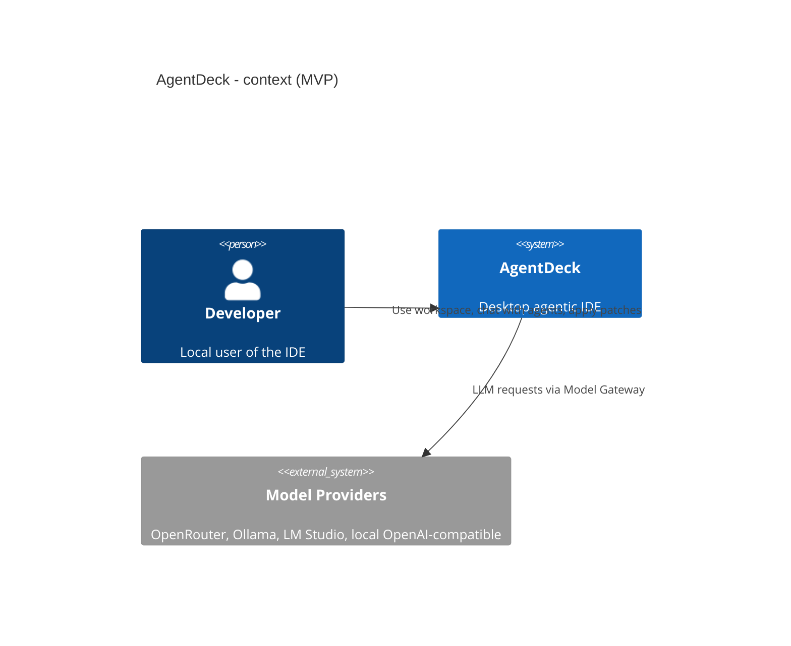

# AgentDeck — Agentic Desktop IDE (MVP)

[](.) [](LICENSE) [](https://sonarcloud.io/summary/new_code?id=Finfinder_AgentDeck)

AgentDeck is a desktop-first, agentic IDE prototype inspired by the VS Code workbench UX. The MVP focuses on a tightly-scoped, local-first workbench built with Electron, React and Monaco, backed by Node/TypeScript services (Agent Runtime, MCP manager, indexer) and a small, auditable local datastore (SQLite + sqlite-vec).

Quick summary:

- Platform: Windows Desktop (MVP)
- Tech stack: Electron, React, Monaco, Node/TypeScript, SQLite, sqlite-vec, Tree-sitter
- Primary goals: local workbench, chat-driven agent tabs, safe tool calls, MCP integration, local retrieval/memory
- Excluded from MVP: full VS Code API compatibility, Marketplace publishing, remote-first cloud mode

## Quick Start (dev)

Prerequisites:

- Node.js 22+ or a current LTS compatible with Vite 7
- npm
- Git

Typical developer workflow:

```bash
# from repo root
cd AgentDeck
npm install
npm run dev
```

Validation commands:

```bash
npm run audit:security
npm run typecheck
npm run lint
npm run test:coverage
npm run test
npm run build
```

Notes:

- If Electron reports a missing binary after install, run `npm rebuild electron` and start the app again.
- The current Phase 2 shell starts as a functional dark workbench with activity bar, explorer, editor area, bottom panel, status bar, typed preload IPC, Settings Service-backed theme persistence, and a workspace/folder picker entry point.

## Getting Started (Windows)

Prerequisites:

- Node.js (recommended LTS, e.g., 18+ or newer compatible with Vite)
- npm
- Git

1. Install dependencies:

```powershell
cd AgentDeck
npm ci
```

1. Start development (live reload):

```powershell
npm run dev
```

1. Build and run a local production preview:

```powershell
npm run build
npx electron .
```

1. Tests and quality checks:

```powershell
npm run audit:security
npm run typecheck
npm run lint
npm run test:coverage
npm run test
npm run test:architecture
```

1. Playwright (optional E2E smoke):

```powershell
npx playwright install
npx playwright test --project=chromium
```

Troubleshooting tips:

- If Electron reports a missing binary, run `npm rebuild electron` and retry.
- Check the terminal running `npm run dev` for main/preload logs; open DevTools in the renderer (Ctrl+Shift+I) for renderer logs.
- To reset theme/settings, remove the local settings file (the path is logged at startup).

If you want, I can run `npm run dev` locally and inspect logs, or run the Playwright smoke tests for you.

## Code Quality

AgentDeck is configured for [SonarCloud](https://sonarcloud.io/summary/new_code?id=Finfinder_AgentDeck) analysis under project key `Finfinder_AgentDeck` in the `finfinder` organization.

Security scanning complements SonarCloud with Dependabot, `npm audit`, and CodeQL. The remediation and triage policy is documented in [SECURITY.md](SECURITY.md).

Agent-managed repository setup:

- The [`sonar.yml`](.github/workflows/sonar.yml) workflow runs on pushes to `main` and semver branches, and on pull requests targeting those branches.
- The workflow runs `npm ci --ignore-scripts`, `npm run audit:security`, `npm run typecheck`, `npm run lint`, `npm run test:coverage`, `npm run test:architecture`, and `npm run build` before scanning.
- The npm audit gate fails CI for vulnerabilities at `moderate` severity or higher and uploads the machine-readable `npm-audit.json` report as a workflow artifact.
- The [`codeql.yml`](.github/workflows/codeql.yml) workflow runs CodeQL for JavaScript and TypeScript and publishes results to GitHub Code Scanning.
- The [`dependabot.yml`](.github/dependabot.yml) configuration opens weekly npm dependency update pull requests labeled for security triage.
- Vitest writes V8 coverage reports to `coverage/`, including LCOV at `coverage/lcov.info`, which is imported by SonarCloud.
- SonarCloud PR decoration reports new issues, coverage changes, and Quality Gate status on pull requests.
- The workflow waits for the SonarCloud Quality Gate with `sonar.qualitygate.wait=true`; branch protection should require the resulting status check after the first successful run.

Manual repository owner setup:

- The SonarCloud project and the GitHub Actions repository secret `SONAR_TOKEN` are managed outside this repository.
- The recommended project key is `Finfinder_AgentDeck`; the recommended Quality Gate is `Sonar way` with New Code Definition set to `Previous version`.
- GitHub Code Scanning must be enabled by repository settings or plan capabilities before CodeQL results are visible.
- Do not commit Sonar tokens, paste them into chat, or store them in README, workflow files, logs, issue text, or local project settings.

### SonarQube for IDE Connected Mode

[SonarQube for IDE](https://marketplace.visualstudio.com/items?itemName=SonarSource.sonarlint-vscode) provides local analysis in VS Code. The shared binding in `.sonarlint/connectedMode.json` connects the workspace to the SonarCloud project without storing credentials.

Developer setup:

1. Install Java 17+.
2. Install the VS Code extension:

   ```bash
   code --install-extension SonarSource.sonarlint-vscode
   ```

3. Open AgentDeck in VS Code and accept the Connected Mode configuration when prompted.
4. Generate a personal User Token in SonarCloud and provide it to the extension locally.

Each developer uses their own token. Tokens must not be committed or shared with agents in chat.

### SonarQube MCP Server (Optional)

The [SonarQube MCP Server](https://github.com/SonarSource/sonarqube-mcp-server) lets AI agents query SonarCloud Quality Gate, metrics, issues, and hotspots when the local MCP server is configured by the developer.

Example local VS Code MCP configuration:

```json
{
  "servers": {
    "sonarqube": {
      "command": "docker",
      "args": [
        "run",
        "-i",
        "--rm",
        "-e",
        "SONAR_TOKEN",
        "-e",
        "SONAR_HOST_URL=https://sonarcloud.io",
        "-e",
        "SONAR_ORGANIZATION=finfinder",
        "mcp/sonarqube"
      ],
      "env": {
        "SONAR_TOKEN": "${input:sonarToken}"
      }
    }
  },
  "inputs": [
    {
      "id": "sonarToken",
      "type": "promptString",
      "description": "SonarCloud user token",
      "password": true
    }
  ]
}
```

Alternatively, provide `SONAR_TOKEN` through your local environment. The MCP server configuration is optional and should stay local unless it contains only secret-free placeholders.

## What this MVP contains (scope)

The AgentDeck MVP targets a vertical slice that validates the agent-first developer experience:

- Open multi-root `.code-workspace` and browse workspace files
- Monaco-based editor with tabs, dirty state and split editors
- Chat tabs connected to an `Agent Runtime` that can make controlled tool calls and emit patch sets
- Local Model Gateway adapters (OpenRouter/Ollama/local OpenAI-compatible endpoints)
- MCP Manager for running trusted MCP servers (stdio/http) and routing tool calls
- Local Store: append-only event log + Markdown memory + SQLite/sqlite-vec index for retrieval
- Permission Broker and Conflict Broker for deny-first approvals and patch conflict handling

Out of scope for MVP:

- Full `vscode` API surface and Marketplace integration
- Terminal/debugger feature parity with VS Code
- Remote cloud-first deployment (can be added later)

## Project layout (recommended)

Suggested repository layout for the AgentDeck monorepo package:

```text
AgentDeck/
├─ package.json              # npm workspaces, dev/build/test scripts
├─ VERSION                   # current development version
├─ apps/
│  └─ desktop/               # Electron main + preload + packaging
├─ packages/
│  ├─ workbench/             # React renderer, UI components, Monaco integration
│  ├─ services/              # Node/TS services: settings, workspace, auth, runtime, model-gateway
│  ├─ agent-runtime/         # session workers, chat tabs, tool loop
│  └─ shared/                # shared types, IPC contracts
├─ tests/                    # unit tests and contract tests
├─ docs/                     # domain.md and ADRs
└─ README.md
```

Future phases add `packages/extension-host`, Monaco editor services, MCP, memory/indexing and compatibility fixtures.

## Architecture (short)

High-level containers:

- Workbench Shell (Electron main + React renderer)
- Workspace Service (Node/TS) — file tree, watchers, `.code-workspace` parser
- Editor Service (Monaco) — document models and views
- Agent Runtime — isolated session workers, chat tabs, tool loop
- Model Gateway — provider adapters
- MCP Manager — lifecycle & routing for MCP servers
- Local Store — SQLite + sqlite-vec + Markdown memory

See `docs/domain.md` for the domain model (ChatTab, AgentDefinition, Worker, AgentTask, PatchSet, Conflict, MemoryEntry, RetrievalQuery, ExtensionManifest, McpServerProfile, IdentitySession).

### Example mermaid (contractual overview)



## Design decisions & ADR highlights

- Shell: Electron + React + Monaco (chosen for rapid MVP and local-first tooling integration)
- IPC: versioned preload IPC with allowlist (deny-first security principle)
- Runtime: isolated worker per session for robustness and permission scoping
- Memory: Markdown as source-of-truth + SQLite + sqlite-vec for embeddings and retrieval

Full ADRs live in `docs/adr/`.

## Development & contribution

- Follow the monorepo conventions defined in the parent workspace's `AI_Instruction/monorepo.yaml` file and the branch strategy.
- Add ADRs under `docs/` and implement the minimal contract for services before expanding APIs.
- Use typed IPC contracts; renderer must not access Node APIs directly.

Implemented npm scripts:

```json
{
  "scripts": {
    "dev": "electron-vite dev",
    "build": "npm run typecheck && electron-vite build",
    "typecheck": "npm run typecheck:main && npm run typecheck:preload && npm run typecheck:shared && npm run typecheck:services && npm run typecheck:agent-runtime && npm run typecheck:workbench && npm run typecheck:tests && npm run typecheck:build",
    "lint": "eslint .",
    "test": "npm run test:unit && npm run test:architecture",
    "test:unit": "vitest run --config vitest.config.ts",
    "test:coverage": "vitest run --config vitest.config.ts --coverage",
    "test:architecture": "depcruise --config .dependency-cruiser.cjs apps packages"
  }
}
```

## Contributing

- Open issues and PRs against this repository. For larger changes, open an RFC/plan under `.github/Issue/` and reference the relevant ADRs.
- Keep changes small and reviewable; update `docs/domain.md` and ADRs when changing contracts.

## License

MIT
