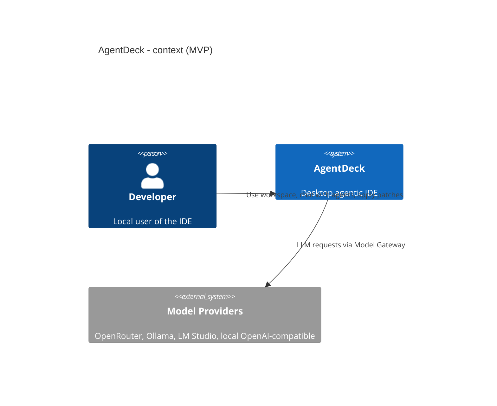

# AgentDeck — Agentic Desktop IDE (MVP)

[](.) [](LICENSE)

AgentDeck is a desktop-first, agentic IDE prototype inspired by the VS Code workbench UX. The MVP focuses on a tightly-scoped, local-first workbench built with Electron, React and Monaco, backed by Node/TypeScript services (Agent Runtime, MCP manager, indexer) and a small, auditable local datastore (SQLite + sqlite-vec).

Quick summary:

- Platform: Windows Desktop (MVP)
- Tech stack: Electron, React, Monaco, Node/TypeScript, SQLite, sqlite-vec, Tree-sitter
- Primary goals: local workbench, chat-driven agent tabs, safe tool calls, MCP integration, local retrieval/memory
- Excluded from MVP: full VS Code API compatibility, Marketplace publishing, remote-first cloud mode

## Quick Start (dev)

Prerequisites:

- Node.js 18+ (or LTS), npm or pnpm
- Git

Typical developer workflow (suggested):

```bash
# from repo root
cd AgentDeck
npm install        # or `pnpm install`
npm run dev        # runs electron + renderer in dev mode (project scripts TBD)
```

If you prefer pnpm:

```bash
pnpm install
pnpm dev
```

Notes:

- This repository is an MVP scaffold: project scripts, package.json and workspace layout are a suggested starting point. See the **Project layout** section below.

## What this MVP contains (scope)

The AgentDeck MVP targets a vertical slice that validates the agent-first developer experience:

- Open multi-root `.code-workspace` and browse workspace files
- Monaco-based editor with tabs, dirty state and split editors
- Chat tabs connected to an `Agent Runtime` that can make controlled tool calls and emit patch sets
- Local Model Gateway adapters (OpenRouter/Ollama/local OpenAI-compatible endpoints)
- MCP Manager for running trusted MCP servers (stdio/http) and routing tool calls
- Local Store: append-only event log + Markdown memory + SQLite/sqlite-vec index for retrieval
- Permission Broker and Conflict Broker for deny-first approvals and patch conflict handling

Out of scope for MVP:

- Full `vscode` API surface and Marketplace integration
- Terminal/debugger feature parity with VS Code
- Remote cloud-first deployment (can be added later)

## Project layout (recommended)

Suggested repository layout for the AgentDeck monorepo package:

```
AgentDeck/
├─ apps/
│  └─ desktop/               # Electron main + preload + packaging
├─ packages/
│  ├─ workbench/             # React renderer, UI components, Monaco integration
│  ├─ services/              # Node/TS services: workspace, auth, runtime, model-gateway
│  ├─ agent-runtime/         # session workers, chat tabs, tool loop
│  ├─ extension-host/        # isolated process for compatible extensions
│  └─ shared/                # shared types, IPC contracts
├─ scripts/                   # dev helpers, build and packaging scripts
├─ docs/                      # design docs, domain.md, ADRs
├─ LICENSE
└─ README.md
```

## Architecture (short)

High-level containers:

- Workbench Shell (Electron main + React renderer)
- Workspace Service (Node/TS) — file tree, watchers, `.code-workspace` parser
- Editor Service (Monaco) — document models and views
- Agent Runtime — isolated session workers, chat tabs, tool loop
- Model Gateway — provider adapters
- MCP Manager — lifecycle & routing for MCP servers
- Local Store — SQLite + sqlite-vec + Markdown memory

See `docs/domain.md` for the domain model (ChatTab, AgentDefinition, Worker, AgentTask, PatchSet, Conflict, MemoryEntry, RetrievalQuery, ExtensionManifest, McpServerProfile, IdentitySession).

### Example mermaid (contractual overview)



## Design decisions & ADR highlights

- Shell: Electron + React + Monaco (chosen for rapid MVP and local-first tooling integration)
- IPC: versioned preload IPC with allowlist (deny-first security principle)
- Runtime: isolated worker per session for robustness and permission scoping
- Memory: Markdown as source-of-truth + SQLite + sqlite-vec for embeddings and retrieval

Full ADRs live in `docs/adrs/` (or `docs/` as `adr-*.md`).

## Development & contribution

- Follow the monorepo `monorepo.yaml` conventions and branch strategy.
- Add ADRs under `docs/` and implement the minimal contract for services before expanding APIs.
- Use typed IPC contracts; renderer must not access Node APIs directly.

Suggested npm scripts (to be implemented in `package.json`):

```json
{
	"scripts": {
		"dev": "concurrently \"npm:dev:main\" \"npm:dev:renderer\"",
		"dev:main": "electron --watch ./apps/desktop/main --...",
		"dev:renderer": "vite --config packages/workbench/vite.config.ts",
		"build": "# build and package steps...",
		"test": "pnpm test"
	}
}
```

## Contributing

- Open issues and PRs against this repository. For larger changes, open an RFC/plan under `.github/Issue/` and reference the relevant ADRs.
- Keep changes small and reviewable; update `docs/domain.md` and ADRs when changing contracts.

## License

MIT

---

If you want, I can commit this README and push the change; would you like me to do that? 
